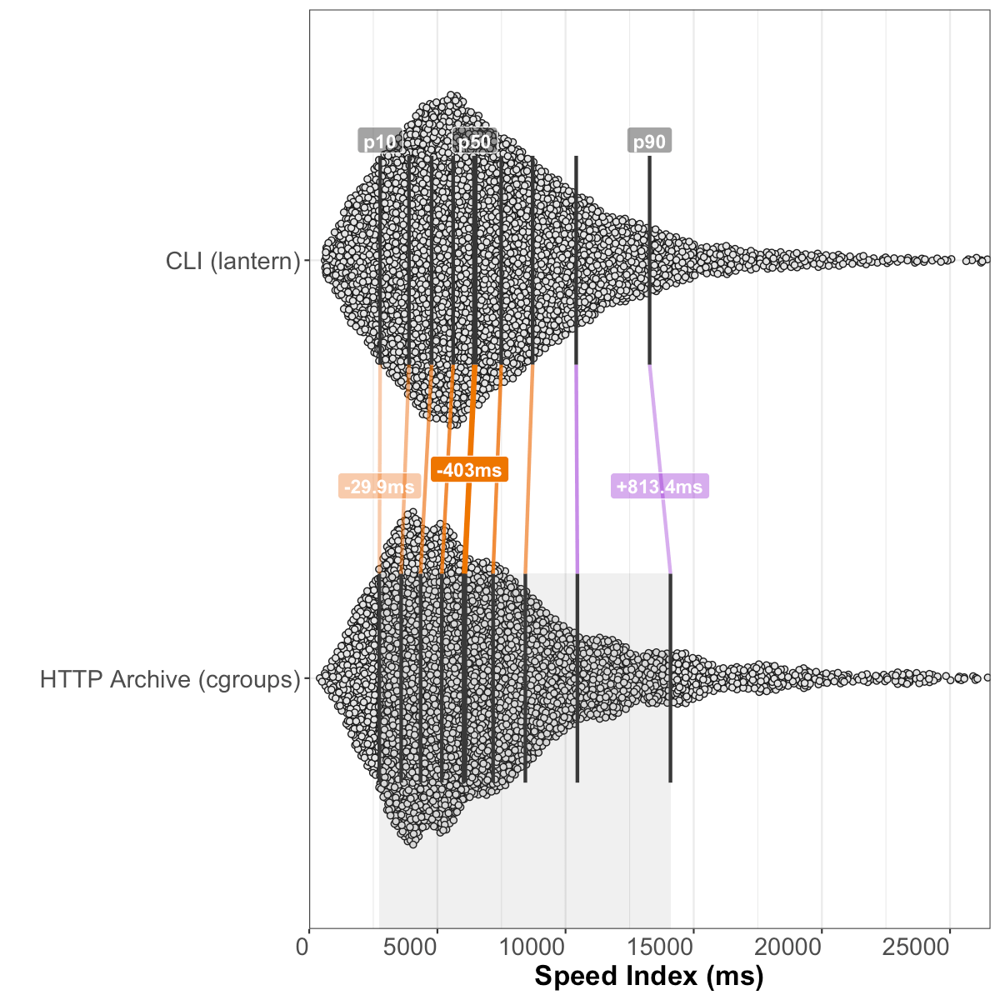

# Analysis of CLI vs HTTP Archive Lighthouse results, October 2020

**Note**: This is a comparison of a manual Lighthouse CLI run of ~10k sites using the default configuration against HTTP Archive Lighthouse results. HTTP Archive (via WPT) recently switched from cgroups-based to DevTools-protocol-based CPU throttling (see [HTTPArchive/httparchive.org#217](https://github.com/HTTPArchive/httparchive.org/issues/217)), which has had a signficant effect on metric results and their comparability to what a user would see when running Lighthouse on their personal machine.

## Summary of queried tables
**Desktop CLI** (default lantern throttling):
  - Lighthouse version: [`6.4.1`](https://github.com/GoogleChrome/lighthouse/releases/tag/v6.4.1)
  - **9.9K** total Lighthouse runs
  - **0% error rate** (0 runs with a `runtimeError`)
  - 0.18% metric error rate (18 runs with a `null` Performance score)
  - Chrome version: `86.0.4240`

**HTTP Archive with cgroups CPU throttling** (July 2020 run):
  - Lighthouse versions: [`5.6.0`](https://github.com/GoogleChrome/lighthouse/releases/tag/v5.6.0), [`6.1.0`](https://github.com/GoogleChrome/lighthouse/releases/tag/v6.1.0), and [`6.1.1`](https://github.com/GoogleChrome/lighthouse/releases/tag/v6.1.1)
  - **6.3M** total Lighthouse runs
  - **0.74% error rate** (47K runs with a `runtimeError`)
  - 4.4% metric error rate (280K runs with a `null` Performance score)
  - Chrome versions: `83.0.4103`, and `84.0.4147`

**HTTP Archive with devtools CPU throttling** (September 2020 run):
  - Lighthouse versions: [`5.6.0`](https://github.com/GoogleChrome/lighthouse/releases/tag/v5.6.0), and [`6.3.0`](https://github.com/GoogleChrome/lighthouse/releases/tag/v6.3.0)
  - **6.8M** total Lighthouse runs
  - **0.87% error rate** (59K runs with a `runtimeError`)
  - 11.81% metric error rate (801K runs with a `null` Performance score)
  - Chrome version: `85.0.4183`

## Overall Performance score

### CLI (lantern throttling) vs HTTP Archive (cgroups throttling)
_results based on 9,737 pairs of before/after runs of the same sites without error_

##### Shifts in the overall performance distribution

| deciles | CLI (lantern) | HTTP Archive (cgroups) | change |
| --- | --- | --- | --- |
| p10 | 14.6 | **14.6** | 0 _(95% CI [-0.8, 0.9])_ |
| p20 | 21 | **22.6** | +1.6 _(95% CI [0.8, 2.3])_ |
| p30 | 28.2 | **30.6** | +2.4 _(95% CI [1.7, 3.1])_ |
| p40 | 35.1 | **37.3** | +2.2 _(95% CI [1.5, 2.9])_ |
| p50 | 42.3 | **44.6** | +2.3 _(95% CI [1.4, 3.2])_ |
| p60 | 50.3 | **52.7** | +2.4 _(95% CI [1.4, 3.4])_ |
| p70 | 59.1 | **61.8** | +2.6 _(95% CI [1.6, 3.7])_ |
| p80 | 71 | **73** | +2 _(95% CI [0.8, 3.3])_ |
| p90 | 87.6 | **88.1** | +0.4 _(95% CI [-0.7, 1.5])_ |

##### Distribution of performance changes seen by individual sites

| deciles | change |
| --- | --- |
| p10 | -15.7 _(95% CI [-16.1, -15])_ |
| p20 | -8.7 _(95% CI [-9, -8.1])_ |
| p30 | -4.4 _(95% CI [-4.9, -4])_ |
| p40 | -1 _(95% CI [-1.5, -1])_ |
| p50 | +1 _(95% CI [1, 1.1])_ |
| p60 | +4 _(95% CI [3.9, 4.2])_ |
| p70 | +7.9 _(95% CI [7.2, 8])_ |
| p80 | +12.2 _(95% CI [12, 12.9])_ |
| p90 | +19.2 _(95% CI [18.7, 19.9])_ |

### CLI (lantern throttling) vs HTTP Archive (devtools throttling)
_results based on 9,737 pairs of before/after runs of the same sites without error_

##### Shifts in the overall performance distribution

| deciles | CLI (lantern) | HTTP Archive (devtools) | change |
| --- | --- | --- | --- |
| p10 | 14.6 | **8** | -6.6 _(95% CI [-7.3, -5.8])_ |
| p20 | 21 | **13** | -8.1 _(95% CI [-8.7, -7.4])_ |
| p30 | 28.2 | **17.9** | -10.2 _(95% CI [-10.9, -9.6])_ |
| p40 | 35.1 | **23.9** | -11.2 _(95% CI [-11.9, -10.5])_ |
| p50 | 42.3 | **30.7** | -11.6 _(95% CI [-12.5, -10.7])_ |
| p60 | 50.3 | **38.6** | -11.7 _(95% CI [-12.5, -10.9])_ |
| p70 | 59.1 | **48.2** | -10.9 _(95% CI [-11.9, -10])_ |
| p80 | 71 | **60.3** | -10.7 _(95% CI [-11.8, -9.5])_ |
| p90 | 87.6 | **79.3** | -8.4 _(95% CI [-9.8, -6.9])_ |

##### Distribution of performance changes seen by individual sites

| deciles | change |
| --- | --- |
| p10 | -26.6 _(95% CI [-27, -26])_ |
| p20 | -20 _(95% CI [-20.2, -19.4])_ |
| p30 | -15 _(95% CI [-15.5, -14.8])_ |
| p40 | -11.1 _(95% CI [-11.6, -11])_ |
| p50 | -8 _(95% CI [-8, -7.5])_ |
| p60 | -5 _(95% CI [-5, -4.8])_ |
| p70 | -2 _(95% CI [-2, -2])_ |
| p80 | +0.5 _(95% CI [0, 1])_ |
| p90 | +5.8 _(95% CI [5.1, 6.1])_ |

## First Contentful Paint
### CLI (lantern throttling) vs HTTP Archive (cgroups throttling)
_results based on 9,752 pairs of before/after runs of the same sites without error_

##### Shifts in the overall FCP distribution

| deciles | CLI (lantern) | HTTP Archive (cgroups) | change |
| --- | --- | --- | --- |
| p10 | 1,617.9ms | **1,806.9ms** | +189ms _(95% CI [141, 237])_ |
| p20 | 2,110ms | **2,291.4ms** | +181.3ms _(95% CI [138.6, 224.1])_ |
| p30 | 2,446.9ms | **2,676.3ms** | +229.4ms _(95% CI [188, 270.9])_ |
| p40 | 2,757.7ms | **3,028.8ms** | +271.1ms _(95% CI [227.1, 315.1])_ |
| p50 | 3,057.6ms | **3,378.4ms** | +320.8ms _(95% CI [275.4, 366.2])_ |
| p60 | 3,400.1ms | **3,770.3ms** | +370.2ms _(95% CI [316.5, 423.8])_ |
| p70 | 3,899.3ms | **4,278.8ms** | +379.5ms _(95% CI [308.6, 450.3])_ |
| p80 | 4,602.5ms | **5,032.4ms** | +429.9ms _(95% CI [339.2, 520.6])_ |
| p90 | 6,005.7ms | **6,473.6ms** | +467.9ms _(95% CI [292, 643.7])_ |

##### Distribution of FCP changes seen by individual sites

| deciles | change |
| --- | --- |
| p10 | -985.4ms _(95% CI [-1,035.3, -936.5])_ |
| p20 | -436.2ms _(95% CI [-466.4, -409.6])_ |
| p30 | -151.2ms _(95% CI [-176.1, -130.7])_ |
| p40 | +42.6ms _(95% CI [25.9, 59.3])_ |
| p50 | +232.6ms _(95% CI [213.9, 251.7])_ |
| p60 | +448.9ms _(95% CI [425.9, 472.4])_ |
| p70 | +708.3ms _(95% CI [682.4, 736.1])_ |
| p80 | +1,080.2ms _(95% CI [1,044.3, 1,113.2])_ |
| p90 | +1,776.1ms _(95% CI [1,714, 1,843.9])_ |

### CLI (lantern throttling) vs HTTP Archive (devtools throttling)
_results based on 9,752 pairs of before/after runs of the same sites without error_

##### Shifts in the overall FCP distribution

| deciles | CLI (lantern) | HTTP Archive (devtools) | change |
| --- | --- | --- | --- |
| p10 | 1,617.9ms | **2,176.5ms** | +558.6ms _(95% CI [516.1, 601.2])_ |
| p20 | 2,110ms | **2,713.6ms** | +603.6ms _(95% CI [557.7, 649.5])_ |
| p30 | 2,446.9ms | **3,125.7ms** | +678.8ms _(95% CI [639.4, 718.2])_ |
| p40 | 2,757.7ms | **3,494.9ms** | +737.2ms _(95% CI [693.1, 781.3])_ |
| p50 | 3,057.6ms | **3,868.3ms** | +810.7ms _(95% CI [760.3, 861.1])_ |
| p60 | 3,400.1ms | **4,311.2ms** | +911ms _(95% CI [854.4, 967.7])_ |
| p70 | 3,899.3ms | **4,815ms** | +915.7ms _(95% CI [849.4, 982.1])_ |
| p80 | 4,602.5ms | **5,593.2ms** | +990.6ms _(95% CI [893.3, 1,088])_ |
| p90 | 6,005.7ms | **7,022.1ms** | +1,016.4ms _(95% CI [824.2, 1,208.6])_ |

##### Distribution of FCP changes seen by individual sites

| deciles | change |
| --- | --- |
| p10 | -499ms _(95% CI [-546.5, -458.4])_ |
| p20 | -2.7ms _(95% CI [-28, 24])_ |
| p30 | +287.7ms _(95% CI [267, 307.7])_ |
| p40 | +495.9ms _(95% CI [477.8, 516.5])_ |
| p50 | +700.7ms _(95% CI [677.9, 724.2])_ |
| p60 | +928.5ms _(95% CI [905.5, 953.6])_ |
| p70 | +1,201.6ms _(95% CI [1,173.7, 1,227.7])_ |
| p80 | +1,583.8ms _(95% CI [1,541.1, 1,619.9])_ |
| p90 | +2,318.6ms _(95% CI [2,255.7, 2,394.8])_ |

## Speed Index
### CLI (lantern throttling) vs HTTP Archive (cgroups throttling)
_results based on 9,749 pairs of before/after runs of the same sites without error_

##### Shifts in the overall Speed Index distribution

| deciles | CLI (lantern) | HTTP Archive (cgroups) | change |
| --- | --- | --- | --- |
| p10 | 2,766ms | **2,736.1ms** | -29.9ms _(95% CI [-112.2, 52.3])_ |
| p20 | 3,892.1ms | **3,587.8ms** | -304.4ms _(95% CI [-400.6, -208.2])_ |
| p30 | 4,777.3ms | **4,344.5ms** | -432.9ms _(95% CI [-535.5, -330.2])_ |
| p40 | 5,614.2ms | **5,174.2ms** | -440ms _(95% CI [-539, -340.9])_ |
| p50 | 6,460.7ms | **6,057.7ms** | -403ms _(95% CI [-547.1, -258.9])_ |
| p60 | 7,491.2ms | **7,172.7ms** | -318.5ms _(95% CI [-469.3, -167.7])_ |
| p70 | 8,717.6ms | **8,432ms** | -285.5ms _(95% CI [-468.8, -102.2])_ |
| p80 | 10,415.4ms | **10,461.9ms** | +46.5ms _(95% CI [-247.3, 340.3])_ |
| p90 | 13,279.7ms | **14,093.1ms** | +813.4ms _(95% CI [370, 1,256.8])_ |

##### Distribution of Speed Index changes seen by individual sites

| deciles | change |
| --- | --- |
| p10 | -4,289.9ms _(95% CI [-4,428.9, -4,144.5])_ |
| p20 | -2,427.2ms _(95% CI [-2,513.9, -2,333.8])_ |
| p30 | -1,414.6ms _(95% CI [-1,491.6, -1,334.7])_ |
| p40 | -727.5ms _(95% CI [-791.6, -669.3])_ |
| p50 | -187ms _(95% CI [-232.6, -139.3])_ |
| p60 | +281.5ms _(95% CI [241.1, 322.5])_ |
| p70 | +910.1ms _(95% CI [831.8, 987.8])_ |
| p80 | +2,088.1ms _(95% CI [1,983.3, 2,207.5])_ |
| p90 | +4,614.8ms _(95% CI [4,389.6, 4,857.2])_ |

### CLI (lantern throttling) vs HTTP Archive (devtools throttling)
_results based on 9,749 pairs of before/after runs of the same sites without error_

##### Shifts in the overall Speed Index distribution

| deciles | CLI (lantern) | HTTP Archive (devtools) | change |
| --- | --- | --- | --- |
| p10 | 2,766ms | **2,935.8ms** | +169.8ms _(95% CI [92.9, 246.8])_ |
| p20 | 3,892.1ms | **3,864.8ms** | -27.3ms _(95% CI [-124.7, 70.1])_ |
| p30 | 4,777.3ms | **4,692.7ms** | -84.6ms _(95% CI [-183.1, 13.9])_ |
| p40 | 5,614.2ms | **5,563.2ms** | -51ms _(95% CI [-163.2, 61.2])_ |
| p50 | 6,460.7ms | **6,600.2ms** | +139.4ms _(95% CI [4, 274.9])_ |
| p60 | 7,491.2ms | **7,785.9ms** | +294.7ms _(95% CI [131.4, 458])_ |
| p70 | 8,717.6ms | **9,238.3ms** | +520.8ms _(95% CI [325.1, 716.4])_ |
| p80 | 10,415.4ms | **11,422.2ms** | +1,006.8ms _(95% CI [735.8, 1,277.8])_ |
| p90 | 13,279.7ms | **15,445.1ms** | +2,165.4ms _(95% CI [1,663.4, 2,667.4])_ |

##### Distribution of Speed Index changes seen by individual sites

| deciles | change |
| --- | --- |
| p10 | -3,480.6ms _(95% CI [-3,614.6, -3,351.2])_ |
| p20 | -1,792.1ms _(95% CI [-1,873.3, -1,706.4])_ |
| p30 | -871ms _(95% CI [-932.2, -805])_ |
| p40 | -255.7ms _(95% CI [-309.9, -204.6])_ |
| p50 | +201.5ms _(95% CI [158.2, 246.8])_ |
| p60 | +679.8ms _(95% CI [629.5, 740.9])_ |
| p70 | +1,423.4ms _(95% CI [1,337.9, 1,506.1])_ |
| p80 | +2,745.5ms _(95% CI [2,607.8, 2,900.6])_ |
| p90 | +5,430ms _(95% CI [5,192.4, 5,672.3])_ |

## Largest Contentful Paint
### CLI (lantern throttling) vs HTTP Archive (cgroups throttling)
_results based on 9,741 pairs of before/after runs of the same sites without error_

##### Shifts in the overall LCP distribution

| deciles | CLI (lantern) | HTTP Archive (cgroups) | change |
| --- | --- | --- | --- |
| p10 | 2,653.6ms | **2,554.3ms** | -99.3ms _(95% CI [-187.3, -11.4])_ |
| p20 | 3,829.7ms | **3,476.7ms** | -352.9ms _(95% CI [-441.3, -264.5])_ |
| p30 | 4,895.5ms | **4,282.8ms** | -612.7ms _(95% CI [-725.2, -500.2])_ |
| p40 | 6,052.1ms | **5,129.3ms** | -922.8ms _(95% CI [-1,046.2, -799.5])_ |
| p50 | 7,263.6ms | **6,152.6ms** | -1,111ms _(95% CI [-1,240, -982])_ |
| p60 | 8,663.4ms | **7,468ms** | -1,195.5ms _(95% CI [-1,411.5, -979.4])_ |
| p70 | 10,421.9ms | **9,310.4ms** | -1,111.5ms _(95% CI [-1,394.1, -828.8])_ |
| p80 | 12,988.1ms | **12,192.3ms** | -795.8ms _(95% CI [-1,181.6, -410])_ |
| p90 | 17,361.5ms | **17,937ms** | +575.4ms _(95% CI [-150.6, 1,301.5])_ |

##### Distribution of LCP changes seen by individual sites

| deciles | change |
| --- | --- |
| p10 | -5,811.6ms _(95% CI [-6,021.4, -5,607.5])_ |
| p20 | -3,249.1ms _(95% CI [-3,387.6, -3,127.3])_ |
| p30 | -1,929.6ms _(95% CI [-2,014.7, -1,836.3])_ |
| p40 | -1,059ms _(95% CI [-1,129.8, -988.2])_ |
| p50 | -437.5ms _(95% CI [-492.8, -386.1])_ |
| p60 | +62.4ms _(95% CI [9.9, 108.9])_ |
| p70 | +622.8ms _(95% CI [563, 696.3])_ |
| p80 | +1,696.9ms _(95% CI [1,579.1, 1,826.5])_ |
| p90 | +4,995.5ms _(95% CI [4,615.6, 5,382.9])_ |

### CLI (lantern throttling) vs HTTP Archive (devtools throttling)
_results based on 9,741 pairs of before/after runs of the same sites without error_

##### Shifts in the overall LCP distribution

| deciles | CLI (lantern) | HTTP Archive (devtools) | change |
| --- | --- | --- | --- |
| p10 | 2,653.6ms | **2,854.4ms** | +200.7ms _(95% CI [109.5, 292])_ |
| p20 | 3,829.7ms | **3,804.6ms** | -25.1ms _(95% CI [-110.7, 60.5])_ |
| p30 | 4,895.5ms | **4,627.9ms** | -267.6ms _(95% CI [-381.2, -154.1])_ |
| p40 | 6,052.1ms | **5,565.9ms** | -486.3ms _(95% CI [-608.1, -364.4])_ |
| p50 | 7,263.6ms | **6,612.4ms** | -651.2ms _(95% CI [-780.8, -521.6])_ |
| p60 | 8,663.4ms | **8,009.4ms** | -654ms _(95% CI [-860.9, -447.2])_ |
| p70 | 10,421.9ms | **9,920.3ms** | -501.6ms _(95% CI [-744.5, -258.7])_ |
| p80 | 12,988.1ms | **12,888.9ms** | -99.3ms _(95% CI [-481.1, 282.6])_ |
| p90 | 17,361.5ms | **19,210.1ms** | +1,848.6ms _(95% CI [1,066.1, 2,631.1])_ |

##### Distribution of LCP changes seen by individual sites

| deciles | change |
| --- | --- |
| p10 | -5,003.7ms _(95% CI [-5,228.6, -4,772.9])_ |
| p20 | -2,623.5ms _(95% CI [-2,757.7, -2,504.8])_ |
| p30 | -1,433.7ms _(95% CI [-1,534.5, -1,342.6])_ |
| p40 | -621.8ms _(95% CI [-685.3, -563.1])_ |
| p50 | -60.5ms _(95% CI [-110.2, -9.3])_ |
| p60 | +454.2ms _(95% CI [407.8, 505.2])_ |
| p70 | +1,044.1ms _(95% CI [975.1, 1,116.1])_ |
| p80 | +2,114ms _(95% CI [1,990.8, 2,233.1])_ |
| p90 | +5,420.4ms _(95% CI [5,026.5, 5,828])_ |

## Time to Interactive
### CLI (lantern throttling) vs HTTP Archive (cgroups throttling)
_results based on 9,749 pairs of before/after runs of the same sites without error_

##### Shifts in the overall TTI distribution

| deciles | CLI (lantern) | HTTP Archive (cgroups) | change |
| --- | --- | --- | --- |
| p10 | 3,126.9ms | **3,186ms** | +59.1ms _(95% CI [-47.6, 165.7])_ |
| p20 | 4,745ms | **4,889.2ms** | +144.3ms _(95% CI [-21.4, 310])_ |
| p30 | 6,157.6ms | **7,142.5ms** | +985ms _(95% CI [740.5, 1,229.4])_ |
| p40 | 7,393.4ms | **9,621.5ms** | +2,228.1ms _(95% CI [1,978.5, 2,477.8])_ |
| p50 | 8,701ms | **12,220.2ms** | +3,519.2ms _(95% CI [3,257.6, 3,780.8])_ |
| p60 | 10,179ms | **15,160.3ms** | +4,981.3ms _(95% CI [4,609.4, 5,353.3])_ |
| p70 | 12,112.1ms | **18,830.1ms** | +6,718ms _(95% CI [6,285.3, 7,150.7])_ |
| p80 | 14,456.3ms | **23,836.5ms** | +9,380.2ms _(95% CI [8,762.3, 9,998.1])_ |
| p90 | 18,811.4ms | **31,980.2ms** | +13,168.7ms _(95% CI [12,273.5, 14,064])_ |

##### Distribution of TTI changes seen by individual sites

| deciles | change |
| --- | --- |
| p10 | -2,077.5ms _(95% CI [-2,193.9, -1,955.2])_ |
| p20 | -634.1ms _(95% CI [-723.6, -552.6])_ |
| p30 | +234.6ms _(95% CI [169.2, 309])_ |
| p40 | +1,110.2ms _(95% CI [1,022.8, 1,203.4])_ |
| p50 | +2,355.7ms _(95% CI [2,215.8, 2,513.7])_ |
| p60 | +4,152.4ms _(95% CI [3,958.2, 4,349.8])_ |
| p70 | +6,421.1ms _(95% CI [6,174.1, 6,670.5])_ |
| p80 | +10,028.6ms _(95% CI [9,675.4, 10,396.5])_ |
| p90 | +16,739.9ms _(95% CI [16,009.1, 17,436.7])_ |

### CLI (lantern throttling) vs HTTP Archive (devtools throttling)
_results based on 9,749 pairs of before/after runs of the same sites without error_

##### Shifts in the overall TTI distribution

| deciles | CLI (lantern) | HTTP Archive (devtools) | change |
| --- | --- | --- | --- |
| p10 | 3,126.9ms | **4,439.1ms** | +1,312.2ms _(95% CI [1,144.2, 1,480.2])_ |
| p20 | 4,745ms | **7,267.5ms** | +2,522.6ms _(95% CI [2,292.4, 2,752.8])_ |
| p30 | 6,157.6ms | **10,032.9ms** | +3,875.3ms _(95% CI [3,585.1, 4,165.5])_ |
| p40 | 7,393.4ms | **12,983.1ms** | +5,589.7ms _(95% CI [5,283.8, 5,895.6])_ |
| p50 | 8,701ms | **16,161.2ms** | +7,460.3ms _(95% CI [7,088.1, 7,832.5])_ |
| p60 | 10,179ms | **19,821.5ms** | +9,642.5ms _(95% CI [9,157, 10,128])_ |
| p70 | 12,112.1ms | **24,288.4ms** | +12,176.3ms _(95% CI [11,580.5, 12,772])_ |
| p80 | 14,456.3ms | **30,361.9ms** | +15,905.7ms _(95% CI [15,095.3, 16,716])_ |
| p90 | 18,811.4ms | **40,856.4ms** | +22,044.9ms _(95% CI [20,922.5, 23,167.4])_ |

##### Distribution of TTI changes seen by individual sites

| deciles | change |
| --- | --- |
| p10 | +160.9ms _(95% CI [95.3, 234.2])_ |
| p20 | +1,203.8ms _(95% CI [1,116.7, 1,286.4])_ |
| p30 | +2,475.7ms _(95% CI [2,350.4, 2,621.6])_ |
| p40 | +4,031.8ms _(95% CI [3,865.2, 4,212.4])_ |
| p50 | +6,070.6ms _(95% CI [5,859.8, 6,259])_ |
| p60 | +8,469.6ms _(95% CI [8,215.2, 8,732.8])_ |
| p70 | +11,764.2ms _(95% CI [11,425.7, 12,096.8])_ |
| p80 | +16,392.3ms _(95% CI [15,909.2, 16,812.7])_ |
| p90 | +25,038.7ms _(95% CI [24,257.5, 25,841.9])_ |

## Total Blocking Time
### CLI (lantern throttling) vs HTTP Archive (cgroups throttling)
_results based on 9,749 pairs of before/after runs of the same sites without error_

##### Shifts in the overall TBT distribution

| deciles | CLI (lantern) | HTTP Archive (cgroups) | change |
| --- | --- | --- | --- |
| p10 | 38.6ms | **0ms** | -38.6ms _(95% CI [-43.9, -33.4])_ |
| p20 | 106.9ms | **38.9ms** | -68ms _(95% CI [-76, -59.9])_ |
| p30 | 200.6ms | **110.9ms** | -89.7ms _(95% CI [-101, -78.4])_ |
| p40 | 331.7ms | **217.8ms** | -113.9ms _(95% CI [-130, -97.7])_ |
| p50 | 505.9ms | **355.5ms** | -150.4ms _(95% CI [-173, -127.7])_ |
| p60 | 729.9ms | **554.5ms** | -175.4ms _(95% CI [-205, -145.9])_ |
| p70 | 1,042.1ms | **822.8ms** | -219.3ms _(95% CI [-259.6, -179])_ |
| p80 | 1,514.2ms | **1,240.5ms** | -273.7ms _(95% CI [-334.3, -213])_ |
| p90 | 2,523.3ms | **2,077.7ms** | -445.6ms _(95% CI [-582.8, -308.3])_ |

##### Distribution of TBT changes seen by individual sites

| deciles | change |
| --- | --- |
| p10 | -1,090.8ms _(95% CI [-1,141.7, -1,037.1])_ |
| p20 | -556.1ms _(95% CI [-584.9, -531.1])_ |
| p30 | -316.3ms _(95% CI [-332.8, -300.4])_ |
| p40 | -164.6ms _(95% CI [-176.7, -154.6])_ |
| p50 | -80.1ms _(95% CI [-86.3, -73.5])_ |
| p60 | -24.5ms _(95% CI [-28.8, -20])_ |
| p70 | +11.2ms _(95% CI [5, 18.4])_ |
| p80 | +158.3ms _(95% CI [138.5, 175])_ |
| p90 | +521.4ms _(95% CI [483.3, 561.4])_ |

### CLI (lantern throttling) vs HTTP Archive (devtools throttling)
_results based on 9,749 pairs of before/after runs of the same sites without error_

##### Shifts in the overall TBT distribution

| deciles | CLI (lantern) | HTTP Archive (devtools) | change |
| --- | --- | --- | --- |
| p10 | 38.6ms | **51.4ms** | +12.8ms _(95% CI [4.8, 20.7])_ |
| p20 | 106.9ms | **205.7ms** | +98.8ms _(95% CI [81.2, 116.5])_ |
| p30 | 200.6ms | **437.1ms** | +236.4ms _(95% CI [210.1, 262.7])_ |
| p40 | 331.7ms | **719.4ms** | +387.6ms _(95% CI [355, 420.3])_ |
| p50 | 505.9ms | **1,078.1ms** | +572.2ms _(95% CI [524.9, 619.5])_ |
| p60 | 729.9ms | **1,556.9ms** | +827ms _(95% CI [763.1, 890.9])_ |
| p70 | 1,042.1ms | **2,194.1ms** | +1,151.9ms _(95% CI [1,084.8, 1,219])_ |
| p80 | 1,514.2ms | **3,171.4ms** | +1,657.2ms _(95% CI [1,537.6, 1,776.8])_ |
| p90 | 2,523.3ms | **4,896.5ms** | +2,373.2ms _(95% CI [2,192.1, 2,554.4])_ |

##### Distribution of TBT changes seen by individual sites

| deciles | change |
| --- | --- |
| p10 | -110.8ms _(95% CI [-125.7, -97.7])_ |
| p20 | -0.1ms _(95% CI [-2.3, 0])_ |
| p30 | +75ms _(95% CI [64.8, 86.7])_ |
| p40 | +222ms _(95% CI [205.4, 239.1])_ |
| p50 | +419.7ms _(95% CI [395.8, 439.8])_ |
| p60 | +682.3ms _(95% CI [651.1, 711.5])_ |
| p70 | +1,039ms _(95% CI [1,002.6, 1,081.2])_ |
| p80 | +1,621.2ms _(95% CI [1,569.5, 1,681.4])_ |
| p90 | +2,706.8ms _(95% CI [2,613.4, 2,789.8])_ |

## Cumulative Layout Shift
### CLI (lantern throttling) vs HTTP Archive (cgroups throttling)
_results based on 9,724 pairs of before/after runs of the same sites without error_

##### Shifts in the overall CLS distribution

| deciles | CLI (lantern) | HTTP Archive (cgroups) | change |
| --- | --- | --- | --- |
| p10 | 0 | **0** | 0 _(95% CI [0, 0])_ |
| p20 | 0.003 | **0** | -0.003 _(95% CI [-0.004, -0.002])_ |
| p30 | 0.019 | **0.003** | -0.016 _(95% CI [-0.019, -0.013])_ |
| p40 | 0.05 | **0.014** | -0.036 _(95% CI [-0.041, -0.031])_ |
| p50 | 0.1 | **0.044** | -0.057 _(95% CI [-0.063, -0.05])_ |
| p60 | 0.174 | **0.093** | -0.081 _(95% CI [-0.092, -0.071])_ |
| p70 | 0.28 | **0.17** | -0.11 _(95% CI [-0.124, -0.097])_ |
| p80 | 0.434 | **0.301** | -0.132 _(95% CI [-0.157, -0.108])_ |
| p90 | 0.753 | **0.554** | -0.199 _(95% CI [-0.242, -0.156])_ |

##### Distribution of CLS changes seen by individual sites

| deciles | change |
| --- | --- |
| p10 | -0.37 _(95% CI [-0.395, -0.347])_ |
| p20 | -0.151 _(95% CI [-0.161, -0.142])_ |
| p30 | -0.066 _(95% CI [-0.071, -0.06])_ |
| p40 | -0.021 _(95% CI [-0.024, -0.019])_ |
| p50 | -0.004 _(95% CI [-0.005, -0.003])_ |
| p60 | 0 _(95% CI [0, 0])_ |
| p70 | 0 _(95% CI [0, 0])_ |
| p80 | +0.006 _(95% CI [0.005, 0.008])_ |
| p90 | +0.098 _(95% CI [0.085, 0.107])_ |

### CLI (lantern throttling) vs HTTP Archive (devtools throttling)
_results based on 9,742 pairs of before/after runs of the same sites without error_

##### Shifts in the overall CLS distribution

| deciles | CLI (lantern) | HTTP Archive (devtools) | change |
| --- | --- | --- | --- |
| p10 | 0 | **0** | 0 _(95% CI [0, 0])_ |
| p20 | 0.003 | **0.002** | -0.001 _(95% CI [-0.002, -0.001])_ |
| p30 | 0.019 | **0.014** | -0.004 _(95% CI [-0.007, -0.002])_ |
| p40 | 0.05 | **0.043** | -0.007 _(95% CI [-0.011, -0.003])_ |
| p50 | 0.1 | **0.087** | -0.013 _(95% CI [-0.019, -0.007])_ |
| p60 | 0.174 | **0.149** | -0.025 _(95% CI [-0.034, -0.015])_ |
| p70 | 0.28 | **0.253** | -0.027 _(95% CI [-0.038, -0.015])_ |
| p80 | 0.434 | **0.399** | -0.035 _(95% CI [-0.058, -0.011])_ |
| p90 | 0.755 | **0.713** | -0.041 _(95% CI [-0.083, 0])_ |

##### Distribution of CLS changes seen by individual sites

| deciles | change |
| --- | --- |
| p10 | -0.215 _(95% CI [-0.233, -0.199])_ |
| p20 | -0.067 _(95% CI [-0.073, -0.061])_ |
| p30 | -0.017 _(95% CI [-0.019, -0.015])_ |
| p40 | -0.003 _(95% CI [-0.004, -0.002])_ |
| p50 | 0 _(95% CI [0, 0])_ |
| p60 | 0 _(95% CI [0, 0])_ |
| p70 | +0.001 _(95% CI [0.001, 0.002])_ |
| p80 | +0.023 _(95% CI [0.019, 0.028])_ |
| p90 | +0.143 _(95% CI [0.13, 0.161])_ |

