# Analysis of HTTP Archive Lighthouse results, July 2020 
## Summary of queried tables
**July 2020** (latest):
  - Lighthouse versions: [`5.6.0`](https://github.com/GoogleChrome/lighthouse/releases/tag/v5.6.0), [`6.1.0`](https://github.com/GoogleChrome/lighthouse/releases/tag/v6.1.0), and [`6.1.1`](https://github.com/GoogleChrome/lighthouse/releases/tag/v6.1.1)
  - **6.3M** total Lighthouse runs
  - **0.74% error rate** (47K runs with a `runtimeError`)
  - 4.4% metric error rate (280K runs with a `null` Performance score)
  - Chrome versions: `83.0.4103`, and `84.0.4147`

**June 2020** (one month prior):
  - Lighthouse versions: [`5.6.0`](https://github.com/GoogleChrome/lighthouse/releases/tag/v5.6.0), and [`6.0.0`](https://github.com/GoogleChrome/lighthouse/releases/tag/v6.0.0)
  - **5.7M** total Lighthouse runs
  - **0.76% error rate** (44K runs with a `runtimeError`)
  - 4.08% metric error rate (232K runs with a `null` Performance score)
  - Chrome version: `83.0.4103`

**July 2019** (one year prior):
  - Lighthouse version: [`5.1.0`](https://github.com/GoogleChrome/lighthouse/releases/tag/v5.1.0)
  - **5.1M** total Lighthouse runs
  - **2.19% error rate** (111K runs with a `runtimeError`)
  - 4.96% metric error rate (252K runs with a `null` Performance score)
  - Chrome version: `75.0.3770`

## Overall Performance score

### June 2020 vs July 2020 (month-over-month)
_results based on 4,385,083 pairs of before/after runs of the same sites without error_

##### Shifts in the overall performance distribution

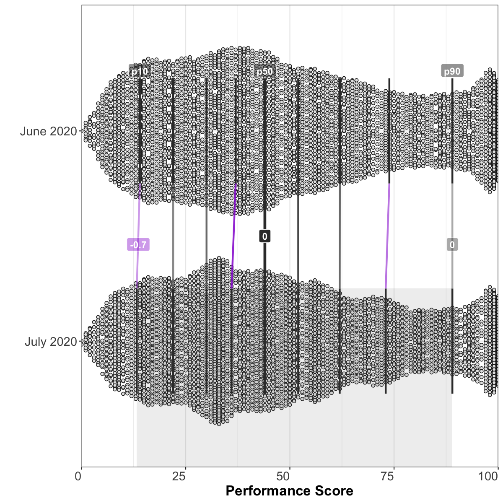

| deciles | June 2020 | July 2020 | change |
| --- | --- | --- | --- |
| p10 | 14 | **13.3** | -0.7 _(95% CI [-1.5, 0])_ |
| p20 | 22 | **22** | 0 _(95% CI [0, 0])_ |
| p30 | 30 | **30** | 0 _(95% CI [0, 0])_ |
| p40 | 37 | **36** | -1 _(95% CI [-1.2, -0.8])_ |
| p50 | 44 | **44** | 0 _(95% CI [0, 0])_ |
| p60 | 52 | **52** | 0 _(95% CI [0, 0])_ |
| p70 | 62 | **62** | 0 _(95% CI [-0.5, 0.4])_ |
| p80 | 73.9 | **73** | -0.9 _(95% CI [-1.5, -0.2])_ |
| p90 | 89 | **89** | 0 _(95% CI [0, 0])_ |

##### Distribution of performance changes seen by individual sites

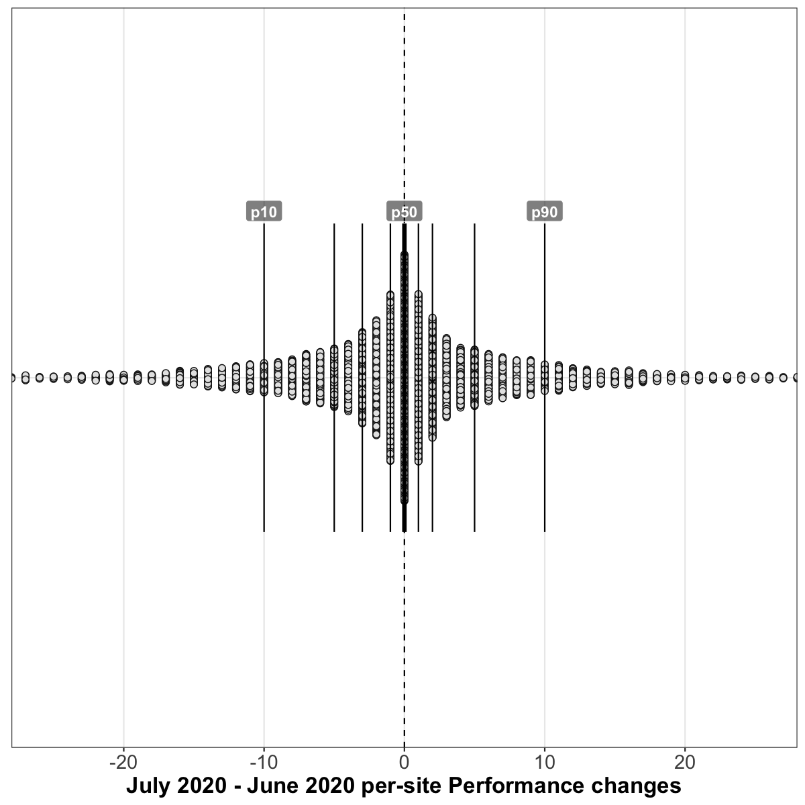

| deciles | change |
| --- | --- |
| p10 | -10 _(95% CI [-10, -10])_ |
| p20 | -5 _(95% CI [-5, -5])_ |
| p30 | -3 _(95% CI [-3, -3])_ |
| p40 | -1 _(95% CI [-1, -1])_ |
| p50 | 0 _(95% CI [0, 0])_ |
| p60 | +1 _(95% CI [1, 1])_ |
| p70 | +2 _(95% CI [2, 2])_ |
| p80 | +5 _(95% CI [5, 5])_ |
| p90 | +10 _(95% CI [10, 10])_ |

### July 2019 vs July 2020 (year-over-year)
_results based on 2,618,616 pairs of before/after runs of the same sites without error_

##### Shifts in the overall performance distribution

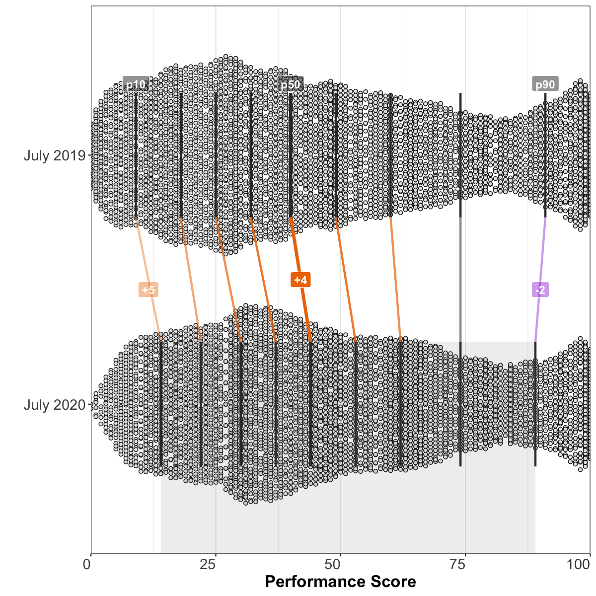

| deciles | July 2019 | July 2020 | change |
| --- | --- | --- | --- |
| p10 | 9 | **14** | +5 _(95% CI [4.9, 5.1])_ |
| p20 | 18 | **22** | +4 _(95% CI [4, 4])_ |
| p30 | 25 | **30** | +5 _(95% CI [5, 5])_ |
| p40 | 32 | **37** | +5 _(95% CI [5, 5])_ |
| p50 | 40 | **44** | +4 _(95% CI [4, 4])_ |
| p60 | 49 | **53** | +4 _(95% CI [3.6, 4.3])_ |
| p70 | 60 | **62** | +2 _(95% CI [2, 2])_ |
| p80 | 74 | **74** | 0 _(95% CI [0, 0])_ |
| p90 | 91 | **89** | -2 _(95% CI [-2, -2])_ |

##### Distribution of performance changes seen by individual sites

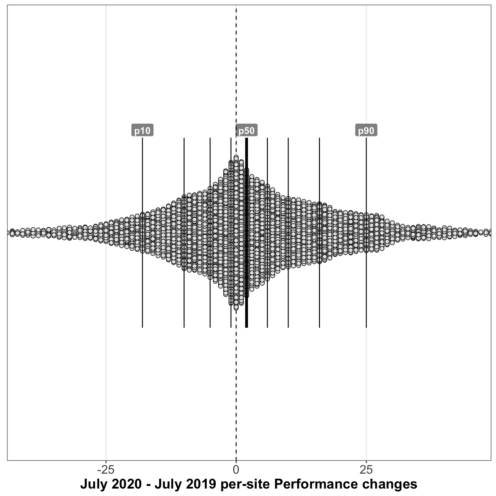

| deciles | change |
| --- | --- |
| p10 | -18 _(95% CI [-18, -18])_ |
| p20 | -10 _(95% CI [-10, -10])_ |
| p30 | -5 _(95% CI [-5, -5])_ |
| p40 | -1 _(95% CI [-1, -1])_ |
| p50 | +2 _(95% CI [2, 2])_ |
| p60 | +6 _(95% CI [6, 6])_ |
| p70 | +10 _(95% CI [10, 10.2])_ |
| p80 | +16 _(95% CI [16, 16])_ |
| p90 | +25 _(95% CI [24.7, 25])_ |

## First Contentful Paint
### June 2020 vs July 2020 (month-over-month)
_results based on 4,588,995 pairs of before/after runs of the same sites without error_

##### Shifts in the overall FCP distribution

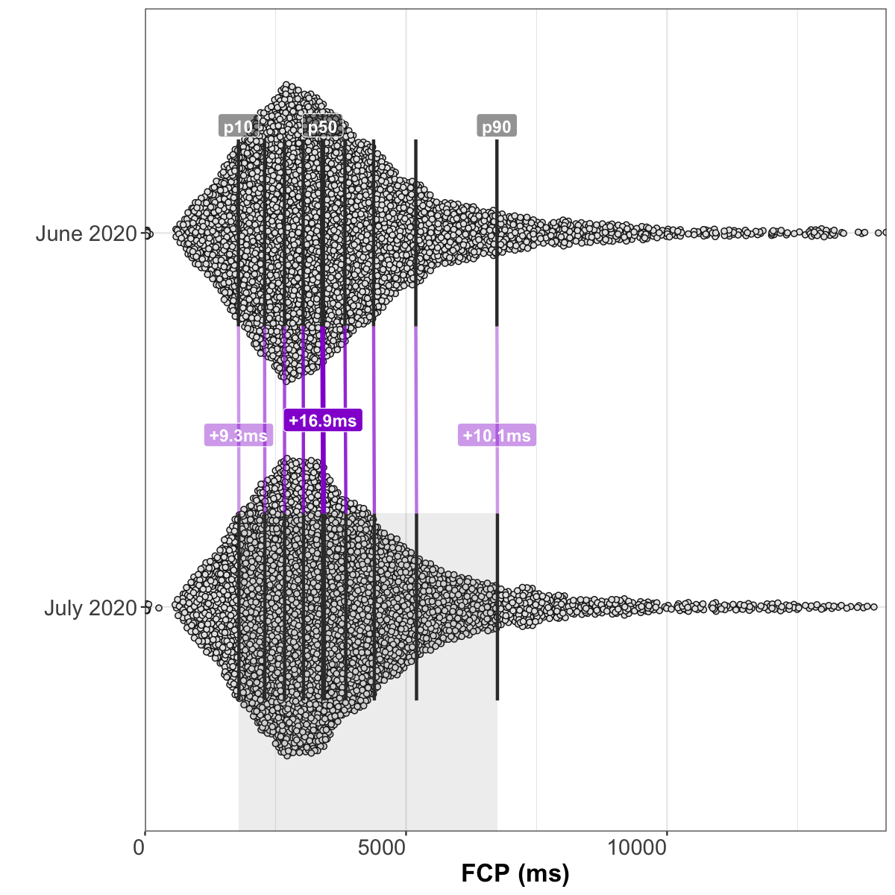

| deciles | June 2020 | July 2020 | change |
| --- | --- | --- | --- |
| p10 | 1,788.6ms | **1,797.9ms** | +9.3ms _(95% CI [7.8, 10.7])_ |
| p20 | 2,289.8ms | **2,294.4ms** | +4.5ms _(95% CI [3.2, 5.8])_ |
| p30 | 2,670.4ms | **2,673ms** | +2.6ms _(95% CI [1.4, 3.7])_ |
| p40 | 3,028.2ms | **3,035.1ms** | +6.9ms _(95% CI [5.6, 8.3])_ |
| p50 | 3,402ms | **3,418.9ms** | +16.9ms _(95% CI [15.3, 18.4])_ |
| p60 | 3,828.4ms | **3,847ms** | +18.6ms _(95% CI [16.7, 20.5])_ |
| p70 | 4,377.9ms | **4,392.4ms** | +14.5ms _(95% CI [12.2, 16.8])_ |
| p80 | 5,186.9ms | **5,200.9ms** | +14ms _(95% CI [10.8, 17.2])_ |
| p90 | 6,740.5ms | **6,750.5ms** | +10.1ms _(95% CI [3.8, 16.4])_ |

##### Distribution of FCP changes seen by individual sites

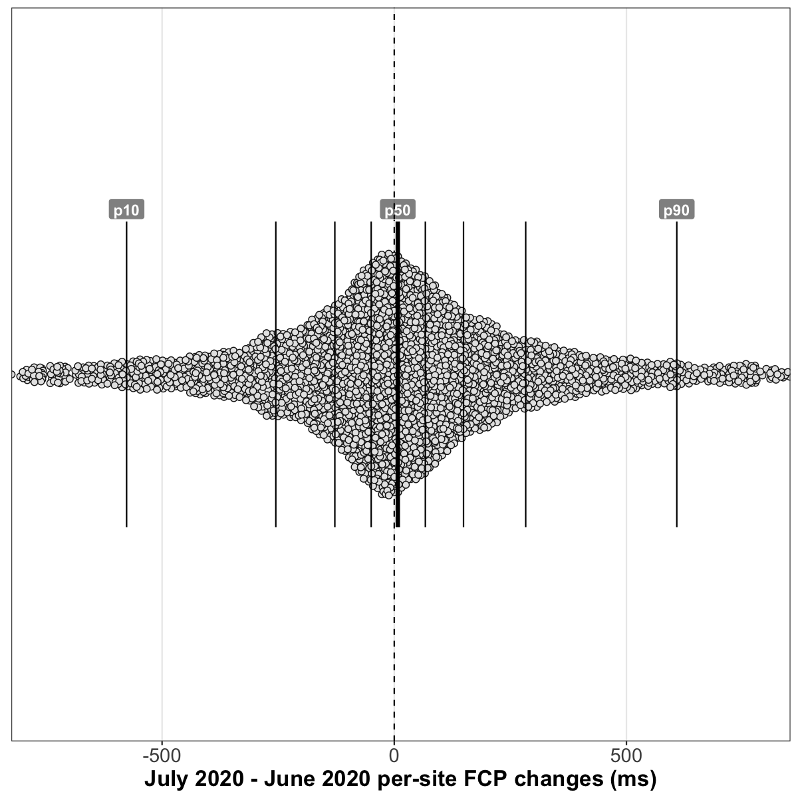

| deciles | change |
| --- | --- |
| p10 | -576.4ms _(95% CI [-578, -574.7])_ |
| p20 | -255.1ms _(95% CI [-255.7, -254.5])_ |
| p30 | -127.9ms _(95% CI [-128.3, -127.6])_ |
| p40 | -49.7ms _(95% CI [-50, -49.4])_ |
| p50 | +7.6ms _(95% CI [7.3, 7.8])_ |
| p60 | +66.9ms _(95% CI [66.6, 67.2])_ |
| p70 | +149.1ms _(95% CI [148.7, 149.5])_ |
| p80 | +283ms _(95% CI [282.4, 283.7])_ |
| p90 | +608.4ms _(95% CI [606.8, 610.1])_ |

### July 2019 vs July 2020 (year-over-year)
_results based on 2,760,136 pairs of before/after runs of the same sites without error_

##### Shifts in the overall FCP distribution

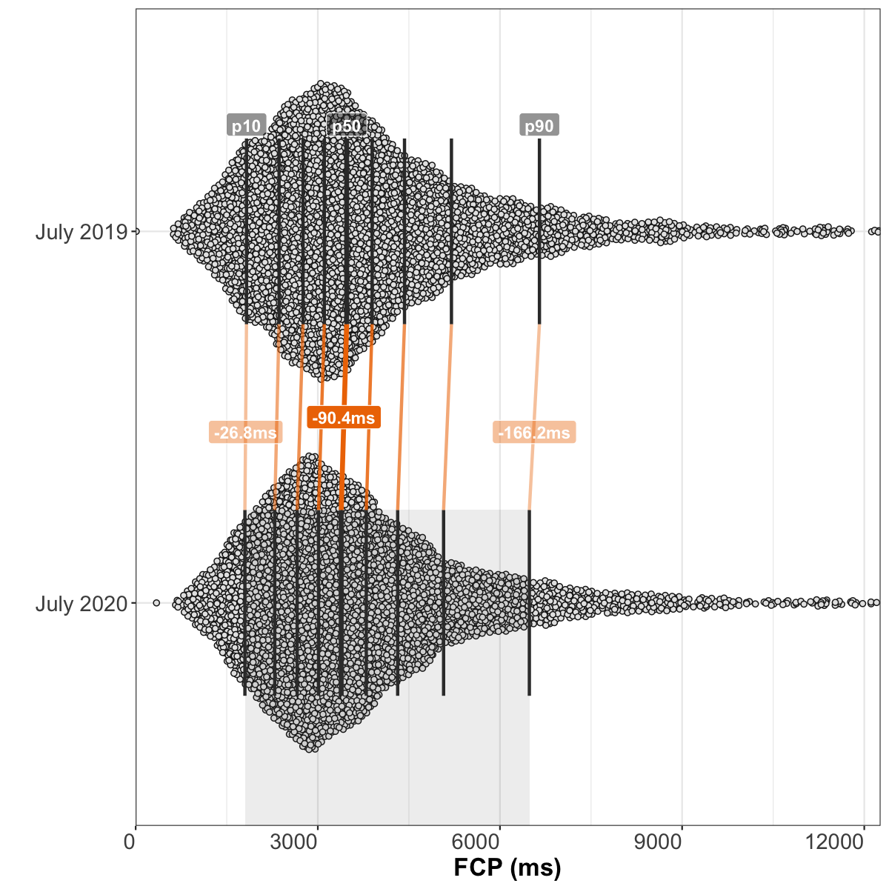

| deciles | July 2019 | July 2020 | change |
| --- | --- | --- | --- |
| p10 | 1,826ms | **1,799.1ms** | -26.8ms _(95% CI [-29.4, -24.3])_ |
| p20 | 2,362ms | **2,290.4ms** | -71.6ms _(95% CI [-74, -69.1])_ |
| p30 | 2,757ms | **2,659.5ms** | -97.5ms _(95% CI [-99.6, -95.4])_ |
| p40 | 3,107.4ms | **3,011.5ms** | -95.9ms _(95% CI [-98.2, -93.7])_ |
| p50 | 3,475.4ms | **3,385ms** | -90.4ms _(95% CI [-93.3, -87.5])_ |
| p60 | 3,894.6ms | **3,798.2ms** | -96.4ms _(95% CI [-99.1, -93.7])_ |
| p70 | 4,427.8ms | **4,315.2ms** | -112.6ms _(95% CI [-116.3, -108.8])_ |
| p80 | 5,201ms | **5,071.5ms** | -129.4ms _(95% CI [-135.4, -123.4])_ |
| p90 | 6,650.1ms | **6,483.9ms** | -166.2ms _(95% CI [-176.4, -156.1])_ |

##### Distribution of FCP changes seen by individual sites

| deciles | change |
| --- | --- |
| p10 | -1,399ms _(95% CI [-1,402.9, -1,394.9])_ |
| p20 | -684.1ms _(95% CI [-686.2, -682])_ |
| p30 | -357.3ms _(95% CI [-358.7, -356])_ |
| p40 | -160.8ms _(95% CI [-161.8, -160])_ |
| p50 | -22.5ms _(95% CI [-23.2, -21.8])_ |
| p60 | +86ms _(95% CI [85.3, 86.7])_ |
| p70 | +233.1ms _(95% CI [232.1, 234.1])_ |
| p80 | +491.6ms _(95% CI [489.7, 493.3])_ |
| p90 | +1,127.1ms _(95% CI [1,123.4, 1,130.8])_ |

## Speed Index
### June 2020 vs July 2020 (month-over-month)
_results based on 4,585,237 pairs of before/after runs of the same sites without error_

##### Shifts in the overall Speed Index distribution

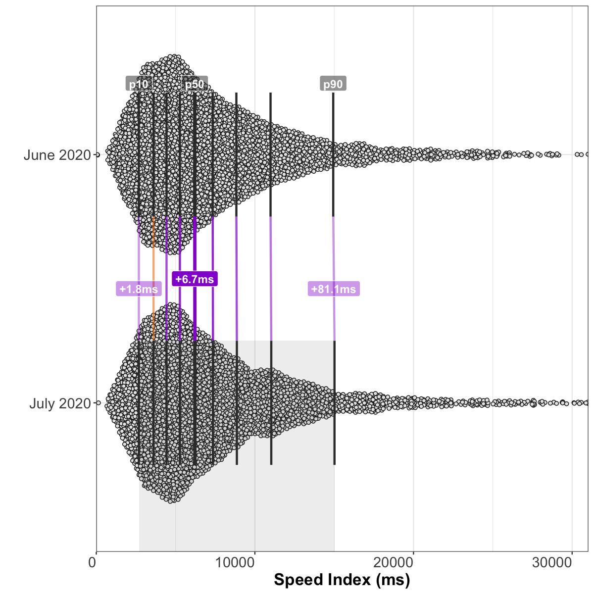

| deciles | June 2020 | July 2020 | change |
| --- | --- | --- | --- |
| p10 | 2,682.3ms | **2,684.2ms** | +1.8ms _(95% CI [-0.3, 4])_ |
| p20 | 3,612.7ms | **3,610.9ms** | -1.8ms _(95% CI [-4.1, 0.5])_ |
| p30 | 4,429.7ms | **4,430.2ms** | +0.5ms _(95% CI [-2.3, 3.3])_ |
| p40 | 5,269.1ms | **5,271ms** | +1.8ms _(95% CI [-1.3, 5])_ |
| p50 | 6,208.9ms | **6,215.6ms** | +6.7ms _(95% CI [2.4, 11])_ |
| p60 | 7,338.7ms | **7,357.5ms** | +18.8ms _(95% CI [14, 23.6])_ |
| p70 | 8,831.2ms | **8,862.5ms** | +31.3ms _(95% CI [24.6, 37.9])_ |
| p80 | 10,986.7ms | **11,032.2ms** | +45.4ms _(95% CI [36.3, 54.6])_ |
| p90 | 14,937.2ms | **15,018.3ms** | +81.1ms _(95% CI [66, 96.2])_ |

##### Distribution of Speed Index changes seen by individual sites

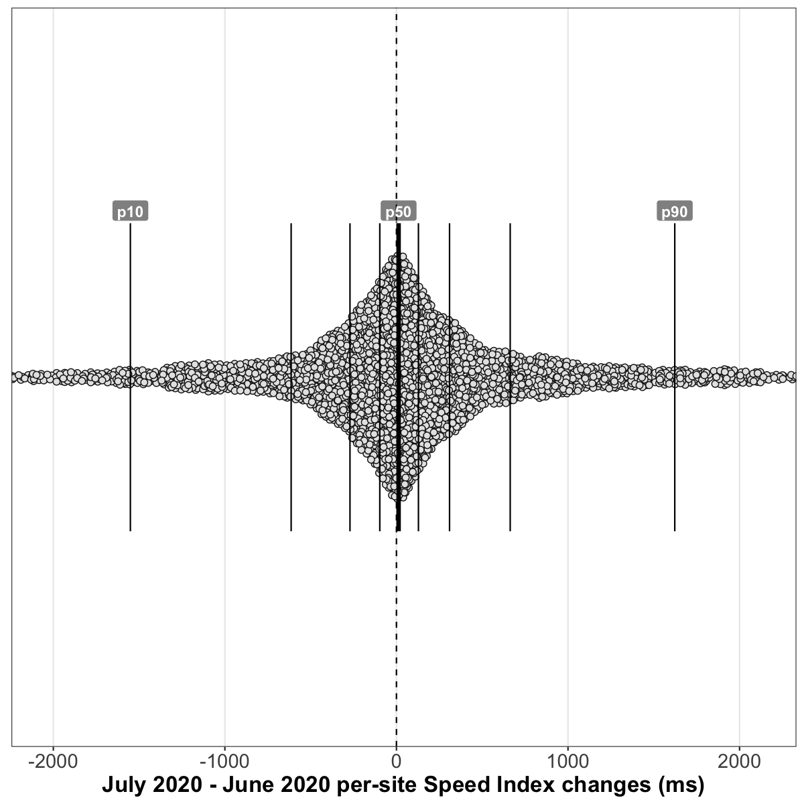

| deciles | change |
| --- | --- |
| p10 | -1,550.9ms _(95% CI [-1,555.6, -1,546.2])_ |
| p20 | -613.7ms _(95% CI [-615.5, -611.9])_ |
| p30 | -270.9ms _(95% CI [-271.8, -269.9])_ |
| p40 | -97.1ms _(95% CI [-97.8, -96.5])_ |
| p50 | +12.5ms _(95% CI [12, 13])_ |
| p60 | +128.2ms _(95% CI [127.6, 128.8])_ |
| p70 | +309.5ms _(95% CI [308.5, 310.4])_ |
| p80 | +663ms _(95% CI [661.1, 665])_ |
| p90 | +1,622.4ms _(95% CI [1,617.8, 1,626.9])_ |

### July 2019 vs July 2020 (year-over-year)
_results based on 2,758,063 pairs of before/after runs of the same sites without error_

##### Shifts in the overall Speed Index distribution

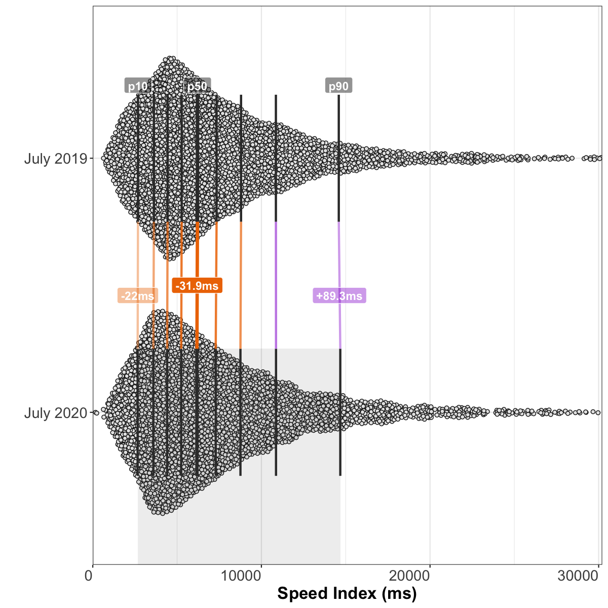

| deciles | July 2019 | July 2020 | change |
| --- | --- | --- | --- |
| p10 | 2,682.4ms | **2,660.4ms** | -22ms _(95% CI [-26, -17.9])_ |
| p20 | 3,624ms | **3,592.5ms** | -31.5ms _(95% CI [-36, -27.1])_ |
| p30 | 4,436.7ms | **4,410.8ms** | -25.9ms _(95% CI [-31.3, -20.4])_ |
| p40 | 5,272ms | **5,244.3ms** | -27.6ms _(95% CI [-33.2, -22.1])_ |
| p50 | 6,208ms | **6,176.1ms** | -31.9ms _(95% CI [-38.4, -25.3])_ |
| p60 | 7,342.5ms | **7,290.2ms** | -52.3ms _(95% CI [-60.8, -43.7])_ |
| p70 | 8,792.5ms | **8,757.2ms** | -35.3ms _(95% CI [-47.6, -23])_ |
| p80 | 10,859ms | **10,866ms** | +7ms _(95% CI [-10.9, 24.9])_ |
| p90 | 14,588.3ms | **14,677.6ms** | +89.3ms _(95% CI [62.1, 116.5])_ |

##### Distribution of Speed Index changes seen by individual sites

| deciles | change |
| --- | --- |
| p10 | -3,598.4ms _(95% CI [-3,610.2, -3,587])_ |
| p20 | -1,593.4ms _(95% CI [-1,598.9, -1,587.6])_ |
| p30 | -733.9ms _(95% CI [-737.1, -730.6])_ |
| p40 | -271.4ms _(95% CI [-273.4, -269.5])_ |
| p50 | +2.6ms _(95% CI [1.5, 3.8])_ |
| p60 | +251.2ms _(95% CI [249.6, 253])_ |
| p70 | +678.2ms _(95% CI [675.1, 681.1])_ |
| p80 | +1,514ms _(95% CI [1,508, 1,519.5])_ |
| p90 | +3,569.3ms _(95% CI [3,556.7, 3,581.3])_ |

## Largest Contentful Paint
### June 2020 vs July 2020 (month-over-month)
_results based on 4,578,404 pairs of before/after runs of the same sites without error_

##### Shifts in the overall LCP distribution

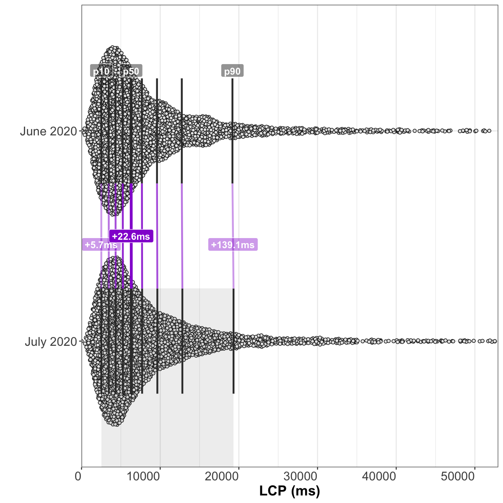

| deciles | June 2020 | July 2020 | change |
| --- | --- | --- | --- |
| p10 | 2,510.3ms | **2,516ms** | +5.7ms _(95% CI [3.4, 7.9])_ |
| p20 | 3,455.3ms | **3,469.8ms** | +14.6ms _(95% CI [11.9, 17.2])_ |
| p30 | 4,322ms | **4,338.7ms** | +16.8ms _(95% CI [13.8, 19.8])_ |
| p40 | 5,238.7ms | **5,260.3ms** | +21.6ms _(95% CI [17.6, 25.5])_ |
| p50 | 6,305.8ms | **6,328.4ms** | +22.6ms _(95% CI [18, 27.3])_ |
| p60 | 7,674.4ms | **7,702.5ms** | +28.1ms _(95% CI [22.2, 34])_ |
| p70 | 9,593.9ms | **9,637.9ms** | +43.9ms _(95% CI [35.1, 52.8])_ |
| p80 | 12,744.6ms | **12,817.4ms** | +72.8ms _(95% CI [57.4, 88.2])_ |
| p90 | 19,182.9ms | **19,322ms** | +139.1ms _(95% CI [109.9, 168.3])_ |

##### Distribution of LCP changes seen by individual sites

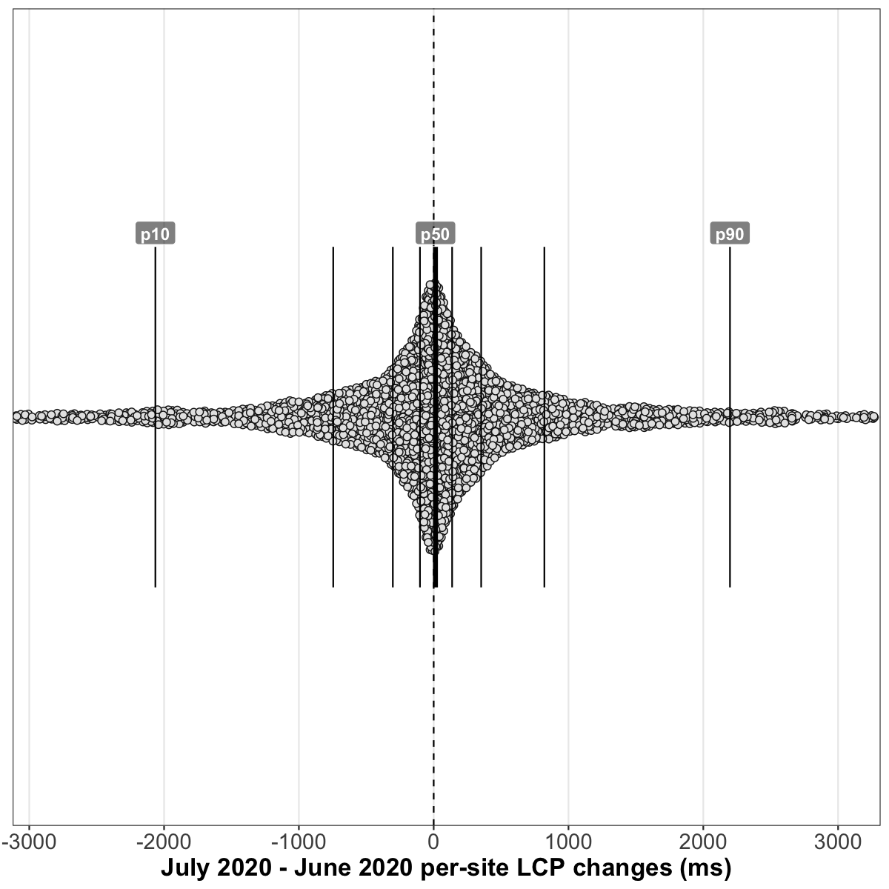

| deciles | change |
| --- | --- |
| p10 | -2,064.5ms _(95% CI [-2,071.3, -2,057.8])_ |
| p20 | -745.2ms _(95% CI [-747.6, -742.7])_ |
| p30 | -303ms _(95% CI [-304.3, -301.9])_ |
| p40 | -101.7ms _(95% CI [-102.3, -101])_ |
| p50 | +13.1ms _(95% CI [12.7, 13.6])_ |
| p60 | +136.8ms _(95% CI [136.1, 137.5])_ |
| p70 | +352.2ms _(95% CI [351, 353.5])_ |
| p80 | +821.1ms _(95% CI [818.4, 823.5])_ |
| p90 | +2,197.9ms _(95% CI [2,190.8, 2,205.1])_ |

### July 2019 vs July 2020 (year-over-year)

LCP data was not collected in July 2019.

## Time to Interactive
### June 2020 vs July 2020 (month-over-month)
_results based on 4,396,880 pairs of before/after runs of the same sites without error_

##### Shifts in the overall TTI distribution

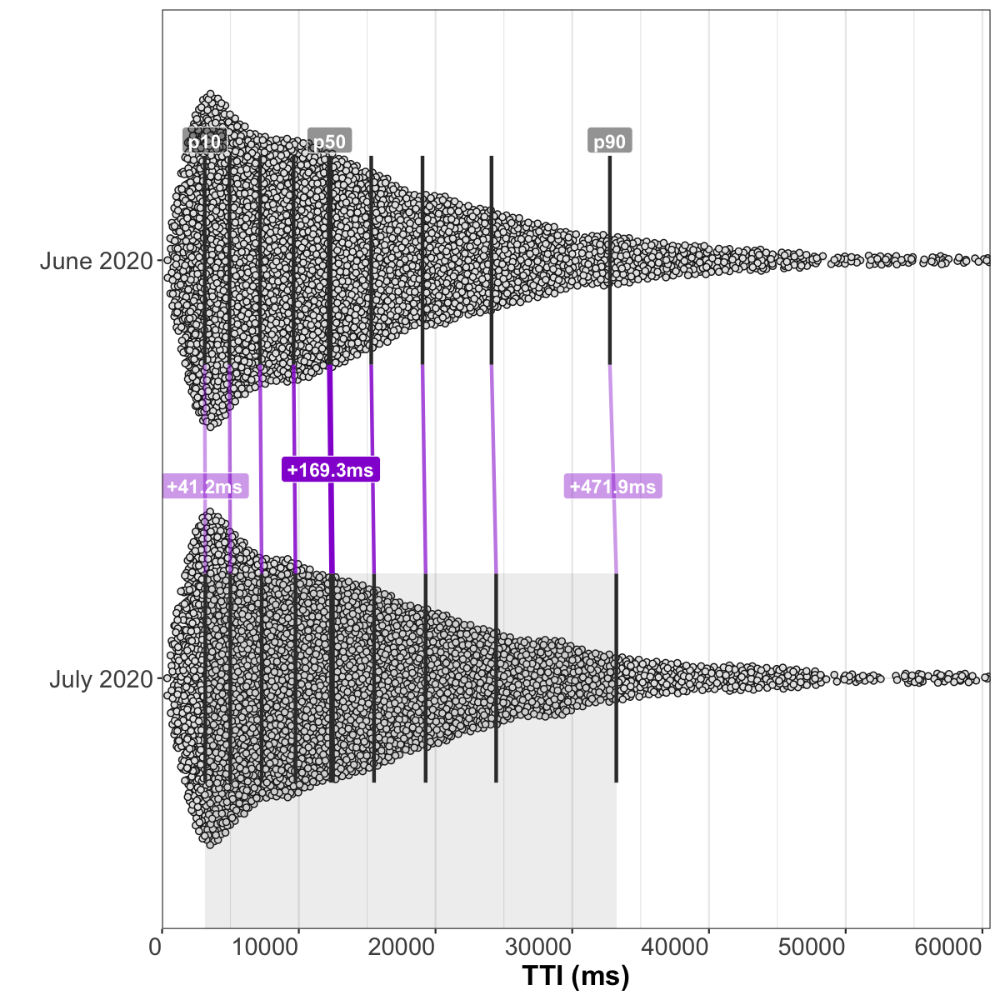

| deciles | June 2020 | July 2020 | change |
| --- | --- | --- | --- |
| p10 | 3,117.2ms | **3,158.4ms** | +41.2ms _(95% CI [36.8, 45.5])_ |
| p20 | 4,929.4ms | **4,990.4ms** | +60.9ms _(95% CI [53.9, 68])_ |
| p30 | 7,165.7ms | **7,285ms** | +119.3ms _(95% CI [110, 128.7])_ |
| p40 | 9,617.5ms | **9,758.1ms** | +140.6ms _(95% CI [130.9, 150.3])_ |
| p50 | 12,259.7ms | **12,429ms** | +169.3ms _(95% CI [158.5, 180])_ |
| p60 | 15,297.5ms | **15,504.2ms** | +206.8ms _(95% CI [193.5, 220.1])_ |
| p70 | 19,048.5ms | **19,277.9ms** | +229.4ms _(95% CI [212.6, 246.3])_ |
| p80 | 24,095.8ms | **24,434.1ms** | +338.3ms _(95% CI [315.1, 361.5])_ |
| p90 | 32,752.6ms | **33,224.5ms** | +471.9ms _(95% CI [436.4, 507.4])_ |

##### Distribution of TTI changes seen by individual sites

| deciles | change |
| --- | --- |
| p10 | -3,843.6ms _(95% CI [-3,855.8, -3,831.7])_ |
| p20 | -1,355.5ms _(95% CI [-1,360.5, -1,350.5])_ |
| p30 | -497.4ms _(95% CI [-499.7, -495.2])_ |
| p40 | -132.5ms _(95% CI [-133.6, -131.4])_ |
| p50 | +41.5ms _(95% CI [40.7, 42.2])_ |
| p60 | +276.9ms _(95% CI [275.4, 278.4])_ |
| p70 | +762.1ms _(95% CI [759.3, 765])_ |
| p80 | +1,808.2ms _(95% CI [1,802.4, 1,814])_ |
| p90 | +4,554.7ms _(95% CI [4,542.2, 4,567.9])_ |

### July 2019 vs July 2020 (year-over-year)
_results based on 2,625,704 pairs of before/after runs of the same sites without error_

##### Shifts in the overall TTI distribution

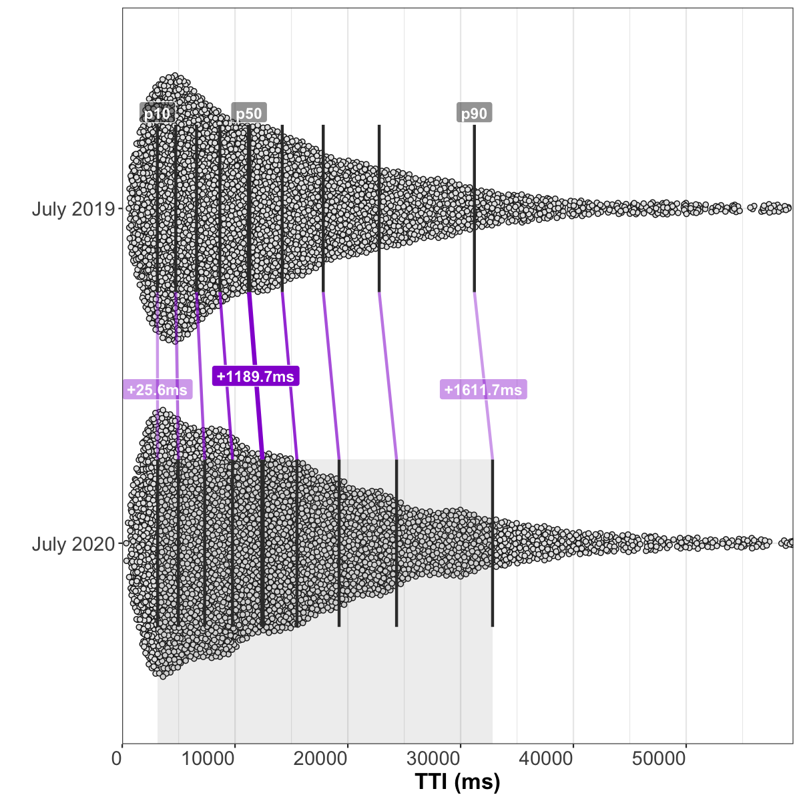

| deciles | July 2019 | July 2020 | change |
| --- | --- | --- | --- |
| p10 | 3,111.9ms | **3,137.5ms** | +25.6ms _(95% CI [18.9, 32.4])_ |
| p20 | 4,743.8ms | **4,980.1ms** | +236.3ms _(95% CI [225.5, 247.1])_ |
| p30 | 6,589.4ms | **7,307.1ms** | +717.7ms _(95% CI [704.3, 731.1])_ |
| p40 | 8,655.1ms | **9,777ms** | +1,121.8ms _(95% CI [1,105.3, 1,138.4])_ |
| p50 | 11,246.2ms | **12,435.9ms** | +1,189.7ms _(95% CI [1,169.6, 1,209.8])_ |
| p60 | 14,188.2ms | **15,491.5ms** | +1,303.4ms _(95% CI [1,277.2, 1,329.5])_ |
| p70 | 17,820.5ms | **19,227.7ms** | +1,407.2ms _(95% CI [1,377.2, 1,437.3])_ |
| p80 | 22,781.5ms | **24,322.5ms** | +1,540.9ms _(95% CI [1,502, 1,579.8])_ |
| p90 | 31,222.9ms | **32,834.6ms** | +1,611.7ms _(95% CI [1,544.6, 1,678.8])_ |

##### Distribution of TTI changes seen by individual sites

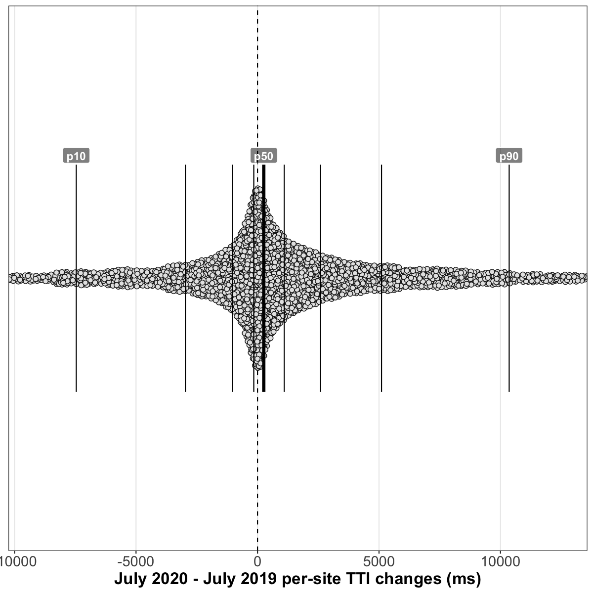

| deciles | change |
| --- | --- |
| p10 | -7,460ms _(95% CI [-7,487.2, -7,434.2])_ |
| p20 | -2,969ms _(95% CI [-2,982.7, -2,955.9])_ |
| p30 | -1,026.5ms _(95% CI [-1,033.4, -1,019.5])_ |
| p40 | -153.4ms _(95% CI [-156.5, -150.3])_ |
| p50 | +257.6ms _(95% CI [254.2, 260.9])_ |
| p60 | +1,098.1ms _(95% CI [1,091.2, 1,104.5])_ |
| p70 | +2,594.8ms _(95% CI [2,583.9, 2,604.9])_ |
| p80 | +5,103.8ms _(95% CI [5,087.3, 5,119.9])_ |
| p90 | +10,357ms _(95% CI [10,325.7, 10,387])_ |

## Total Blocking Time
### June 2020 vs July 2020 (month-over-month)
_results based on 4,396,880 pairs of before/after runs of the same sites without error_

##### Shifts in the overall TBT distribution

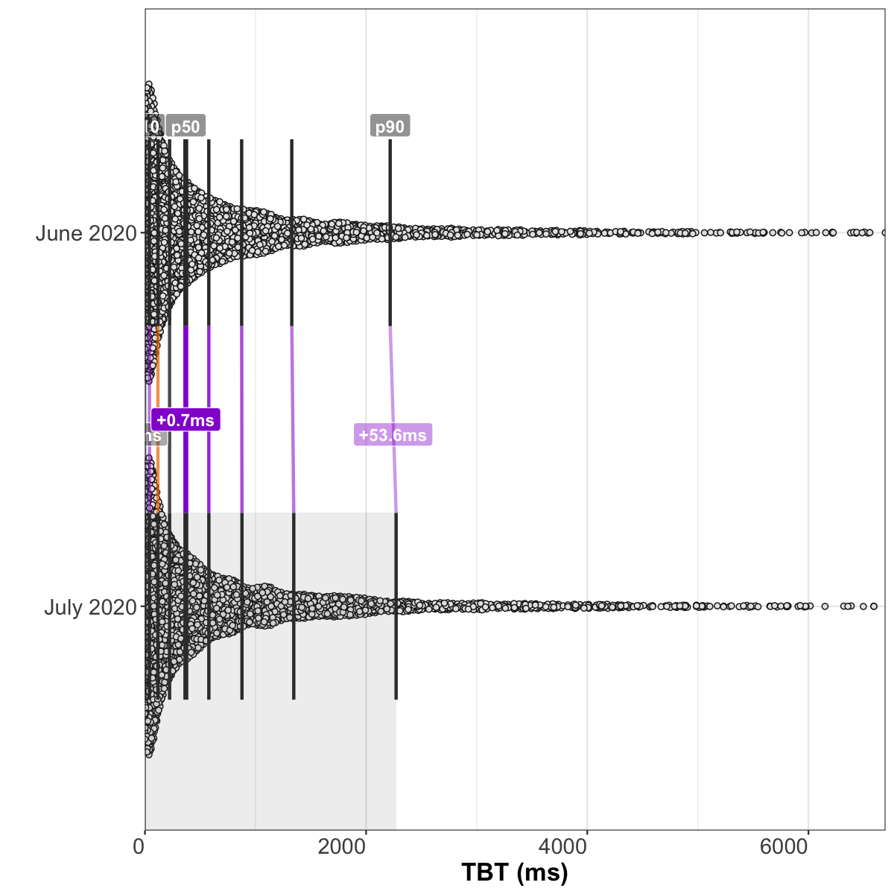

| deciles | June 2020 | July 2020 | change |
| --- | --- | --- | --- |
| p10 | 0ms | **0ms** | 0ms _(95% CI [0, 0])_ |
| p20 | 40.9ms | **41.4ms** | +0.5ms _(95% CI [0.3, 0.8])_ |
| p30 | 118.5ms | **117.4ms** | -1.2ms _(95% CI [-1.5, -0.8])_ |
| p40 | 223ms | **223ms** | 0ms _(95% CI [-0.6, 0.6])_ |
| p50 | 369.4ms | **370.1ms** | +0.7ms _(95% CI [-0.2, 1.6])_ |
| p60 | 577.8ms | **578.1ms** | +0.3ms _(95% CI [-0.8, 1.5])_ |
| p70 | 874.9ms | **877.6ms** | +2.7ms _(95% CI [1.2, 4.3])_ |
| p80 | 1,328ms | **1,346ms** | +18ms _(95% CI [15.7, 20.3])_ |
| p90 | 2,217.9ms | **2,271.4ms** | +53.6ms _(95% CI [48.9, 58.2])_ |

##### Distribution of TBT changes seen by individual sites

| deciles | change |
| --- | --- |
| p10 | -486.4ms _(95% CI [-487.9, -484.9])_ |
| p20 | -178ms _(95% CI [-178.6, -177.3])_ |
| p30 | -61.2ms _(95% CI [-61.6, -60.9])_ |
| p40 | -10.3ms _(95% CI [-10.4, -10.1])_ |
| p50 | 0ms _(95% CI [0, 0])_ |
| p60 | +23.1ms _(95% CI [22.9, 23.3])_ |
| p70 | +82.6ms _(95% CI [82.2, 83])_ |
| p80 | +208.4ms _(95% CI [207.7, 209.1])_ |
| p90 | +528.6ms _(95% CI [527.1, 530.2])_ |

### July 2019 vs July 2020 (year-over-year)

TBT data was not collected in July 2019.

## Cumulative Layout Shift
### June 2020 vs July 2020 (month-over-month)
_results based on 4,568,538 pairs of before/after runs of the same sites without error_

##### Shifts in the overall CLS distribution

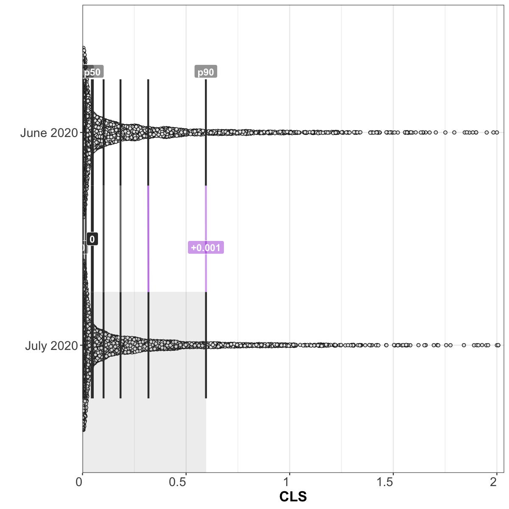

| deciles | June 2020 | July 2020 | change |
| --- | --- | --- | --- |
| p10 | 0 | **0** | 0 _(95% CI [0, 0])_ |
| p20 | 0 | **0** | 0 _(95% CI [0, 0])_ |
| p30 | 0.003 | **0.003** | 0 _(95% CI [0, 0])_ |
| p40 | 0.016 | **0.016** | 0 _(95% CI [0, 0])_ |
| p50 | 0.048 | **0.047** | 0 _(95% CI [0, 0])_ |
| p60 | 0.102 | **0.102** | 0 _(95% CI [0, 0])_ |
| p70 | 0.183 | **0.184** | 0 _(95% CI [0, 0.001])_ |
| p80 | 0.317 | **0.318** | +0.001 _(95% CI [0.001, 0.002])_ |
| p90 | 0.595 | **0.596** | +0.001 _(95% CI [-0.001, 0.002])_ |

##### Distribution of CLS changes seen by individual sites

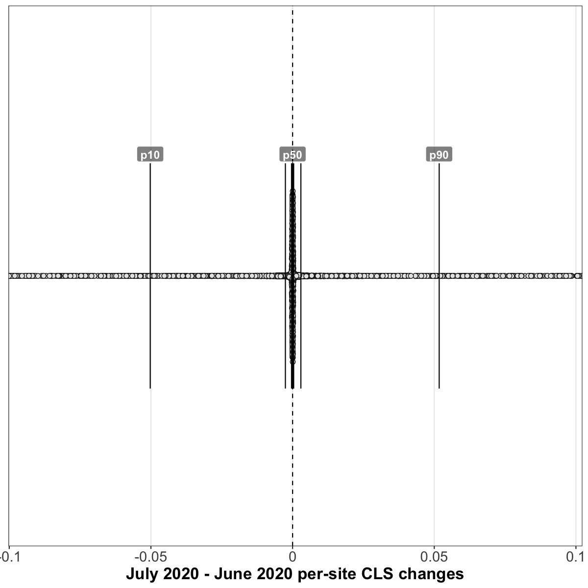

| deciles | change |
| --- | --- |
| p10 | -0.05 _(95% CI [-0.051, -0.05])_ |
| p20 | -0.003 _(95% CI [-0.003, -0.003])_ |
| p30 | 0 _(95% CI [0, 0])_ |
| p40 | 0 _(95% CI [0, 0])_ |
| p50 | 0 _(95% CI [0, 0])_ |
| p60 | 0 _(95% CI [0, 0])_ |
| p70 | 0 _(95% CI [0, 0])_ |
| p80 | +0.003 _(95% CI [0.003, 0.003])_ |
| p90 | +0.052 _(95% CI [0.051, 0.052])_ |

### July 2019 vs July 2020 (year-over-year)

CLS data was not collected in July 2019.

