# Analysis of HTTP Archive Lighthouse results, August 2020 
## Summary of queried tables
**August 2020** (latest):
  - Lighthouse versions: [`5.6.0`](https://github.com/GoogleChrome/lighthouse/releases/tag/v5.6.0), [`6.1.1`](https://github.com/GoogleChrome/lighthouse/releases/tag/v6.1.1), and [`6.2.0`](https://github.com/GoogleChrome/lighthouse/releases/tag/v6.2.0)
  - **6.3M** total Lighthouse runs
  - **0.7% error rate** (44K runs with a `runtimeError`)
  - 3.9% metric error rate (245K runs with a `null` Performance score)
  - Chrome version: `84.0.4147`

**July 2020** (one month prior):
  - Lighthouse versions: [`5.6.0`](https://github.com/GoogleChrome/lighthouse/releases/tag/v5.6.0), [`6.1.0`](https://github.com/GoogleChrome/lighthouse/releases/tag/v6.1.0), and [`6.1.1`](https://github.com/GoogleChrome/lighthouse/releases/tag/v6.1.1)
  - **6.3M** total Lighthouse runs
  - **0.74% error rate** (47K runs with a `runtimeError`)
  - 4.4% metric error rate (280K runs with a `null` Performance score)
  - Chrome versions: `83.0.4103`, and `84.0.4147`

**August 2019** (one year prior):
  - Lighthouse versions: [`2.9.1`](https://github.com/GoogleChrome/lighthouse/releases/tag/v2.9.1), and [`5.2.0`](https://github.com/GoogleChrome/lighthouse/releases/tag/v5.2.0)
  - **5.3M** total Lighthouse runs
  - **2.91% error rate** (153K runs with a `runtimeError`)
  - 5.78% metric error rate (304K runs with a `null` Performance score)
  - Chrome versions: `75.0.3770`, and `76.0.3809`

## Overall Performance score

### July 2020 vs August 2020 (month-over-month)
_results based on 5,758,356 pairs of before/after runs of the same sites without error_

##### Shifts in the overall performance distribution

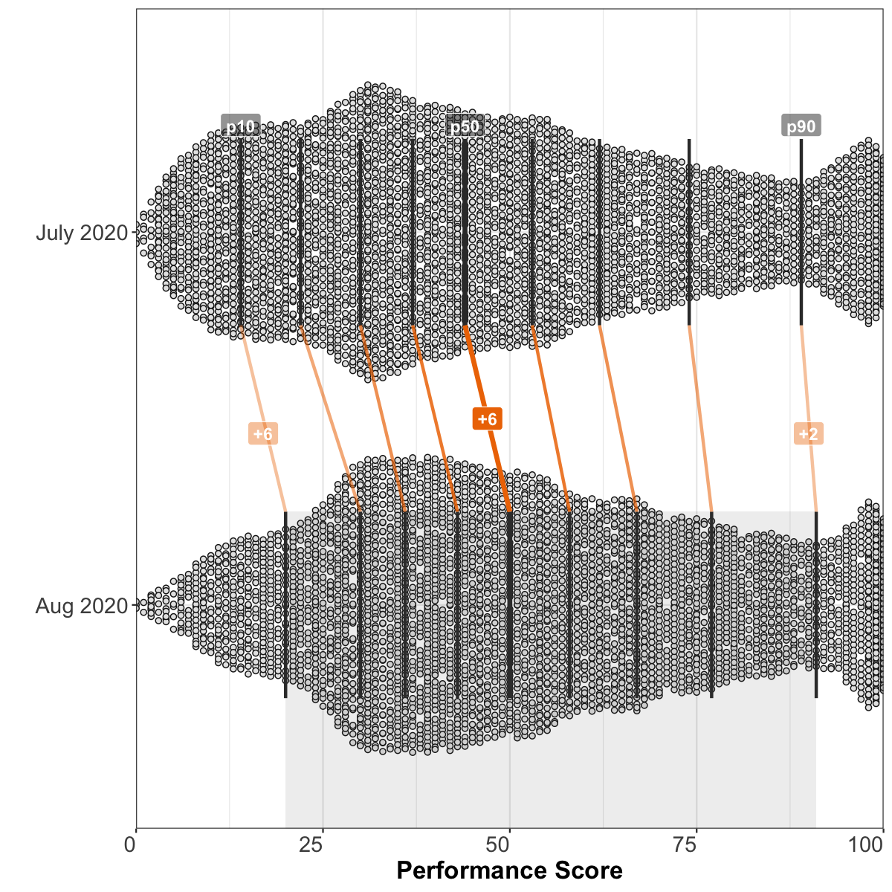

| deciles | July 2020 | August 2020 | change |
| --- | --- | --- | --- |
| p10 | 14 | **20** | +6 _(95% CI [6, 6])_ |
| p20 | 22 | **30** | +8 _(95% CI [8, 8])_ |
| p30 | 30 | **36** | +6 _(95% CI [6, 6])_ |
| p40 | 37 | **43** | +6 _(95% CI [6, 6])_ |
| p50 | 44 | **50** | +6 _(95% CI [6, 6])_ |
| p60 | 53 | **58** | +5 _(95% CI [5, 5])_ |
| p70 | 62 | **67** | +5 _(95% CI [5, 5])_ |
| p80 | 74 | **77** | +3 _(95% CI [2.8, 3.2])_ |
| p90 | 89 | **91** | +2 _(95% CI [2, 2])_ |

##### Distribution of performance changes seen by individual sites

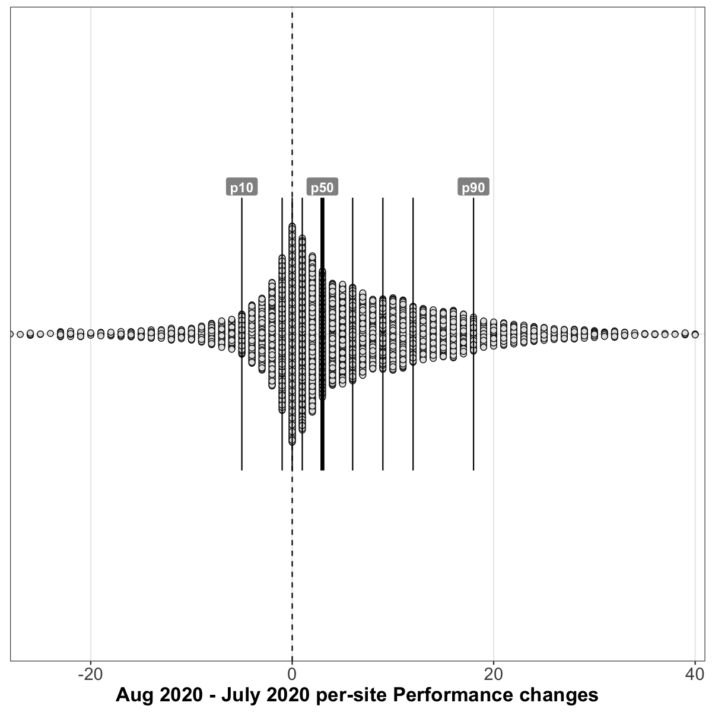

| deciles | change |
| --- | --- |
| p10 | -5 _(95% CI [-5, -5])_ |
| p20 | -1 _(95% CI [-1, -1])_ |
| p30 | 0 _(95% CI [0, 0])_ |
| p40 | +1 _(95% CI [1, 1])_ |
| p50 | +3 _(95% CI [3, 3])_ |
| p60 | +6 _(95% CI [6, 6])_ |
| p70 | +9 _(95% CI [9, 9])_ |
| p80 | +12 _(95% CI [12, 12])_ |
| p90 | +18 _(95% CI [18, 18])_ |

### August 2019 vs August 2020 (year-over-year)
_results based on 2,675,670 pairs of before/after runs of the same sites without error_

##### Shifts in the overall performance distribution

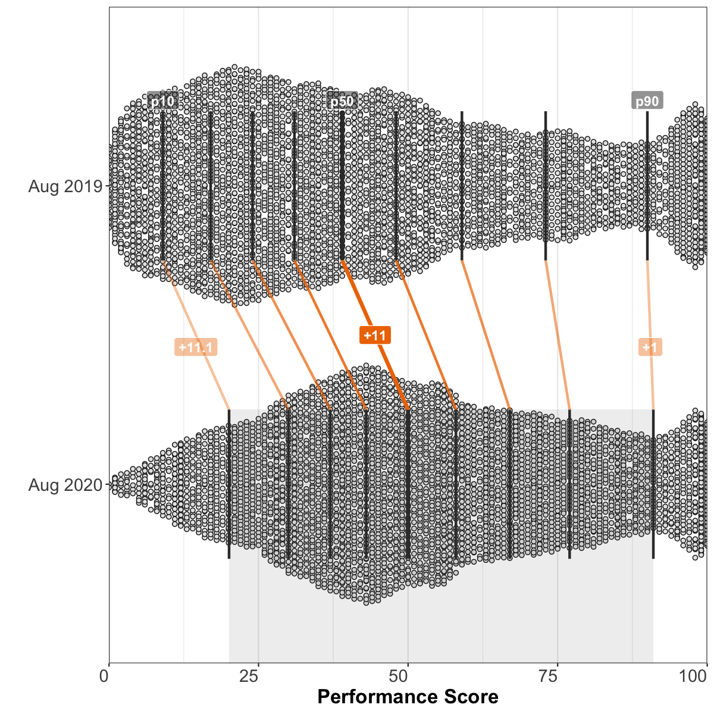

| deciles | August 2019 | August 2020 | change |
| --- | --- | --- | --- |
| p10 | 9 | **20.1** | +11.1 _(95% CI [10.6, 11.6])_ |
| p20 | 17 | **30** | +13 _(95% CI [13, 13])_ |
| p30 | 24 | **37** | +13 _(95% CI [13, 13])_ |
| p40 | 31 | **43** | +12 _(95% CI [12, 12])_ |
| p50 | 39 | **50** | +11 _(95% CI [11, 11])_ |
| p60 | 48 | **58** | +10 _(95% CI [10, 10])_ |
| p70 | 59 | **67** | +8 _(95% CI [7.9, 8.1])_ |
| p80 | 73 | **77** | +4 _(95% CI [3.8, 4.2])_ |
| p90 | 90 | **91** | +1 _(95% CI [1, 1])_ |

##### Distribution of performance changes seen by individual sites

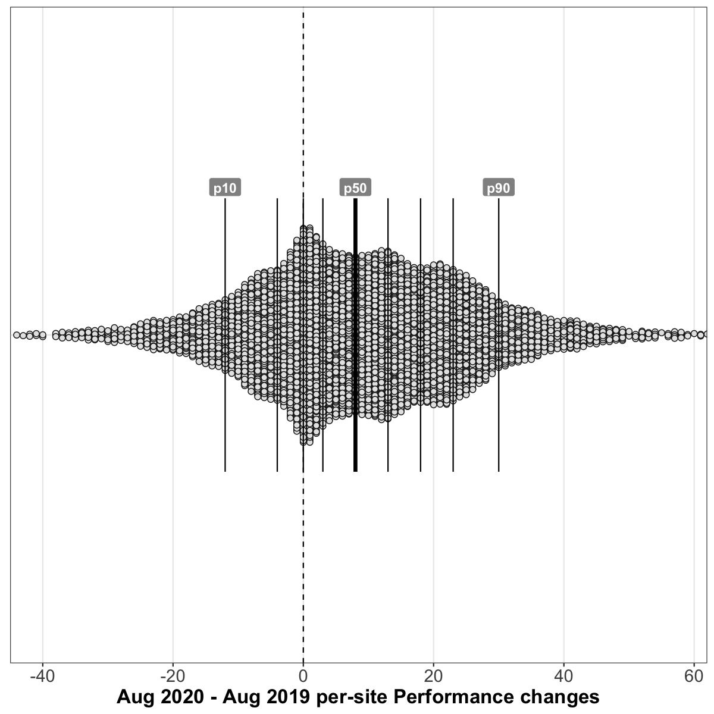

| deciles | change |
| --- | --- |
| p10 | -12 _(95% CI [-12, -12])_ |
| p20 | -4 _(95% CI [-4, -4])_ |
| p30 | 0 _(95% CI [0, 0])_ |
| p40 | +3 _(95% CI [3, 3])_ |
| p50 | +8 _(95% CI [8, 8])_ |
| p60 | +13 _(95% CI [13, 13])_ |
| p70 | +18 _(95% CI [18, 18])_ |
| p80 | +23 _(95% CI [23, 23])_ |
| p90 | +30 _(95% CI [30, 30])_ |

## First Contentful Paint
### July 2020 vs August 2020 (month-over-month)
_results based on 6,027,182 pairs of before/after runs of the same sites without error_

##### Shifts in the overall FCP distribution

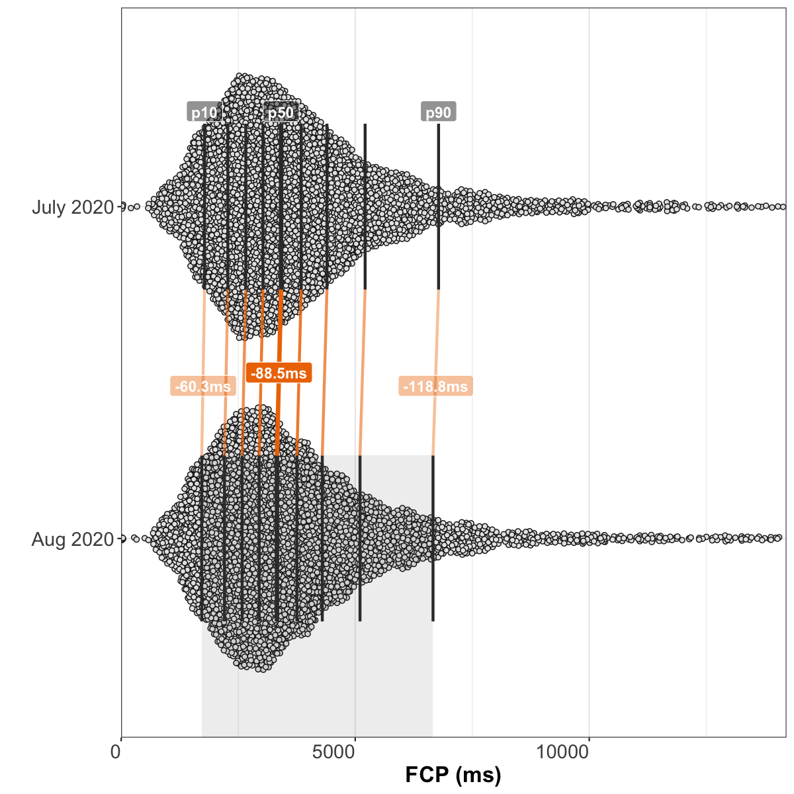

| deciles | July 2020 | August 2020 | change |
| --- | --- | --- | --- |
| p10 | 1,781.3ms | **1,721.1ms** | -60.3ms _(95% CI [-61.4, -59.1])_ |
| p20 | 2,278.7ms | **2,207ms** | -71.7ms _(95% CI [-72.6, -70.8])_ |
| p30 | 2,662.8ms | **2,584.1ms** | -78.7ms _(95% CI [-79.8, -77.6])_ |
| p40 | 3,029.3ms | **2,948.4ms** | -80.8ms _(95% CI [-82, -79.7])_ |
| p50 | 3,415.9ms | **3,327.4ms** | -88.5ms _(95% CI [-89.8, -87.2])_ |
| p60 | 3,846.3ms | **3,754.3ms** | -92.1ms _(95% CI [-93.7, -90.5])_ |
| p70 | 4,396.3ms | **4,296.4ms** | -99.9ms _(95% CI [-102, -97.7])_ |
| p80 | 5,211.6ms | **5,102.3ms** | -109.3ms _(95% CI [-112, -106.5])_ |
| p90 | 6,781ms | **6,662.2ms** | -118.8ms _(95% CI [-124.1, -113.5])_ |

##### Distribution of FCP changes seen by individual sites

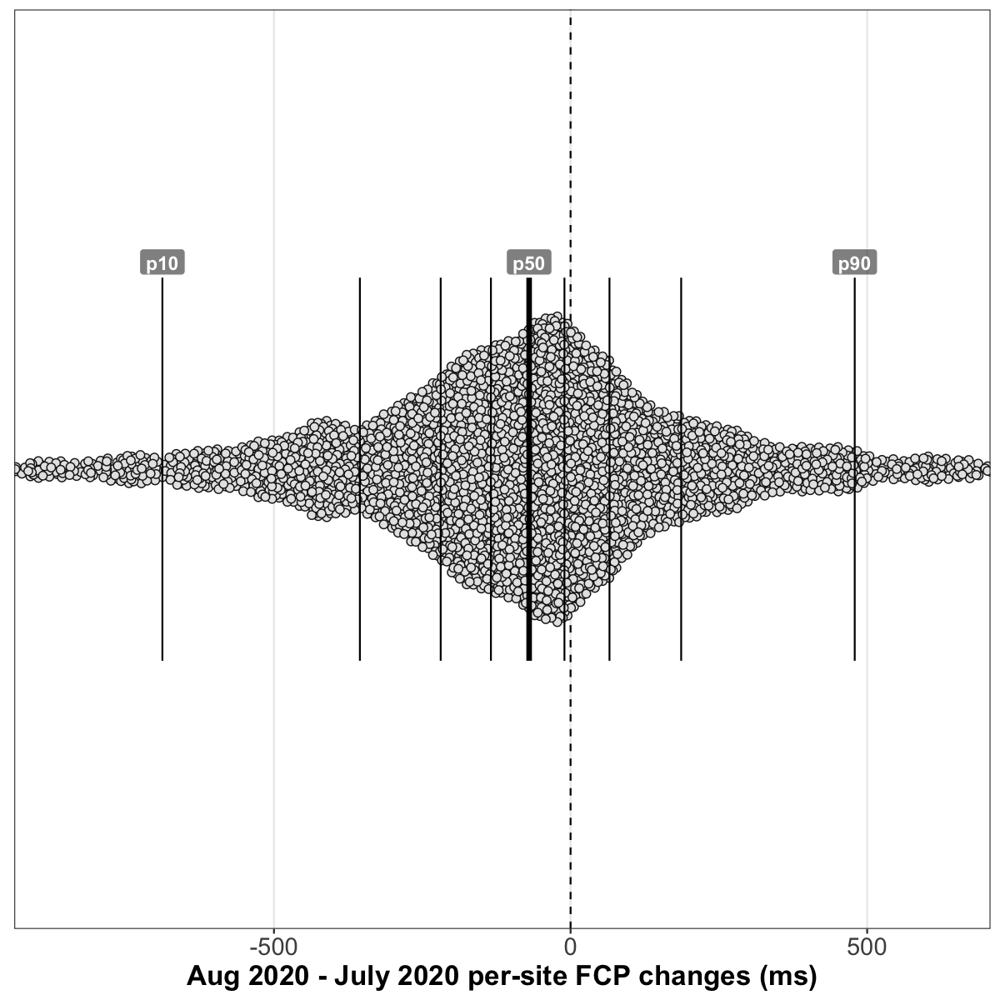

| deciles | change |
| --- | --- |
| p10 | -688.1ms _(95% CI [-689.6, -686.7])_ |
| p20 | -355.2ms _(95% CI [-355.8, -354.6])_ |
| p30 | -219ms _(95% CI [-219.3, -218.6])_ |
| p40 | -134.3ms _(95% CI [-134.6, -134])_ |
| p50 | -69.9ms _(95% CI [-70.1, -69.6])_ |
| p60 | -10.3ms _(95% CI [-10.6, -10.1])_ |
| p70 | +65.6ms _(95% CI [65.3, 65.9])_ |
| p80 | +186.5ms _(95% CI [185.9, 187])_ |
| p90 | +479ms _(95% CI [477.7, 480.4])_ |

### August 2019 vs August 2020 (year-over-year)
_results based on 2,812,157 pairs of before/after runs of the same sites without error_

##### Shifts in the overall FCP distribution

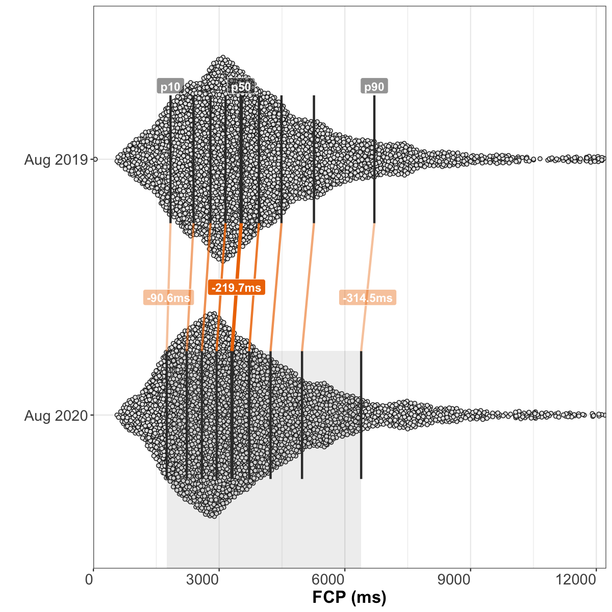

| deciles | August 2019 | August 2020 | change |
| --- | --- | --- | --- |
| p10 | 1,839.8ms | **1,749.2ms** | -90.6ms _(95% CI [-92.9, -88.3])_ |
| p20 | 2,389.1ms | **2,227.7ms** | -161.3ms _(95% CI [-163.8, -158.9])_ |
| p30 | 2,793.3ms | **2,588.6ms** | -204.7ms _(95% CI [-206.8, -202.5])_ |
| p40 | 3,152.2ms | **2,939.6ms** | -212.6ms _(95% CI [-215.1, -210.2])_ |
| p50 | 3,525.9ms | **3,306.2ms** | -219.7ms _(95% CI [-222.3, -217.2])_ |
| p60 | 3,949.2ms | **3,716.4ms** | -232.9ms _(95% CI [-236, -229.7])_ |
| p70 | 4,487.5ms | **4,227.1ms** | -260.4ms _(95% CI [-264, -256.9])_ |
| p80 | 5,262.7ms | **4,978ms** | -284.7ms _(95% CI [-290.1, -279.3])_ |
| p90 | 6,703.5ms | **6,389ms** | -314.5ms _(95% CI [-325.3, -303.7])_ |

##### Distribution of FCP changes seen by individual sites

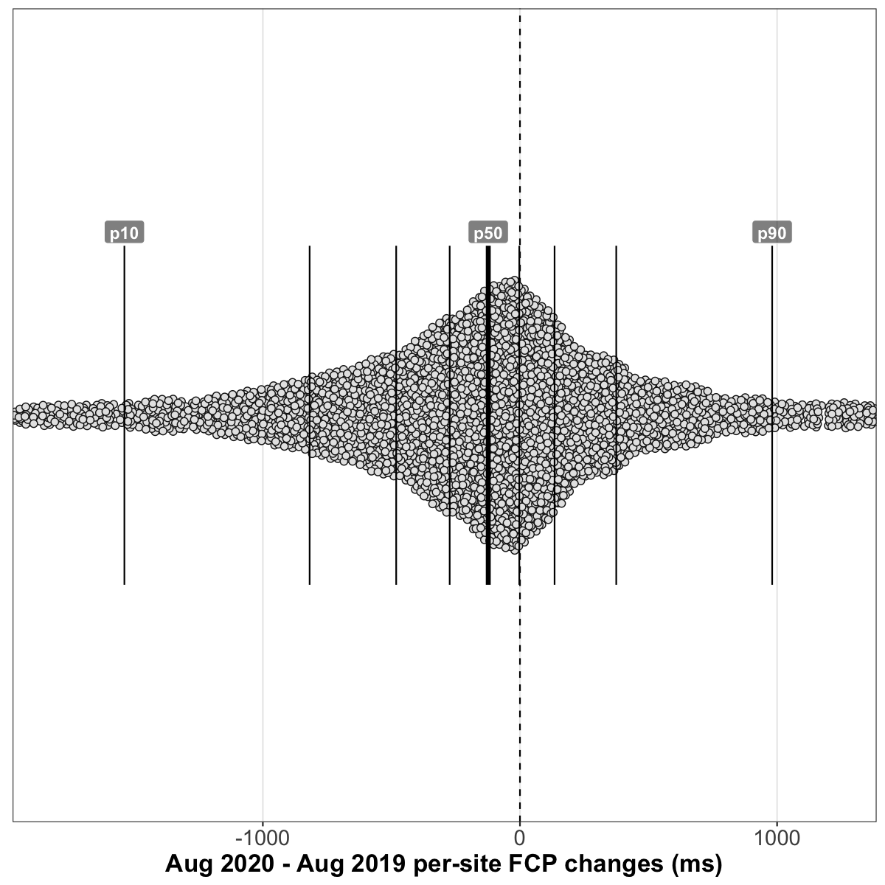

| deciles | change |
| --- | --- |
| p10 | -1,538.4ms _(95% CI [-1,542.3, -1,534.4])_ |
| p20 | -818ms _(95% CI [-820, -815.9])_ |
| p30 | -481.4ms _(95% CI [-482.7, -479.9])_ |
| p40 | -273.3ms _(95% CI [-274.3, -272.4])_ |
| p50 | -123.3ms _(95% CI [-124, -122.6])_ |
| p60 | -2.7ms _(95% CI [-3.3, -2.1])_ |
| p70 | +134.6ms _(95% CI [133.6, 135.5])_ |
| p80 | +374.5ms _(95% CI [372.9, 376.2])_ |
| p90 | +980.9ms _(95% CI [977.3, 984.6])_ |

## Speed Index
### July 2020 vs August 2020 (month-over-month)
_results based on 6,022,028 pairs of before/after runs of the same sites without error_

##### Shifts in the overall Speed Index distribution

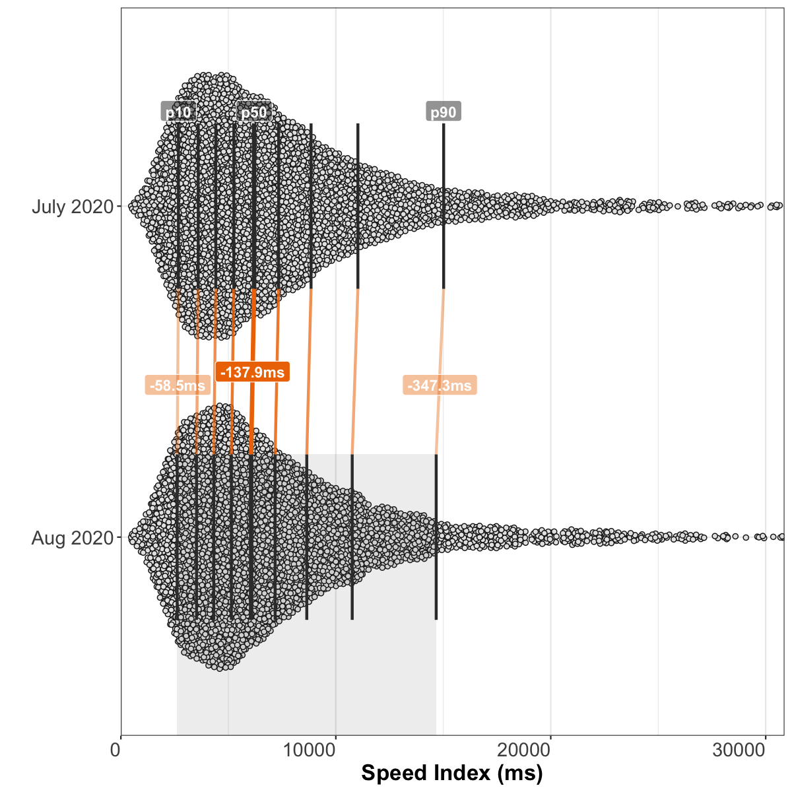

| deciles | July 2020 | August 2020 | change |
| --- | --- | --- | --- |
| p10 | 2,676.8ms | **2,618.3ms** | -58.5ms _(95% CI [-60.3, -56.7])_ |
| p20 | 3,597.9ms | **3,521ms** | -76.9ms _(95% CI [-79.1, -74.8])_ |
| p30 | 4,415.5ms | **4,321.7ms** | -93.8ms _(95% CI [-96, -91.7])_ |
| p40 | 5,255ms | **5,140.4ms** | -114.6ms _(95% CI [-117.2, -111.9])_ |
| p50 | 6,198.1ms | **6,060.3ms** | -137.9ms _(95% CI [-141.5, -134.3])_ |
| p60 | 7,340.3ms | **7,176.5ms** | -163.8ms _(95% CI [-168, -159.6])_ |
| p70 | 8,848ms | **8,649ms** | -199ms _(95% CI [-204.4, -193.7])_ |
| p80 | 11,027.2ms | **10,763ms** | -264.2ms _(95% CI [-272.4, -256.1])_ |
| p90 | 15,017.1ms | **14,669.8ms** | -347.3ms _(95% CI [-361.5, -333])_ |

##### Distribution of Speed Index changes seen by individual sites

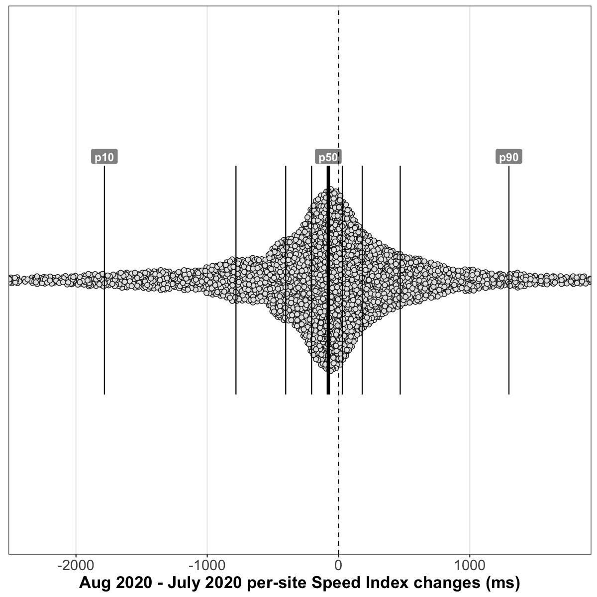

| deciles | change |
| --- | --- |
| p10 | -1,783.4ms _(95% CI [-1,787.7, -1,779])_ |
| p20 | -781.1ms _(95% CI [-782.8, -779.2])_ |
| p30 | -402.2ms _(95% CI [-403.1, -401.2])_ |
| p40 | -205ms _(95% CI [-205.6, -204.3])_ |
| p50 | -77.6ms _(95% CI [-78, -77])_ |
| p60 | +28.7ms _(95% CI [28.1, 29.1])_ |
| p70 | +180.5ms _(95% CI [179.8, 181.2])_ |
| p80 | +470.1ms _(95% CI [468.7, 471.4])_ |
| p90 | +1,298.5ms _(95% CI [1,294.7, 1,302.2])_ |

### August 2019 vs August 2020 (year-over-year)
_results based on 2,810,006 pairs of before/after runs of the same sites without error_

##### Shifts in the overall Speed Index distribution

| deciles | August 2019 | August 2020 | change |
| --- | --- | --- | --- |
| p10 | 2,699.3ms | **2,617ms** | -82.3ms _(95% CI [-86.6, -78])_ |
| p20 | 3,656.8ms | **3,526.4ms** | -130.3ms _(95% CI [-134.6, -126.1])_ |
| p30 | 4,483.8ms | **4,325ms** | -158.8ms _(95% CI [-163.6, -154])_ |
| p40 | 5,333.1ms | **5,140.7ms** | -192.5ms _(95% CI [-198.5, -186.4])_ |
| p50 | 6,276.3ms | **6,049.8ms** | -226.5ms _(95% CI [-234, -219])_ |
| p60 | 7,413.7ms | **7,142.3ms** | -271.4ms _(95% CI [-279.9, -263])_ |
| p70 | 8,872.4ms | **8,571.7ms** | -300.7ms _(95% CI [-312.3, -289.1])_ |
| p80 | 10,943.8ms | **10,622.1ms** | -321.8ms _(95% CI [-338.3, -305.3])_ |
| p90 | 14,658.6ms | **14,350.4ms** | -308.2ms _(95% CI [-333.6, -282.7])_ |

##### Distribution of Speed Index changes seen by individual sites

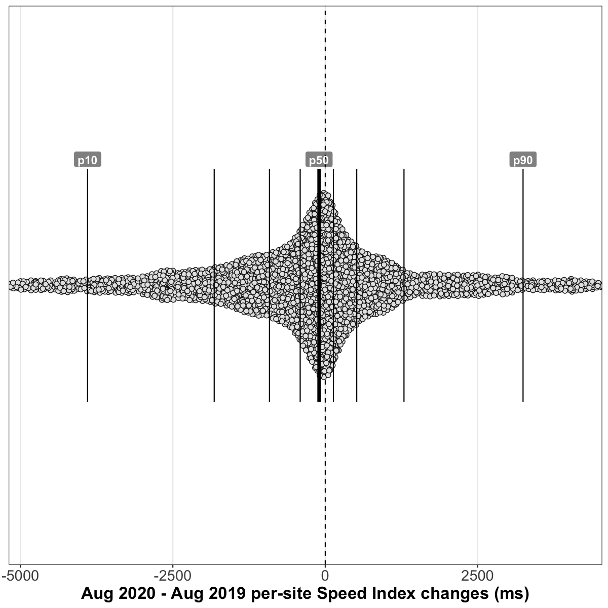

| deciles | change |
| --- | --- |
| p10 | -3,898.9ms _(95% CI [-3,911.2, -3,887.1])_ |
| p20 | -1,821.7ms _(95% CI [-1,827.9, -1,815.6])_ |
| p30 | -915.2ms _(95% CI [-918.6, -911.8])_ |
| p40 | -411.5ms _(95% CI [-413.7, -409.2])_ |
| p50 | -102.1ms _(95% CI [-103.6, -100.7])_ |
| p60 | +133.6ms _(95% CI [132, 135.2])_ |
| p70 | +516.4ms _(95% CI [513.6, 519.1])_ |
| p80 | +1,291.4ms _(95% CI [1,286.2, 1,296.6])_ |
| p90 | +3,244.4ms _(95% CI [3,232.8, 3,256.4])_ |

## Largest Contentful Paint
### July 2020 vs August 2020 (month-over-month)
_results based on 6,013,079 pairs of before/after runs of the same sites without error_

##### Shifts in the overall LCP distribution

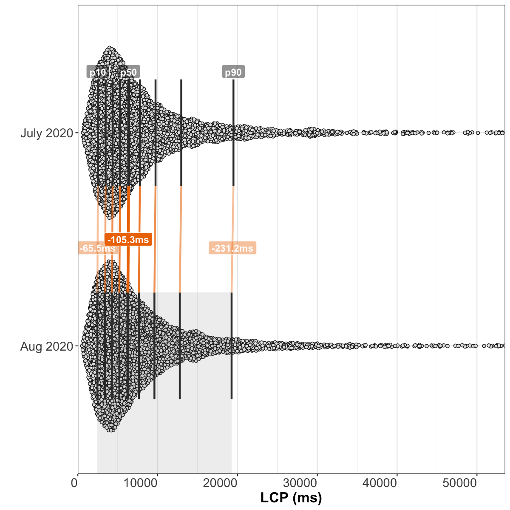

| deciles | July 2020 | August 2020 | change |
| --- | --- | --- | --- |
| p10 | 2,512.9ms | **2,447.4ms** | -65.5ms _(95% CI [-67.4, -63.7])_ |
| p20 | 3,477.2ms | **3,409.7ms** | -67.4ms _(95% CI [-69.8, -65.1])_ |
| p30 | 4,356.7ms | **4,278.3ms** | -78.4ms _(95% CI [-81.1, -75.7])_ |
| p40 | 5,288.1ms | **5,198.5ms** | -89.6ms _(95% CI [-92.9, -86.3])_ |
| p50 | 6,373.6ms | **6,268.3ms** | -105.3ms _(95% CI [-109.5, -101])_ |
| p60 | 7,773.8ms | **7,647.9ms** | -125.9ms _(95% CI [-131.1, -120.7])_ |
| p70 | 9,735ms | **9,594.9ms** | -140ms _(95% CI [-147.3, -132.7])_ |
| p80 | 12,956.6ms | **12,772.6ms** | -184ms _(95% CI [-195.5, -172.6])_ |
| p90 | 19,494.7ms | **19,263.5ms** | -231.2ms _(95% CI [-253.4, -209.1])_ |

##### Distribution of LCP changes seen by individual sites

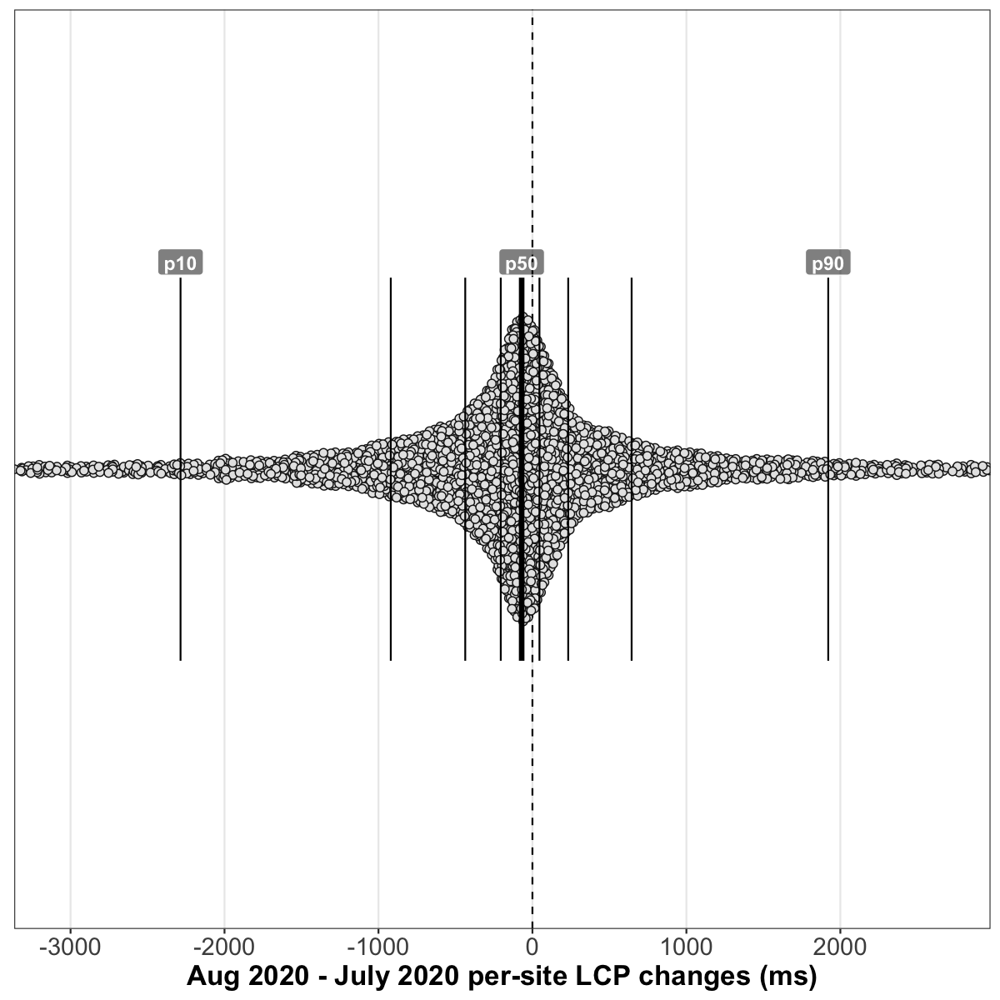

| deciles | change |
| --- | --- |
| p10 | -2,285.6ms _(95% CI [-2,292, -2,279.5])_ |
| p20 | -920.1ms _(95% CI [-922.4, -917.8])_ |
| p30 | -436.4ms _(95% CI [-437.6, -435.2])_ |
| p40 | -205.7ms _(95% CI [-206.3, -205])_ |
| p50 | -69.9ms _(95% CI [-70.4, -69.5])_ |
| p60 | +45.6ms _(95% CI [45.1, 46.2])_ |
| p70 | +232.5ms _(95% CI [231.5, 233.4])_ |
| p80 | +644.3ms _(95% CI [642.1, 646.3])_ |
| p90 | +1,921.4ms _(95% CI [1,915.3, 1,927.7])_ |

### August 2019 vs August 2020 (year-over-year)

LCP data was not collected in August 2019.

## Time to Interactive
### July 2020 vs August 2020 (month-over-month)
_results based on 5,774,063 pairs of before/after runs of the same sites without error_

##### Shifts in the overall TTI distribution

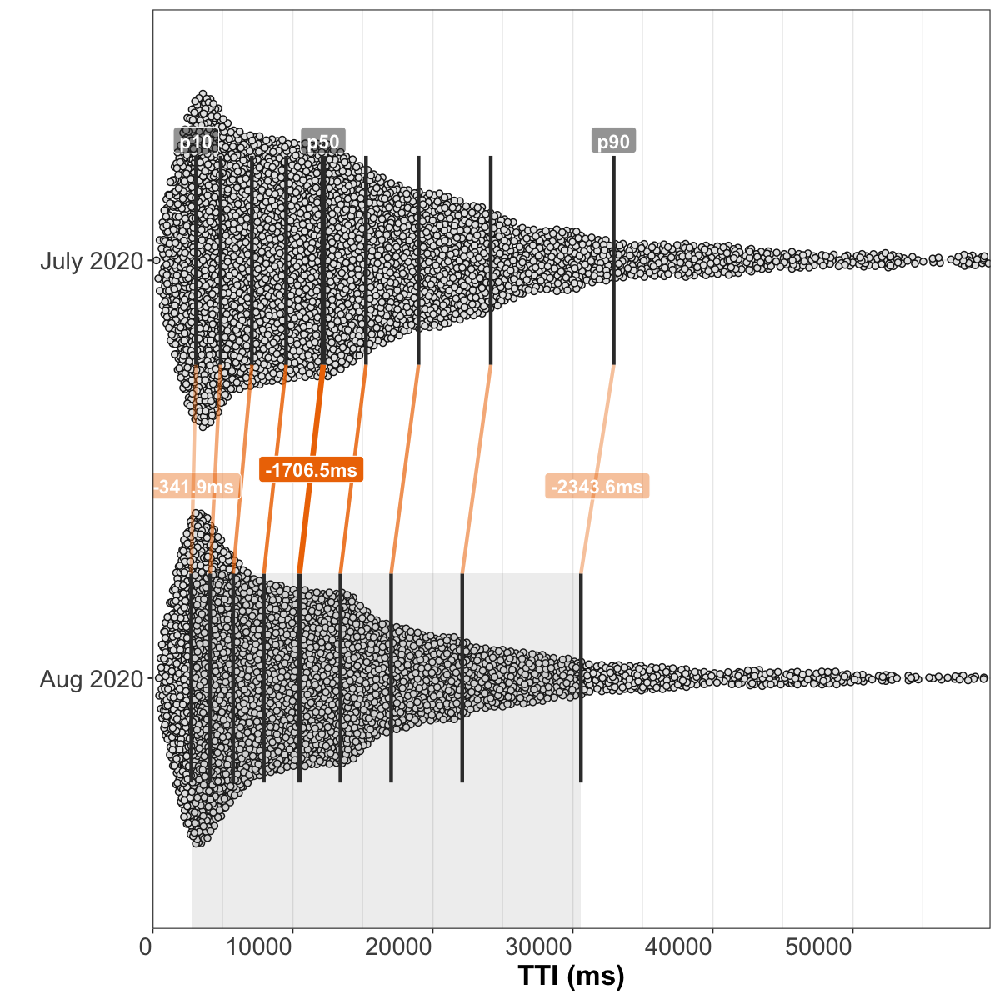

| deciles | July 2020 | August 2020 | change |
| --- | --- | --- | --- |
| p10 | 3,102.1ms | **2,760.2ms** | -341.9ms _(95% CI [-346.3, -337.6])_ |
| p20 | 4,861.1ms | **4,109.5ms** | -751.5ms _(95% CI [-758, -745])_ |
| p30 | 7,091.9ms | **5,756.7ms** | -1,335.2ms _(95% CI [-1,343.7, -1,326.8])_ |
| p40 | 9,539.6ms | **7,950.2ms** | -1,589.4ms _(95% CI [-1,599.7, -1,579.1])_ |
| p50 | 12,194.3ms | **10,487.8ms** | -1,706.5ms _(95% CI [-1,717.9, -1,695.1])_ |
| p60 | 15,244.1ms | **13,415.6ms** | -1,828.5ms _(95% CI [-1,841.4, -1,815.5])_ |
| p70 | 18,999.6ms | **17,039.9ms** | -1,959.8ms _(95% CI [-1,974.2, -1,945.3])_ |
| p80 | 24,156.1ms | **22,118.4ms** | -2,037.7ms _(95% CI [-2,057.8, -2,017.6])_ |
| p90 | 32,939.8ms | **30,596.3ms** | -2,343.6ms _(95% CI [-2,374, -2,313.1])_ |

##### Distribution of TTI changes seen by individual sites

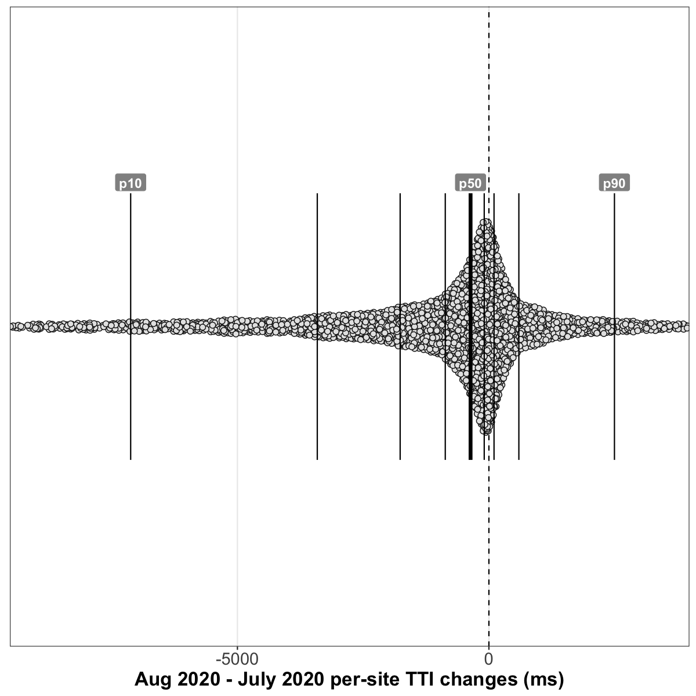

| deciles | change |
| --- | --- |
| p10 | -7,122.7ms _(95% CI [-7,137.6, -7,107.5])_ |
| p20 | -3,412.3ms _(95% CI [-3,419.8, -3,404.8])_ |
| p30 | -1,764.6ms _(95% CI [-1,769, -1,760.2])_ |
| p40 | -867.6ms _(95% CI [-870.3, -864.9])_ |
| p50 | -364.8ms _(95% CI [-366.3, -363.3])_ |
| p60 | -93.1ms _(95% CI [-93.9, -92.4])_ |
| p70 | +101.9ms _(95% CI [100.9, 102.9])_ |
| p80 | +595.5ms _(95% CI [592.7, 598.3])_ |
| p90 | +2,496.1ms _(95% CI [2,487.6, 2,504.9])_ |

### August 2019 vs August 2020 (year-over-year)
_results based on 2,682,123 pairs of before/after runs of the same sites without error_

##### Shifts in the overall TTI distribution

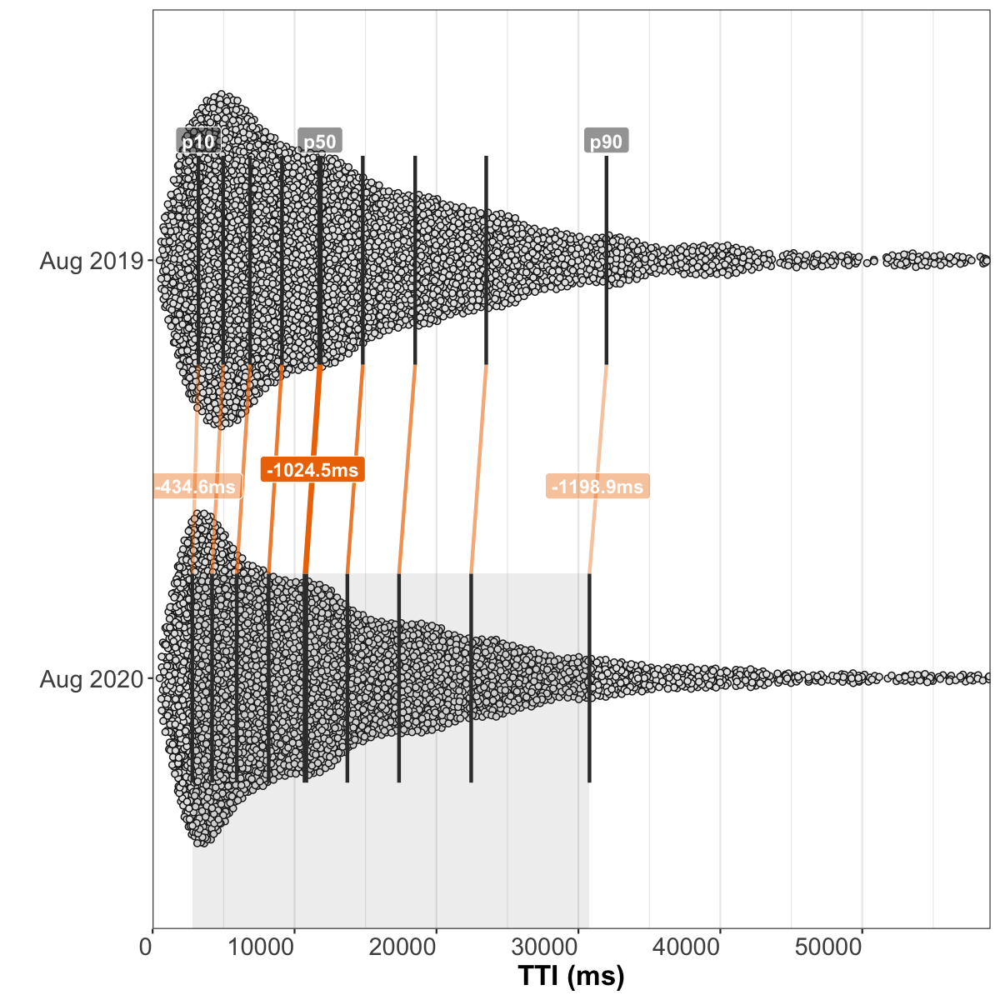

| deciles | August 2019 | August 2020 | change |
| --- | --- | --- | --- |
| p10 | 3,229.4ms | **2,794.8ms** | -434.6ms _(95% CI [-441.7, -427.5])_ |
| p20 | 4,968.9ms | **4,188.5ms** | -780.4ms _(95% CI [-791, -769.7])_ |
| p30 | 6,861.9ms | **5,928.6ms** | -933.3ms _(95% CI [-946.8, -919.8])_ |
| p40 | 9,111.1ms | **8,175.9ms** | -935.2ms _(95% CI [-952.4, -918.1])_ |
| p50 | 11,790.9ms | **10,766.3ms** | -1,024.5ms _(95% CI [-1,044.9, -1,004.2])_ |
| p60 | 14,808.3ms | **13,721.2ms** | -1,087.1ms _(95% CI [-1,111.7, -1,062.5])_ |
| p70 | 18,497.8ms | **17,362.3ms** | -1,135.5ms _(95% CI [-1,164.5, -1,106.4])_ |
| p80 | 23,504.1ms | **22,444.8ms** | -1,059.4ms _(95% CI [-1,100.1, -1,018.6])_ |
| p90 | 31,978.2ms | **30,779.3ms** | -1,198.9ms _(95% CI [-1,264.8, -1,133])_ |

##### Distribution of TTI changes seen by individual sites

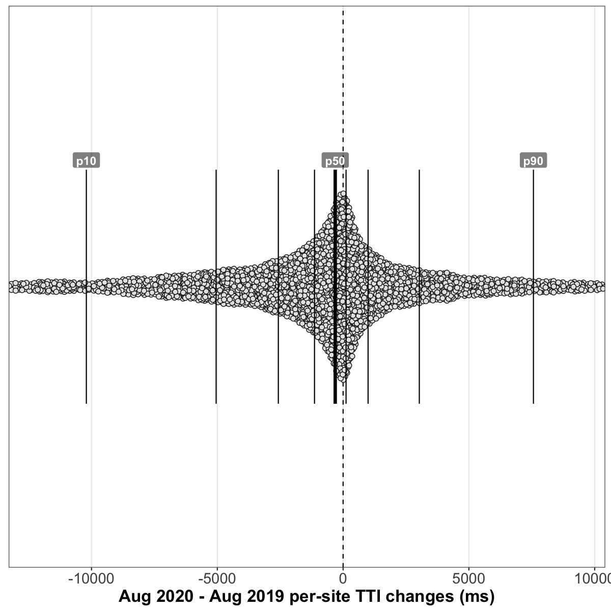

| deciles | change |
| --- | --- |
| p10 | -10,205.4ms _(95% CI [-10,235, -10,176])_ |
| p20 | -5,046.9ms _(95% CI [-5,062.5, -5,031.9])_ |
| p30 | -2,574.4ms _(95% CI [-2,584.4, -2,564.2])_ |
| p40 | -1,136.8ms _(95% CI [-1,143, -1,130.2])_ |
| p50 | -313.4ms _(95% CI [-317.2, -309.8])_ |
| p60 | +117.1ms _(95% CI [114.5, 119.8])_ |
| p70 | +992.6ms _(95% CI [985, 1,000.6])_ |
| p80 | +3,029.1ms _(95% CI [3,016.2, 3,042.1])_ |
| p90 | +7,565.3ms _(95% CI [7,537.8, 7,591.3])_ |

## Total Blocking Time
### July 2020 vs August 2020 (month-over-month)
_results based on 5,774,063 pairs of before/after runs of the same sites without error_

##### Shifts in the overall TBT distribution

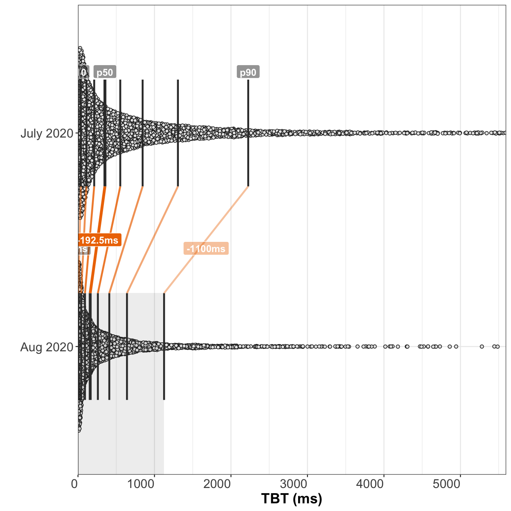

| deciles | July 2020 | August 2020 | change |
| --- | --- | --- | --- |
| p10 | 0ms | **0ms** | 0ms _(95% CI [0, 0])_ |
| p20 | 37.9ms | **4.5ms** | -33.4ms _(95% CI [-33.6, -33.3])_ |
| p30 | 110.8ms | **41.5ms** | -69.2ms _(95% CI [-69.5, -68.9])_ |
| p40 | 211.9ms | **91.3ms** | -120.7ms _(95% CI [-121.2, -120.2])_ |
| p50 | 352.1ms | **159.7ms** | -192.5ms _(95% CI [-193.2, -191.8])_ |
| p60 | 552.8ms | **259.9ms** | -292.9ms _(95% CI [-293.9, -291.9])_ |
| p70 | 844.9ms | **409.3ms** | -435.7ms _(95% CI [-437.1, -434.2])_ |
| p80 | 1,306.4ms | **640.4ms** | -666ms _(95% CI [-668.2, -663.8])_ |
| p90 | 2,225.4ms | **1,125.4ms** | -1,100ms _(95% CI [-1,104.1, -1,095.9])_ |

##### Distribution of TBT changes seen by individual sites

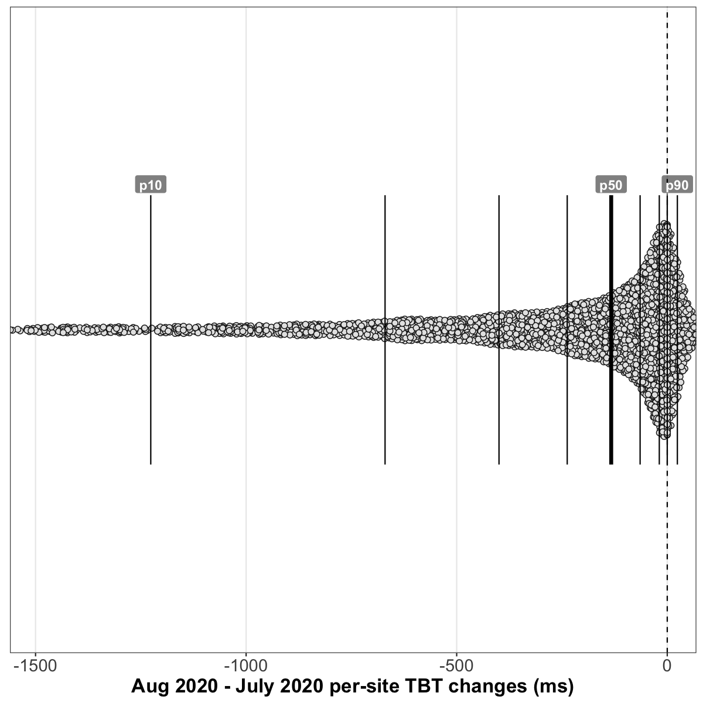

| deciles | change |
| --- | --- |
| p10 | -1,226.4ms _(95% CI [-1,228.6, -1,224.3])_ |
| p20 | -670.1ms _(95% CI [-671.2, -668.9])_ |
| p30 | -399.5ms _(95% CI [-400.3, -398.7])_ |
| p40 | -237.5ms _(95% CI [-238, -237])_ |
| p50 | -133.1ms _(95% CI [-133.4, -132.7])_ |
| p60 | -64.5ms _(95% CI [-64.7, -64.2])_ |
| p70 | -18.9ms _(95% CI [-19, -18.7])_ |
| p80 | 0ms _(95% CI [0, 0])_ |
| p90 | +24ms _(95% CI [23.8, 24.2])_ |

### August 2019 vs August 2020 (year-over-year)
_results based on 2,682,123 pairs of before/after runs of the same sites without error_

##### Shifts in the overall TBT distribution

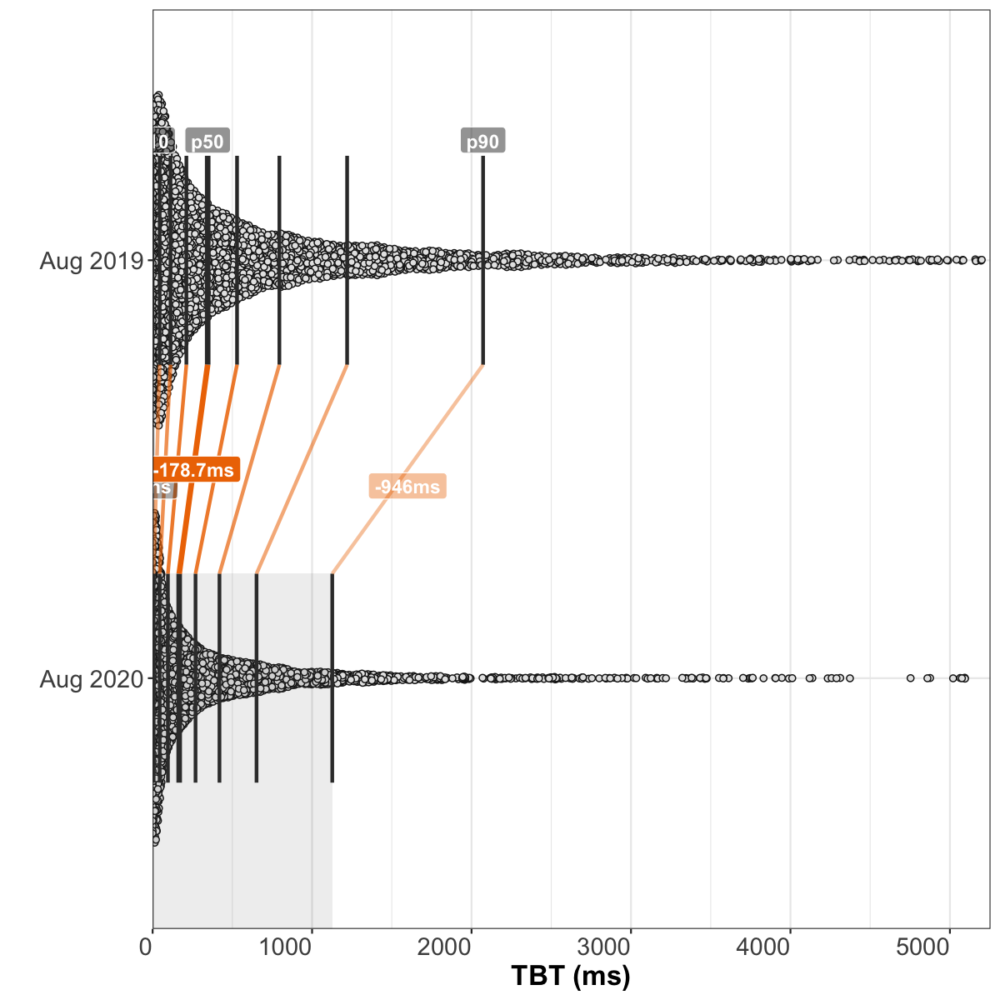

| deciles | August 2019 | August 2020 | change |
| --- | --- | --- | --- |
| p10 | 0ms | **0ms** | 0ms _(95% CI [0, 0])_ |
| p20 | 44.1ms | **6.3ms** | -37.8ms _(95% CI [-38.2, -37.5])_ |
| p30 | 112.3ms | **44.2ms** | -68.2ms _(95% CI [-68.7, -67.7])_ |
| p40 | 211.7ms | **95.8ms** | -115.8ms _(95% CI [-116.5, -115.1])_ |
| p50 | 345.3ms | **166.6ms** | -178.7ms _(95% CI [-179.7, -177.6])_ |
| p60 | 529.3ms | **269ms** | -260.3ms _(95% CI [-261.7, -258.9])_ |
| p70 | 794.9ms | **419.1ms** | -375.8ms _(95% CI [-377.8, -373.7])_ |
| p80 | 1,219.7ms | **651.6ms** | -568.1ms _(95% CI [-571.4, -564.8])_ |
| p90 | 2,072.5ms | **1,126.5ms** | -946ms _(95% CI [-952.2, -939.8])_ |

##### Distribution of TBT changes seen by individual sites

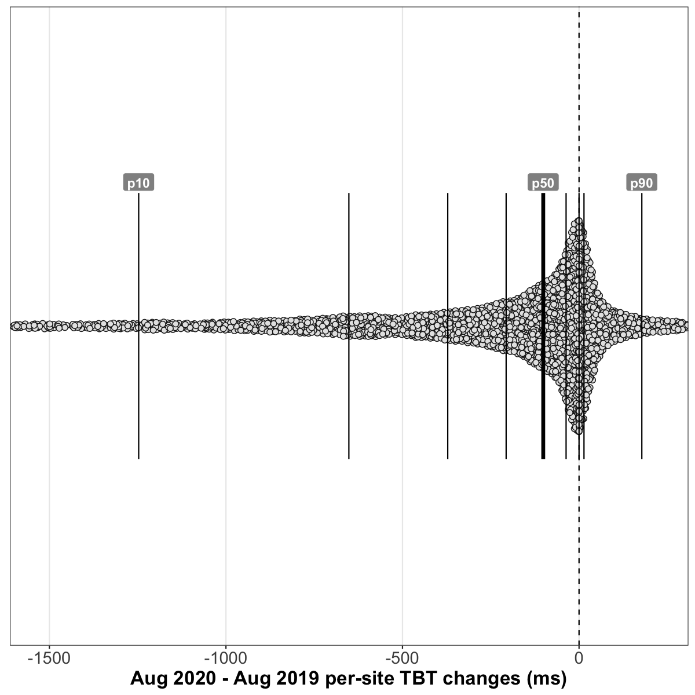

| deciles | change |
| --- | --- |
| p10 | -1,247.1ms _(95% CI [-1,251, -1,243.7])_ |
| p20 | -651.9ms _(95% CI [-653.9, -650])_ |
| p30 | -371.9ms _(95% CI [-373.1, -370.7])_ |
| p40 | -206.5ms _(95% CI [-207.2, -205.8])_ |
| p50 | -101.4ms _(95% CI [-101.9, -100.9])_ |
| p60 | -36.7ms _(95% CI [-37, -36.4])_ |
| p70 | 0ms _(95% CI [0, 0])_ |
| p80 | +14ms _(95% CI [13.7, 14.3])_ |
| p90 | +177.8ms _(95% CI [176.6, 179])_ |

## Cumulative Layout Shift
### July 2020 vs August 2020 (month-over-month)
_results based on 6,002,269 pairs of before/after runs of the same sites without error_

##### Shifts in the overall CLS distribution

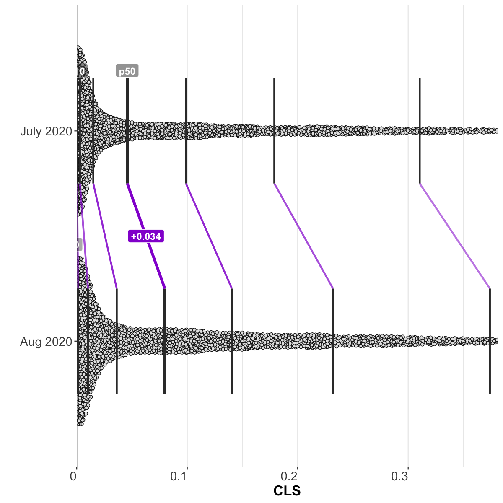

| deciles | July 2020 | August 2020 | change |
| --- | --- | --- | --- |
| p10 | 0 | **0** | 0 _(95% CI [0, 0])_ |
| p20 | 0 | **0.001** | +0.001 _(95% CI [0.001, 0.001])_ |
| p30 | 0.003 | **0.01** | +0.007 _(95% CI [0.007, 0.007])_ |
| p40 | 0.015 | **0.036** | +0.021 _(95% CI [0.021, 0.021])_ |
| p50 | 0.046 | **0.08** | +0.034 _(95% CI [0.034, 0.034])_ |
| p60 | 0.099 | **0.14** | +0.042 _(95% CI [0.041, 0.042])_ |
| p70 | 0.179 | **0.232** | +0.053 _(95% CI [0.053, 0.054])_ |
| p80 | 0.31 | **0.374** | +0.064 _(95% CI [0.063, 0.064])_ |
| p90 | 0.585 | **0.673** | +0.089 _(95% CI [0.088, 0.09])_ |

##### Distribution of CLS changes seen by individual sites

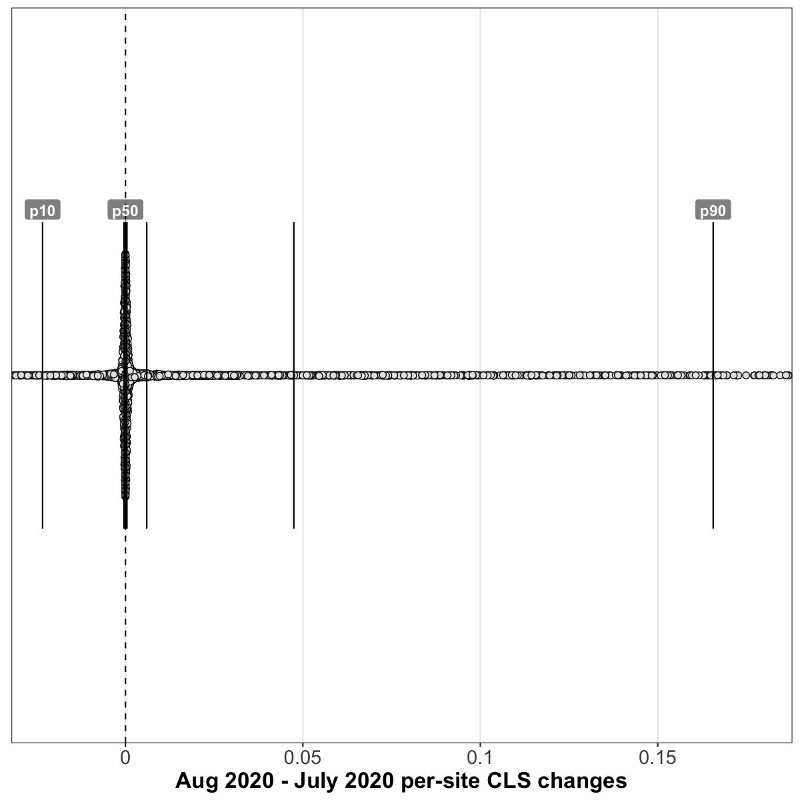

| deciles | change |
| --- | --- |
| p10 | -0.023 _(95% CI [-0.024, -0.023])_ |
| p20 | 0 _(95% CI [0, 0])_ |
| p30 | 0 _(95% CI [0, 0])_ |
| p40 | 0 _(95% CI [0, 0])_ |
| p50 | 0 _(95% CI [0, 0])_ |
| p60 | 0 _(95% CI [0, 0])_ |
| p70 | +0.006 _(95% CI [0.006, 0.006])_ |
| p80 | +0.047 _(95% CI [0.047, 0.048])_ |
| p90 | +0.166 _(95% CI [0.165, 0.166])_ |

### August 2019 vs August 2020 (year-over-year)

CLS data was not collected in August 2019.

