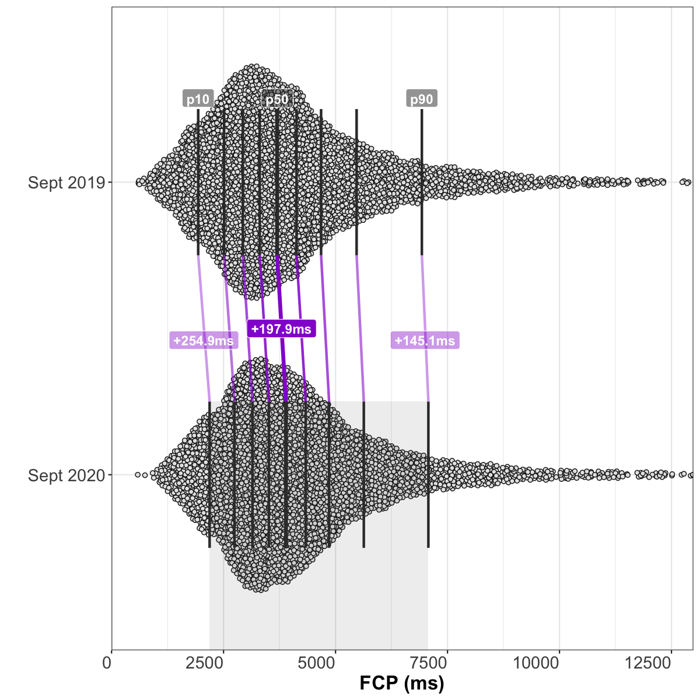

# Analysis of HTTP Archive Lighthouse results, September 2020 
## Summary of queried tables
**September 2020** (latest):
  - Lighthouse versions: [`5.6.0`](https://github.com/GoogleChrome/lighthouse/releases/tag/v5.6.0), and [`6.3.0`](https://github.com/GoogleChrome/lighthouse/releases/tag/v6.3.0)
  - **6.8M** total Lighthouse runs
  - **0.86% error rate** (59K runs with a `runtimeError`)
  - 11.76% metric error rate (801K runs with a `null` Performance score)
  - Chrome version: `85.0.4183`

**July 2020** (two months prior):
  - Lighthouse versions: [`5.6.0`](https://github.com/GoogleChrome/lighthouse/releases/tag/v5.6.0), [`6.1.0`](https://github.com/GoogleChrome/lighthouse/releases/tag/v6.1.0), and [`6.1.1`](https://github.com/GoogleChrome/lighthouse/releases/tag/v6.1.1)
  - **6.3M** total Lighthouse runs
  - **0.74% error rate** (47K runs with a `runtimeError`)
  - 4.4% metric error rate (280K runs with a `null` Performance score)
  - Chrome versions: `83.0.4103`, and `84.0.4147`

**September 2019** (one year prior):
  - Lighthouse versions: [`5.2.0`](https://github.com/GoogleChrome/lighthouse/releases/tag/v5.2.0), [`5.3.0`](https://github.com/GoogleChrome/lighthouse/releases/tag/v5.3.0), and [`5.4.0`](https://github.com/GoogleChrome/lighthouse/releases/tag/v5.4.0)
  - **5.2M** total Lighthouse runs
  - **2.32% error rate** (122K runs with a `runtimeError`)
  - 5.3% metric error rate (278K runs with a `null` Performance score)
  - Chrome versions: `76.0.3809`, and `77.0.3865`

## Overall Performance score

### July 2020 vs September 2020 (month-over-month)
_results based on 4,129,108 pairs of before/after runs of the same sites without error_

##### Shifts in the overall performance distribution

| deciles | July 2020 | September 2020 | change |
| --- | --- | --- | --- |
| p10 | 14.6 | **8** | -6.6 _(95% CI [-7.4, -5.8])_ |
| p20 | 23 | **13** | -10 _(95% CI [-10, -10])_ |
| p30 | 31 | **18** | -13 _(95% CI [-13, -13])_ |
| p40 | 38 | **24** | -14 _(95% CI [-14.4, -13.6])_ |
| p50 | 45 | **31** | -14 _(95% CI [-14, -14])_ |
| p60 | 53 | **39** | -14 _(95% CI [-14, -14])_ |
| p70 | 62 | **48** | -14 _(95% CI [-14.1, -13.9])_ |
| p80 | 74 | **60.9** | -13.1 _(95% CI [-13.5, -12.6])_ |
| p90 | 89 | **80** | -9 _(95% CI [-9, -9])_ |

##### Distribution of performance changes seen by individual sites

| deciles | change |
| --- | --- |
| p10 | -26 _(95% CI [-26, -26])_ |
| p20 | -20 _(95% CI [-20, -20])_ |
| p30 | -16 _(95% CI [-16, -16])_ |
| p40 | -12 _(95% CI [-12, -12])_ |
| p50 | -9 _(95% CI [-9, -9])_ |
| p60 | -6 _(95% CI [-6, -6])_ |
| p70 | -4 _(95% CI [-4, -4])_ |
| p80 | -2 _(95% CI [-2, -2])_ |
| p90 | +0.4 _(95% CI [0, 1])_ |

### September 2019 vs September 2020 (year-over-year)
_results based on 2,516,208 pairs of before/after runs of the same sites without error_

##### Shifts in the overall performance distribution

| deciles | September 2019 | September 2020 | change |
| --- | --- | --- | --- |
| p10 | 8 | **8** | 0 _(95% CI [0, 0])_ |
| p20 | 15.2 | **13** | -2.2 _(95% CI [-2.9, -1.5])_ |
| p30 | 22 | **18** | -4 _(95% CI [-4.2, -3.8])_ |
| p40 | 29 | **25** | -4 _(95% CI [-4.1, -3.9])_ |
| p50 | 36 | **31** | -5 _(95% CI [-5.1, -4.9])_ |
| p60 | 45 | **39** | -6 _(95% CI [-6, -6])_ |
| p70 | 55 | **49** | -6 _(95% CI [-6, -6])_ |
| p80 | 69 | **61** | -8 _(95% CI [-8, -8])_ |
| p90 | 88 | **80** | -8 _(95% CI [-8, -8])_ |

##### Distribution of performance changes seen by individual sites

| deciles | change |
| --- | --- |
| p10 | -24 _(95% CI [-24, -24])_ |
| p20 | -16 _(95% CI [-16, -16])_ |
| p30 | -11 _(95% CI [-11, -11])_ |
| p40 | -7 _(95% CI [-7, -7])_ |
| p50 | -3 _(95% CI [-3, -3])_ |
| p60 | -1 _(95% CI [-1, -1])_ |
| p70 | +2 _(95% CI [2, 2])_ |
| p80 | +7 _(95% CI [7, 7])_ |
| p90 | +15 _(95% CI [15, 15])_ |

## First Contentful Paint
### July 2020 vs September 2020 (month-over-month)
_results based on 4,686,427 pairs of before/after runs of the same sites without error_

##### Shifts in the overall FCP distribution

| deciles | July 2020 | September 2020 | change |
| --- | --- | --- | --- |
| p10 | 1,822ms | **2,184.1ms** | +362.1ms _(95% CI [360.5, 363.7])_ |
| p20 | 2,314.3ms | **2,740.4ms** | +426.1ms _(95% CI [424.7, 427.6])_ |
| p30 | 2,688.7ms | **3,149.3ms** | +460.7ms _(95% CI [459.4, 461.9])_ |
| p40 | 3,048ms | **3,525.1ms** | +477.1ms _(95% CI [475.6, 478.7])_ |
| p50 | 3,428.2ms | **3,919.1ms** | +490.9ms _(95% CI [489.3, 492.5])_ |
| p60 | 3,853.1ms | **4,372.3ms** | +519.2ms _(95% CI [517.2, 521.2])_ |
| p70 | 4,396.1ms | **4,915.3ms** | +519.2ms _(95% CI [516.5, 521.9])_ |
| p80 | 5,201.3ms | **5,742.7ms** | +541.4ms _(95% CI [537.6, 545.1])_ |
| p90 | 6,749.3ms | **7,306.5ms** | +557.2ms _(95% CI [549.7, 564.6])_ |

##### Distribution of FCP changes seen by individual sites

| deciles | change |
| --- | --- |
| p10 | -244.8ms _(95% CI [-246.4, -243])_ |
| p20 | +100.5ms _(95% CI [99.8, 101.2])_ |
| p30 | +251.8ms _(95% CI [251.3, 252.3])_ |
| p40 | +359.3ms _(95% CI [358.9, 359.7])_ |
| p50 | +457.9ms _(95% CI [457.5, 458.4])_ |
| p60 | +562.8ms _(95% CI [562.3, 563.3])_ |
| p70 | +690.4ms _(95% CI [689.9, 691.1])_ |
| p80 | +877.3ms _(95% CI [876.4, 878.1])_ |
| p90 | +1,273.3ms _(95% CI [1,271.5, 1,275.3])_ |

### September 2019 vs September 2020 (year-over-year)
_results based on 2,863,155 pairs of before/after runs of the same sites without error_

##### Shifts in the overall FCP distribution

| deciles | September 2019 | September 2020 | change |
| --- | --- | --- | --- |
| p10 | 1,933.9ms | **2,188.8ms** | +254.9ms _(95% CI [252.2, 257.6])_ |
| p20 | 2,511.5ms | **2,743.9ms** | +232.4ms _(95% CI [229.9, 234.9])_ |
| p30 | 2,930.6ms | **3,145.5ms** | +214.9ms _(95% CI [212.7, 217.1])_ |
| p40 | 3,307.8ms | **3,511.8ms** | +204.1ms _(95% CI [201.6, 206.5])_ |
| p50 | 3,696.1ms | **3,894.1ms** | +197.9ms _(95% CI [195.2, 200.7])_ |
| p60 | 4,129.7ms | **4,334.7ms** | +204.9ms _(95% CI [201.5, 208.4])_ |
| p70 | 4,677.5ms | **4,855.9ms** | +178.3ms _(95% CI [174.2, 182.4])_ |
| p80 | 5,470.6ms | **5,631.3ms** | +160.7ms _(95% CI [154.9, 166.5])_ |
| p90 | 6,927.6ms | **7,072.8ms** | +145.1ms _(95% CI [133.8, 156.5])_ |

##### Distribution of FCP changes seen by individual sites

| deciles | change |
| --- | --- |
| p10 | -1,125.1ms _(95% CI [-1,129.5, -1,120.5])_ |
| p20 | -408ms _(95% CI [-410.1, -405.9])_ |
| p30 | -88.1ms _(95% CI [-89.3, -86.7])_ |
| p40 | +105.2ms _(95% CI [104.3, 106.1])_ |
| p50 | +247.9ms _(95% CI [247.1, 248.6])_ |
| p60 | +386.1ms _(95% CI [385.2, 386.9])_ |
| p70 | +558.3ms _(95% CI [557.2, 559.4])_ |
| p80 | +833.1ms _(95% CI [831.3, 834.8])_ |
| p90 | +1,469.7ms _(95% CI [1,465.9, 1,473.5])_ |

## Speed Index
### July 2020 vs September 2020 (month-over-month)
_results based on 4,682,175 pairs of before/after runs of the same sites without error_

##### Shifts in the overall Speed Index distribution

| deciles | July 2020 | September 2020 | change |
| --- | --- | --- | --- |
| p10 | 2,751.6ms | **2,978ms** | +226.4ms _(95% CI [223.8, 229.1])_ |
| p20 | 3,675.3ms | **3,971.5ms** | +296.2ms _(95% CI [293.4, 299])_ |
| p30 | 4,496.6ms | **4,854.8ms** | +358.2ms _(95% CI [355.1, 361.2])_ |
| p40 | 5,341.7ms | **5,779.6ms** | +437.9ms _(95% CI [434.1, 441.7])_ |
| p50 | 6,293.5ms | **6,826.7ms** | +533.2ms _(95% CI [528.6, 537.9])_ |
| p60 | 7,448.7ms | **8,125.8ms** | +677.1ms _(95% CI [670.9, 683.4])_ |
| p70 | 8,967.2ms | **9,856.3ms** | +889.2ms _(95% CI [880.9, 897.4])_ |
| p80 | 11,154.1ms | **12,379.4ms** | +1,225.3ms _(95% CI [1,214.3, 1,236.3])_ |
| p90 | 15,168.2ms | **16,995.4ms** | +1,827.2ms _(95% CI [1,807.3, 1,847.1])_ |

##### Distribution of Speed Index changes seen by individual sites

| deciles | change |
| --- | --- |
| p10 | -1,316ms _(95% CI [-1,321, -1,311])_ |
| p20 | -311.8ms _(95% CI [-313.8, -310])_ |
| p30 | +19.5ms _(95% CI [18.6, 20.4])_ |
| p40 | +195.4ms _(95% CI [194.7, 196.1])_ |
| p50 | +374.5ms _(95% CI [373.7, 375.4])_ |
| p60 | +609.8ms _(95% CI [608.7, 611.1])_ |
| p70 | +981.8ms _(95% CI [979.7, 983.8])_ |
| p80 | +1,698.7ms _(95% CI [1,694.9, 1,702.5])_ |
| p90 | +3,547.2ms _(95% CI [3,538.5, 3,556])_ |

### September 2019 vs September 2020 (year-over-year)
_results based on 2,860,999 pairs of before/after runs of the same sites without error_

##### Shifts in the overall Speed Index distribution

| deciles | September 2019 | September 2020 | change |
| --- | --- | --- | --- |
| p10 | 2,842.6ms | **2,945.6ms** | +103ms _(95% CI [98.8, 107.3])_ |
| p20 | 3,823.6ms | **3,946.6ms** | +123ms _(95% CI [118.7, 127.2])_ |
| p30 | 4,668.9ms | **4,822.3ms** | +153.5ms _(95% CI [148.6, 158.4])_ |
| p40 | 5,538.5ms | **5,738.4ms** | +199.9ms _(95% CI [193.6, 206.2])_ |
| p50 | 6,515.5ms | **6,767.5ms** | +252ms _(95% CI [245, 259])_ |
| p60 | 7,691.4ms | **8,032.9ms** | +341.5ms _(95% CI [331.7, 351.3])_ |
| p70 | 9,215.1ms | **9,717.9ms** | +502.8ms _(95% CI [490.1, 515.5])_ |
| p80 | 11,378.4ms | **12,162.8ms** | +784.4ms _(95% CI [765, 803.8])_ |
| p90 | 15,269.4ms | **16,611.6ms** | +1,342.2ms _(95% CI [1,309.9, 1,374.6])_ |

##### Distribution of Speed Index changes seen by individual sites

| deciles | change |
| --- | --- |
| p10 | -3,283.3ms _(95% CI [-3,295.1, -3,272.1])_ |
| p20 | -1,298.1ms _(95% CI [-1,303.1, -1,292.6])_ |
| p30 | -489.4ms _(95% CI [-492.3, -486.4])_ |
| p40 | -66.4ms _(95% CI [-68, -64.6])_ |
| p50 | +191.6ms _(95% CI [190, 193.2])_ |
| p60 | +517.9ms _(95% CI [515.6, 520.3])_ |
| p70 | +1,068.8ms _(95% CI [1,064.6, 1,072.7])_ |
| p80 | +2,138.9ms _(95% CI [2,131.8, 2,145.9])_ |
| p90 | +4,711.5ms _(95% CI [4,696.5, 4,727])_ |

## Largest Contentful Paint
### July 2020 vs September 2020 (month-over-month)
_results based on 4,674,366 pairs of before/after runs of the same sites without error_

##### Shifts in the overall LCP distribution

| deciles | July 2020 | September 2020 | change |
| --- | --- | --- | --- |
| p10 | 2,582.8ms | **2,921ms** | +338.2ms _(95% CI [335.3, 341])_ |
| p20 | 3,542.7ms | **3,891.1ms** | +348.4ms _(95% CI [345.1, 351.7])_ |
| p30 | 4,422.5ms | **4,785.2ms** | +362.6ms _(95% CI [359.1, 366.1])_ |
| p40 | 5,354ms | **5,757.7ms** | +403.7ms _(95% CI [399, 408.3])_ |
| p50 | 6,442.7ms | **6,881.8ms** | +439.1ms _(95% CI [433.3, 444.9])_ |
| p60 | 7,846.9ms | **8,357.7ms** | +510.9ms _(95% CI [503.4, 518.3])_ |
| p70 | 9,818ms | **10,453.8ms** | +635.8ms _(95% CI [626.1, 645.5])_ |
| p80 | 13,065.4ms | **13,967.5ms** | +902.1ms _(95% CI [884.3, 919.9])_ |
| p90 | 19,664.6ms | **21,331.5ms** | +1,666.9ms _(95% CI [1,629.1, 1,704.7])_ |

##### Distribution of LCP changes seen by individual sites

| deciles | change |
| --- | --- |
| p10 | -2,151.3ms _(95% CI [-2,159.5, -2,143.4])_ |
| p20 | -554.1ms _(95% CI [-557.1, -551.1])_ |
| p30 | -33.5ms _(95% CI [-34.9, -32.3])_ |
| p40 | +208.7ms _(95% CI [207.8, 209.5])_ |
| p50 | +401.3ms _(95% CI [400.5, 402.2])_ |
| p60 | +627.9ms _(95% CI [626.7, 629.1])_ |
| p70 | +987.9ms _(95% CI [985.9, 989.8])_ |
| p80 | +1,726.9ms _(95% CI [1,722.9, 1,730.6])_ |
| p90 | +3,979.9ms _(95% CI [3,968, 3,992])_ |

### September 2019 vs September 2020 (year-over-year)

LCP data was not collected in September 2019.

## Time to Interactive
### July 2020 vs September 2020 (month-over-month)
_results based on 4,141,088 pairs of before/after runs of the same sites without error_

##### Shifts in the overall TTI distribution

| deciles | July 2020 | September 2020 | change |
| --- | --- | --- | --- |
| p10 | 3,129.3ms | **4,382.3ms** | +1,253ms _(95% CI [1,245.4, 1,260.6])_ |
| p20 | 4,872.3ms | **7,181.4ms** | +2,309ms _(95% CI [2,297.4, 2,320.6])_ |
| p30 | 7,062.8ms | **9,974.3ms** | +2,911.6ms _(95% CI [2,898.9, 2,924.3])_ |
| p40 | 9,450.9ms | **12,829ms** | +3,378.1ms _(95% CI [3,362.5, 3,393.7])_ |
| p50 | 12,016.4ms | **15,962.6ms** | +3,946.3ms _(95% CI [3,929.5, 3,963.1])_ |
| p60 | 14,948.6ms | **19,533.1ms** | +4,584.5ms _(95% CI [4,559.6, 4,609.4])_ |
| p70 | 18,544.5ms | **23,917.7ms** | +5,373.2ms _(95% CI [5,348.2, 5,398.2])_ |
| p80 | 23,448.1ms | **29,983.1ms** | +6,535.1ms _(95% CI [6,502, 6,568.2])_ |
| p90 | 31,674.3ms | **40,202.8ms** | +8,528.6ms _(95% CI [8,478.6, 8,578.5])_ |

##### Distribution of TTI changes seen by individual sites

| deciles | change |
| --- | --- |
| p10 | -1,543.8ms _(95% CI [-1,553.5, -1,533.2])_ |
| p20 | +35.5ms _(95% CI [33.4, 37.8])_ |
| p30 | +474.7ms _(95% CI [472.7, 476.7])_ |
| p40 | +1,053ms _(95% CI [1,049.5, 1,056.3])_ |
| p50 | +1,912.9ms _(95% CI [1,907.9, 1,918])_ |
| p60 | +3,198.5ms _(95% CI [3,191.4, 3,206])_ |
| p70 | +5,146ms _(95% CI [5,135.6, 5,156.6])_ |
| p80 | +8,199.7ms _(95% CI [8,183.9, 8,215.2])_ |
| p90 | +14,358.4ms _(95% CI [14,332, 14,388.8])_ |

### September 2019 vs September 2020 (year-over-year)
_results based on 2,523,378 pairs of before/after runs of the same sites without error_

##### Shifts in the overall TTI distribution

| deciles | September 2019 | September 2020 | change |
| --- | --- | --- | --- |
| p10 | 3,609.9ms | **4,358.6ms** | +748.8ms _(95% CI [738.7, 758.9])_ |
| p20 | 5,542.6ms | **7,209.5ms** | +1,666.9ms _(95% CI [1,652, 1,681.8])_ |
| p30 | 7,546.6ms | **10,026.8ms** | +2,480.3ms _(95% CI [2,463.7, 2,496.9])_ |
| p40 | 9,791.1ms | **12,887.7ms** | +3,096.5ms _(95% CI [3,077.1, 3,116])_ |
| p50 | 12,349.9ms | **16,013.4ms** | +3,663.5ms _(95% CI [3,641.9, 3,685.1])_ |
| p60 | 15,197.9ms | **19,580.4ms** | +4,382.4ms _(95% CI [4,350.1, 4,414.8])_ |
| p70 | 18,768.3ms | **23,941.7ms** | +5,173.4ms _(95% CI [5,141.6, 5,205.3])_ |
| p80 | 23,482.8ms | **29,942.7ms** | +6,459.9ms _(95% CI [6,416.7, 6,503])_ |
| p90 | 31,537.5ms | **39,987.8ms** | +8,450.4ms _(95% CI [8,381.6, 8,519.1])_ |

##### Distribution of TTI changes seen by individual sites

| deciles | change |
| --- | --- |
| p10 | -4,599.6ms _(95% CI [-4,622.3, -4,576.6])_ |
| p20 | -913.6ms _(95% CI [-923.3, -904.4])_ |
| p30 | +135.3ms _(95% CI [132.5, 138.1])_ |
| p40 | +732.3ms _(95% CI [727.2, 736.9])_ |
| p50 | +1,799.6ms _(95% CI [1,791.2, 1,807.4])_ |
| p60 | +3,449.2ms _(95% CI [3,436.7, 3,460.6])_ |
| p70 | +5,808.6ms _(95% CI [5,793.3, 5,823.8])_ |
| p80 | +9,492ms _(95% CI [9,468.8, 9,513.6])_ |
| p90 | +16,565.6ms _(95% CI [16,528, 16,602.9])_ |

## Total Blocking Time
### July 2020 vs September 2020 (month-over-month)
_results based on 4,141,088 pairs of before/after runs of the same sites without error_

##### Shifts in the overall TBT distribution

| deciles | July 2020 | September 2020 | change |
| --- | --- | --- | --- |
| p10 | 0ms | **49.6ms** | +49.6ms _(95% CI [49.1, 50])_ |
| p20 | 37.8ms | **203.5ms** | +165.7ms _(95% CI [164.9, 166.6])_ |
| p30 | 109.1ms | **430.4ms** | +321.3ms _(95% CI [320.1, 322.5])_ |
| p40 | 207.6ms | **711.6ms** | +503.9ms _(95% CI [502.3, 505.6])_ |
| p50 | 343.4ms | **1,064ms** | +720.7ms _(95% CI [718.5, 722.9])_ |
| p60 | 536ms | **1,534.5ms** | +998.5ms _(95% CI [995.6, 1,001.4])_ |
| p70 | 814.1ms | **2,178.1ms** | +1,364ms _(95% CI [1,359.9, 1,368.1])_ |
| p80 | 1,249.6ms | **3,138.8ms** | +1,889.1ms _(95% CI [1,884.2, 1,894.1])_ |
| p90 | 2,104.8ms | **4,906.4ms** | +2,801.6ms _(95% CI [2,792.8, 2,810.4])_ |

##### Distribution of TBT changes seen by individual sites

| deciles | change |
| --- | --- |
| p10 | 0ms _(95% CI [0, 0])_ |
| p20 | +83.8ms _(95% CI [83.4, 84.2])_ |
| p30 | +211.3ms _(95% CI [210.6, 211.9])_ |
| p40 | +376.2ms _(95% CI [375.3, 377.1])_ |
| p50 | +586.7ms _(95% CI [585.4, 587.8])_ |
| p60 | +865.1ms _(95% CI [863.5, 866.6])_ |
| p70 | +1,259.3ms _(95% CI [1,257.1, 1,261.3])_ |
| p80 | +1,872.6ms _(95% CI [1,869.4, 1,875.5])_ |
| p90 | +3,051.9ms _(95% CI [3,046.8, 3,056.9])_ |

### September 2019 vs September 2020 (year-over-year)
_results based on 2,523,378 pairs of before/after runs of the same sites without error_

##### Shifts in the overall TBT distribution

| deciles | September 2019 | September 2020 | change |
| --- | --- | --- | --- |
| p10 | 16ms | **50.2ms** | +34.1ms _(95% CI [33.7, 34.6])_ |
| p20 | 92.2ms | **201.1ms** | +109ms _(95% CI [107.9, 110])_ |
| p30 | 201.4ms | **426.3ms** | +224.9ms _(95% CI [223.5, 226.3])_ |
| p40 | 343.7ms | **707.1ms** | +363.4ms _(95% CI [361.5, 365.3])_ |
| p50 | 527.5ms | **1,061.5ms** | +534ms _(95% CI [531.4, 536.5])_ |
| p60 | 762.3ms | **1,531.8ms** | +769.6ms _(95% CI [766, 773.2])_ |
| p70 | 1,081.4ms | **2,176ms** | +1,094.6ms _(95% CI [1,089.7, 1,099.5])_ |
| p80 | 1,571.3ms | **3,144.8ms** | +1,573.4ms _(95% CI [1,566.5, 1,580.3])_ |
| p90 | 2,540.9ms | **4,921.8ms** | +2,380.9ms _(95% CI [2,368.1, 2,393.8])_ |

##### Distribution of TBT changes seen by individual sites

| deciles | change |
| --- | --- |
| p10 | -128.2ms _(95% CI [-129.6, -126.9])_ |
| p20 | 0ms _(95% CI [0, 0])_ |
| p30 | +71.9ms _(95% CI [71.3, 72.5])_ |
| p40 | +195.7ms _(95% CI [194.8, 196.6])_ |
| p50 | +372.5ms _(95% CI [371.2, 373.7])_ |
| p60 | +626.1ms _(95% CI [624.3, 627.8])_ |
| p70 | +1,013.6ms _(95% CI [1,010.8, 1,016.2])_ |
| p80 | +1,647.5ms _(95% CI [1,643.5, 1,651.5])_ |
| p90 | +2,898.6ms _(95% CI [2,891.7, 2,905.4])_ |

## Cumulative Layout Shift
### July 2020 vs September 2020 (month-over-month)
_results based on 4,667,059 pairs of before/after runs of the same sites without error_

##### Shifts in the overall CLS distribution

| deciles | July 2020 | September 2020 | change |
| --- | --- | --- | --- |
| p10 | 0 | **0** | 0 _(95% CI [0, 0])_ |
| p20 | 0 | **0.003** | +0.002 _(95% CI [0.002, 0.002])_ |
| p30 | 0.003 | **0.016** | +0.013 _(95% CI [0.013, 0.013])_ |
| p40 | 0.017 | **0.05** | +0.033 _(95% CI [0.032, 0.033])_ |
| p50 | 0.05 | **0.099** | +0.049 _(95% CI [0.049, 0.049])_ |
| p60 | 0.105 | **0.168** | +0.064 _(95% CI [0.063, 0.064])_ |
| p70 | 0.188 | **0.272** | +0.084 _(95% CI [0.083, 0.084])_ |
| p80 | 0.323 | **0.433** | +0.11 _(95% CI [0.109, 0.11])_ |
| p90 | 0.605 | **0.782** | +0.177 _(95% CI [0.175, 0.178])_ |

##### Distribution of CLS changes seen by individual sites

| deciles | change |
| --- | --- |
| p10 | -0.035 _(95% CI [-0.035, -0.034])_ |
| p20 | 0 _(95% CI [0, 0])_ |
| p30 | 0 _(95% CI [0, 0])_ |
| p40 | 0 _(95% CI [0, 0])_ |
| p50 | 0 _(95% CI [0, 0])_ |
| p60 | +0.005 _(95% CI [0.005, 0.005])_ |
| p70 | +0.035 _(95% CI [0.035, 0.035])_ |
| p80 | +0.105 _(95% CI [0.105, 0.106])_ |
| p90 | +0.286 _(95% CI [0.285, 0.287])_ |

### September 2019 vs September 2020 (year-over-year)

CLS data was not collected in September 2019.

