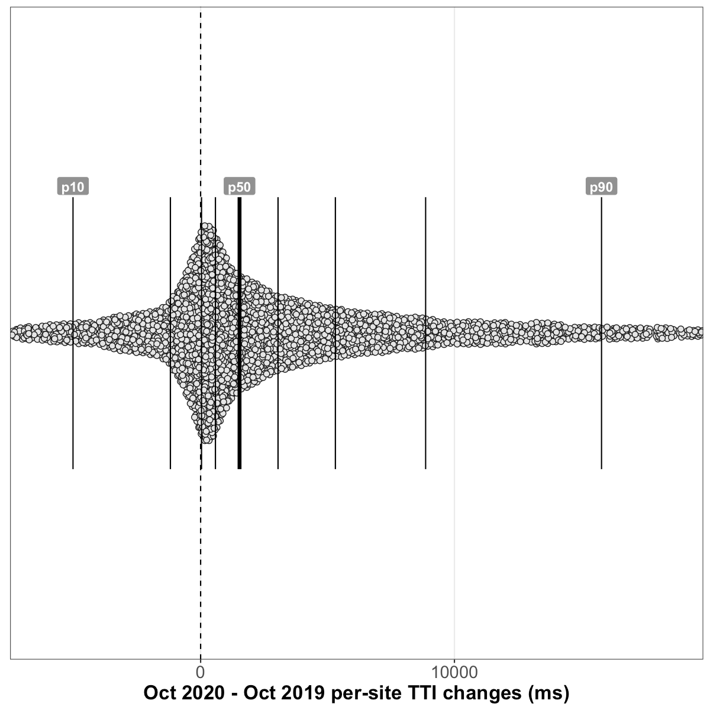

# Analysis of HTTP Archive Lighthouse results, October 2020 
## Summary of queried tables
**October 2020** (latest):
  - Lighthouse versions: [`5.6.0`](https://github.com/GoogleChrome/lighthouse/releases/tag/v5.6.0), [`6.3.0`](https://github.com/GoogleChrome/lighthouse/releases/tag/v6.3.0), [`6.4.0`](https://github.com/GoogleChrome/lighthouse/releases/tag/v6.4.0), and [`6.4.1`](https://github.com/GoogleChrome/lighthouse/releases/tag/v6.4.1)
  - **7M** total Lighthouse runs
  - **1.38% error rate** (96K runs with a `runtimeError`)
  - 11.61% metric error rate (810K runs with a `null` Performance score)
  - Chrome versions: `85.0.4183`, and `86.0.4240`

**September 2020** (one month prior):
  - Lighthouse versions: [`5.6.0`](https://github.com/GoogleChrome/lighthouse/releases/tag/v5.6.0), and [`6.3.0`](https://github.com/GoogleChrome/lighthouse/releases/tag/v6.3.0)
  - **6.8M** total Lighthouse runs
  - **0.87% error rate** (59K runs with a `runtimeError`)
  - 11.81% metric error rate (801K runs with a `null` Performance score)
  - Chrome version: `85.0.4183`

**October 2019** (one year prior):
  - Lighthouse versions: [`5.4.0`](https://github.com/GoogleChrome/lighthouse/releases/tag/v5.4.0), [`5.5.0`](https://github.com/GoogleChrome/lighthouse/releases/tag/v5.5.0), and [`5.6.0`](https://github.com/GoogleChrome/lighthouse/releases/tag/v5.6.0)
  - **4.3M** total Lighthouse runs
  - **1.04% error rate** (45K runs with a `runtimeError`)
  - 3.92% metric error rate (169K runs with a `null` Performance score)
  - Chrome version: `77.0.3865`

## Overall Performance score

### September 2020 vs October 2020 (month-over-month)
_results based on 4,509,601 pairs of before/after runs of the same sites without error_

##### Shifts in the overall performance distribution

| deciles | September 2020 | October 2020 | change |
| --- | --- | --- | --- |
| p10 | 8 | **8** | 0 _(95% CI [0, 0])_ |
| p20 | 13 | **14** | +1 _(95% CI [1, 1])_ |
| p30 | 19 | **19** | 0 _(95% CI [0, 0])_ |
| p40 | 25 | **26** | +1 _(95% CI [1, 1])_ |
| p50 | 32 | **32.8** | +0.8 _(95% CI [0, 1.5])_ |
| p60 | 40 | **40** | 0 _(95% CI [-0.2, 0.2])_ |
| p70 | 49 | **50** | +1 _(95% CI [1, 1])_ |
| p80 | 61.7 | **62.8** | +1.1 _(95% CI [0.7, 1.5])_ |
| p90 | 80.9 | **81** | +0.1 _(95% CI [-0.5, 0.7])_ |

##### Distribution of performance changes seen by individual sites

| deciles | change |
| --- | --- |
| p10 | -7.1 _(95% CI [-7.8, -7])_ |
| p20 | -4 _(95% CI [-4, -4])_ |
| p30 | -2 _(95% CI [-2, -2])_ |
| p40 | -1 _(95% CI [-1, -1])_ |
| p50 | 0 _(95% CI [0, 0])_ |
| p60 | +1 _(95% CI [1, 1])_ |
| p70 | +3 _(95% CI [3, 3])_ |
| p80 | +5 _(95% CI [5, 5])_ |
| p90 | +9 _(95% CI [9, 9])_ |

### October 2019 vs October 2020 (year-over-year)
_results based on 2,087,356 pairs of before/after runs of the same sites without error_

##### Shifts in the overall performance distribution

| deciles | October 2019 | October 2020 | change |
| --- | --- | --- | --- |
| p10 | 8 | **8** | 0 _(95% CI [0, 0])_ |
| p20 | 15 | **13** | -2 _(95% CI [-2, -2])_ |
| p30 | 22 | **19** | -3 _(95% CI [-3, -3])_ |
| p40 | 28 | **25** | -3 _(95% CI [-3, -3])_ |
| p50 | 36 | **32** | -4 _(95% CI [-4, -4])_ |
| p60 | 44 | **40** | -4 _(95% CI [-4.2, -3.8])_ |
| p70 | 54.9 | **50** | -4.9 _(95% CI [-5.4, -4.5])_ |
| p80 | 69 | **62** | -7 _(95% CI [-7.3, -6.7])_ |
| p90 | 88 | **81** | -7 _(95% CI [-7.2, -6.8])_ |

##### Distribution of performance changes seen by individual sites

| deciles | change |
| --- | --- |
| p10 | -23 _(95% CI [-23, -23])_ |
| p20 | -15 _(95% CI [-15, -15])_ |
| p30 | -10 _(95% CI [-10, -10])_ |
| p40 | -6 _(95% CI [-6, -6])_ |
| p50 | -3 _(95% CI [-3, -3])_ |
| p60 | 0 _(95% CI [0, 0])_ |
| p70 | +3 _(95% CI [3, 3])_ |
| p80 | +8 _(95% CI [8, 8])_ |
| p90 | +16 _(95% CI [16, 16])_ |

## First Contentful Paint
### September 2020 vs October 2020 (month-over-month)
_results based on 5,345,068 pairs of before/after runs of the same sites without error_

##### Shifts in the overall FCP distribution

| deciles | September 2020 | October 2020 | change |
| --- | --- | --- | --- |
| p10 | 2,173.3ms | **2,171.1ms** | -2.2ms _(95% CI [-3.6, -0.7])_ |
| p20 | 2,726.9ms | **2,706.9ms** | -20ms _(95% CI [-21.4, -18.5])_ |
| p30 | 3,137.7ms | **3,107ms** | -30.7ms _(95% CI [-31.9, -29.5])_ |
| p40 | 3,514.5ms | **3,484.1ms** | -30.4ms _(95% CI [-31.9, -29])_ |
| p50 | 3,908.3ms | **3,890.1ms** | -18.2ms _(95% CI [-19.9, -16.6])_ |
| p60 | 4,361ms | **4,337.7ms** | -23.3ms _(95% CI [-25, -21.5])_ |
| p70 | 4,900.3ms | **4,872.3ms** | -28ms _(95% CI [-30.3, -25.7])_ |
| p80 | 5,719.7ms | **5,704.4ms** | -15.3ms _(95% CI [-18.6, -12])_ |
| p90 | 7,272.5ms | **7,280.6ms** | +8.1ms _(95% CI [1.8, 14.5])_ |

##### Distribution of FCP changes seen by individual sites

| deciles | change |
| --- | --- |
| p10 | -674.8ms _(95% CI [-676.3, -673.4])_ |
| p20 | -354.5ms _(95% CI [-355.2, -353.8])_ |
| p30 | -208.2ms _(95% CI [-208.7, -207.8])_ |
| p40 | -107.3ms _(95% CI [-107.7, -107])_ |
| p50 | -23.3ms _(95% CI [-23.7, -23])_ |
| p60 | +59.7ms _(95% CI [59.4, 60.1])_ |
| p70 | +161ms _(95% CI [160.6, 161.5])_ |
| p80 | +312.1ms _(95% CI [311.4, 312.7])_ |
| p90 | +645.8ms _(95% CI [644.3, 647.3])_ |

### October 2019 vs October 2020 (year-over-year)
_results based on 2,355,426 pairs of before/after runs of the same sites without error_

##### Shifts in the overall FCP distribution

| deciles | October 2019 | October 2020 | change |
| --- | --- | --- | --- |
| p10 | 1,931.3ms | **2,182.3ms** | +251ms _(95% CI [248.3, 253.7])_ |
| p20 | 2,520.7ms | **2,718.7ms** | +198ms _(95% CI [195.7, 200.4])_ |
| p30 | 2,944.6ms | **3,111.9ms** | +167.3ms _(95% CI [164.9, 169.6])_ |
| p40 | 3,322.4ms | **3,478.7ms** | +156.4ms _(95% CI [153.9, 158.9])_ |
| p50 | 3,707.5ms | **3,873.1ms** | +165.6ms _(95% CI [162.6, 168.6])_ |
| p60 | 4,146.1ms | **4,309ms** | +162.9ms _(95% CI [159.5, 166.2])_ |
| p70 | 4,700.6ms | **4,827ms** | +126.4ms _(95% CI [122.3, 130.4])_ |
| p80 | 5,504.2ms | **5,626.8ms** | +122.6ms _(95% CI [116.2, 129])_ |
| p90 | 7,035.8ms | **7,124.9ms** | +89ms _(95% CI [76, 102.1])_ |

##### Distribution of FCP changes seen by individual sites

| deciles | change |
| --- | --- |
| p10 | -1,210.8ms _(95% CI [-1,215.6, -1,205.7])_ |
| p20 | -461.3ms _(95% CI [-463.6, -458.9])_ |
| p30 | -131.1ms _(95% CI [-132.5, -129.7])_ |
| p40 | +65.6ms _(95% CI [64.5, 66.6])_ |
| p50 | +208.8ms _(95% CI [208, 209.6])_ |
| p60 | +346.5ms _(95% CI [345.5, 347.4])_ |
| p70 | +519.8ms _(95% CI [518.6, 521])_ |
| p80 | +799.7ms _(95% CI [797.8, 801.8])_ |
| p90 | +1,461.1ms _(95% CI [1,456.5, 1,465.3])_ |

## Speed Index
### September 2020 vs October 2020 (month-over-month)
_results based on 5,340,352 pairs of before/after runs of the same sites without error_

##### Shifts in the overall Speed Index distribution

| deciles | September 2020 | October 2020 | change |
| --- | --- | --- | --- |
| p10 | 2,978.6ms | **2,942.7ms** | -35.9ms _(95% CI [-38.2, -33.5])_ |
| p20 | 3,966.2ms | **3,918.4ms** | -47.7ms _(95% CI [-50.2, -45.3])_ |
| p30 | 4,847.4ms | **4,791.9ms** | -55.5ms _(95% CI [-58.6, -52.5])_ |
| p40 | 5,768.9ms | **5,705.6ms** | -63.2ms _(95% CI [-66.7, -59.8])_ |
| p50 | 6,813.6ms | **6,744.1ms** | -69.4ms _(95% CI [-73.4, -65.5])_ |
| p60 | 8,113.6ms | **8,031.1ms** | -82.5ms _(95% CI [-87.8, -77.2])_ |
| p70 | 9,854.4ms | **9,760ms** | -94.4ms _(95% CI [-101.5, -87.4])_ |
| p80 | 12,388.9ms | **12,290.7ms** | -98.3ms _(95% CI [-107.9, -88.7])_ |
| p90 | 17,027.1ms | **16,947.5ms** | -79.6ms _(95% CI [-97.2, -61.9])_ |

##### Distribution of Speed Index changes seen by individual sites

| deciles | change |
| --- | --- |
| p10 | -1,953.4ms _(95% CI [-1,958.8, -1,947.5])_ |
| p20 | -801.6ms _(95% CI [-803.7, -799.5])_ |
| p30 | -387.6ms _(95% CI [-388.6, -386.5])_ |
| p40 | -176.2ms _(95% CI [-176.9, -175.5])_ |
| p50 | -33.3ms _(95% CI [-33.9, -32.9])_ |
| p60 | +100ms _(95% CI [99.4, 100.7])_ |
| p70 | +286.5ms _(95% CI [285.5, 287.4])_ |
| p80 | +651.8ms _(95% CI [649.9, 653.8])_ |
| p90 | +1,716.8ms _(95% CI [1,711.8, 1,722.3])_ |

### October 2019 vs October 2020 (year-over-year)
_results based on 2,353,762 pairs of before/after runs of the same sites without error_

##### Shifts in the overall Speed Index distribution

| deciles | October 2019 | October 2020 | change |
| --- | --- | --- | --- |
| p10 | 2,846.7ms | **2,891.4ms** | +44.8ms _(95% CI [40.3, 49.2])_ |
| p20 | 3,829.2ms | **3,882.5ms** | +53.3ms _(95% CI [48.2, 58.5])_ |
| p30 | 4,683.7ms | **4,750.3ms** | +66.5ms _(95% CI [60.4, 72.6])_ |
| p40 | 5,558.6ms | **5,655.2ms** | +96.5ms _(95% CI [89.9, 103.2])_ |
| p50 | 6,544.2ms | **6,678.5ms** | +134.4ms _(95% CI [126.3, 142.4])_ |
| p60 | 7,739.6ms | **7,935.5ms** | +195.9ms _(95% CI [186.1, 205.8])_ |
| p70 | 9,276ms | **9,625.9ms** | +349.9ms _(95% CI [336.3, 363.5])_ |
| p80 | 11,514.9ms | **12,108.4ms** | +593.5ms _(95% CI [573.9, 613])_ |
| p90 | 15,636.9ms | **16,685.9ms** | +1,049ms _(95% CI [1,012.4, 1,085.6])_ |

##### Distribution of Speed Index changes seen by individual sites

| deciles | change |
| --- | --- |
| p10 | -3,586ms _(95% CI [-3,599.6, -3,572.5])_ |
| p20 | -1,451.9ms _(95% CI [-1,458.4, -1,445.3])_ |
| p30 | -588.7ms _(95% CI [-592.2, -584.9])_ |
| p40 | -134.7ms _(95% CI [-136.7, -132.5])_ |
| p50 | +133.4ms _(95% CI [131.8, 134.9])_ |
| p60 | +440.3ms _(95% CI [437.9, 442.7])_ |
| p70 | +965.8ms _(95% CI [961.7, 970.1])_ |
| p80 | +1,996.7ms _(95% CI [1,988.8, 2,004.5])_ |
| p90 | +4,588.4ms _(95% CI [4,572.2, 4,605.6])_ |

## Largest Contentful Paint
### September 2020 vs October 2020 (month-over-month)
_results based on 5,329,799 pairs of before/after runs of the same sites without error_

##### Shifts in the overall LCP distribution

| deciles | September 2020 | October 2020 | change |
| --- | --- | --- | --- |
| p10 | 2,927.6ms | **2,904.9ms** | -22.6ms _(95% CI [-24.9, -20.4])_ |
| p20 | 3,902.1ms | **3,882.5ms** | -19.6ms _(95% CI [-22.3, -17])_ |
| p30 | 4,801.2ms | **4,771.2ms** | -30ms _(95% CI [-33.1, -26.9])_ |
| p40 | 5,779.8ms | **5,745.5ms** | -34.4ms _(95% CI [-38.2, -30.5])_ |
| p50 | 6,913.3ms | **6,886.4ms** | -26.9ms _(95% CI [-31.7, -22.1])_ |
| p60 | 8,411.3ms | **8,379.2ms** | -32.1ms _(95% CI [-38.8, -25.4])_ |
| p70 | 10,519ms | **10,478.4ms** | -40.6ms _(95% CI [-49.8, -31.4])_ |
| p80 | 14,078.9ms | **14,032ms** | -46.9ms _(95% CI [-62.3, -31.5])_ |
| p90 | 21,481.6ms | **21,494.5ms** | +12.8ms _(95% CI [-20.1, 45.7])_ |

##### Distribution of LCP changes seen by individual sites

| deciles | change |
| --- | --- |
| p10 | -2,359ms _(95% CI [-2,366.1, -2,351.3])_ |
| p20 | -884ms _(95% CI [-886.4, -881.5])_ |
| p30 | -408.9ms _(95% CI [-410.1, -407.7])_ |
| p40 | -179.5ms _(95% CI [-180.2, -178.8])_ |
| p50 | -25.9ms _(95% CI [-26.4, -25.2])_ |
| p60 | +123.1ms _(95% CI [122.4, 123.8])_ |
| p70 | +342.6ms _(95% CI [341.5, 343.7])_ |
| p80 | +798.9ms _(95% CI [796.6, 801.3])_ |
| p90 | +2,256.2ms _(95% CI [2,248.9, 2,264])_ |

### October 2019 vs October 2020 (year-over-year)

LCP data was not collected in October 2019.

## Time to Interactive
### September 2020 vs October 2020 (month-over-month)
_results based on 4,523,764 pairs of before/after runs of the same sites without error_

##### Shifts in the overall TTI distribution

| deciles | September 2020 | October 2020 | change |
| --- | --- | --- | --- |
| p10 | 4,278.9ms | **4,218.2ms** | -60.7ms _(95% CI [-66.6, -54.8])_ |
| p20 | 6,972.6ms | **6,808.3ms** | -164.3ms _(95% CI [-172.8, -155.8])_ |
| p30 | 9,664.1ms | **9,389.1ms** | -275ms _(95% CI [-285.8, -264.2])_ |
| p40 | 12,439.6ms | **12,030.4ms** | -409.2ms _(95% CI [-421.3, -397.1])_ |
| p50 | 15,511.9ms | **15,008.4ms** | -503.5ms _(95% CI [-519.2, -487.8])_ |
| p60 | 19,060.1ms | **18,518.6ms** | -541.6ms _(95% CI [-557.2, -525.9])_ |
| p70 | 23,358.9ms | **22,728.7ms** | -630.2ms _(95% CI [-650.5, -609.9])_ |
| p80 | 29,257.6ms | **28,528.8ms** | -728.7ms _(95% CI [-763.9, -693.6])_ |
| p90 | 39,072.7ms | **38,337.9ms** | -734.8ms _(95% CI [-792.7, -676.9])_ |

##### Distribution of TTI changes seen by individual sites

| deciles | change |
| --- | --- |
| p10 | -7,332.5ms _(95% CI [-7,352.3, -7,313.4])_ |
| p20 | -3,092.9ms _(95% CI [-3,103.1, -3,082.9])_ |
| p30 | -1,225.6ms _(95% CI [-1,230.6, -1,220.5])_ |
| p40 | -442.2ms _(95% CI [-444.5, -439.9])_ |
| p50 | -84.7ms _(95% CI [-85.9, -83.5])_ |
| p60 | +178.7ms _(95% CI [177.2, 180.1])_ |
| p70 | +711.9ms _(95% CI [708.2, 715.2])_ |
| p80 | +2,161.3ms _(95% CI [2,153.2, 2,170.1])_ |
| p90 | +5,911.4ms _(95% CI [5,895.3, 5,927.4])_ |

### October 2019 vs October 2020 (year-over-year)
_results based on 2,093,546 pairs of before/after runs of the same sites without error_

##### Shifts in the overall TTI distribution

| deciles | October 2019 | October 2020 | change |
| --- | --- | --- | --- |
| p10 | 3,612.5ms | **4,312.4ms** | +699.9ms _(95% CI [689.5, 710.2])_ |
| p20 | 5,567.5ms | **7,045.5ms** | +1,478ms _(95% CI [1,463.6, 1,492.5])_ |
| p30 | 7,627.5ms | **9,725ms** | +2,097.5ms _(95% CI [2,077.9, 2,117.1])_ |
| p40 | 9,880.2ms | **12,485.4ms** | +2,605.2ms _(95% CI [2,582.9, 2,627.5])_ |
| p50 | 12,407.9ms | **15,552.9ms** | +3,145ms _(95% CI [3,120.6, 3,169.4])_ |
| p60 | 15,263ms | **19,084.1ms** | +3,821.1ms _(95% CI [3,794.2, 3,848])_ |
| p70 | 18,819.6ms | **23,438.1ms** | +4,618.5ms _(95% CI [4,581.6, 4,655.4])_ |
| p80 | 23,484.6ms | **29,436.6ms** | +5,952ms _(95% CI [5,899.3, 6,004.7])_ |
| p90 | 31,561.7ms | **39,408.2ms** | +7,846.5ms _(95% CI [7,760.8, 7,932.3])_ |

##### Distribution of TTI changes seen by individual sites

| deciles | change |
| --- | --- |
| p10 | -5,028ms _(95% CI [-5,054.3, -5,001.2])_ |
| p20 | -1,191.1ms _(95% CI [-1,203.2, -1,179.7])_ |
| p30 | +36ms _(95% CI [32.5, 39.5])_ |
| p40 | +583.6ms _(95% CI [578.9, 588.2])_ |
| p50 | +1,532.4ms _(95% CI [1,523.9, 1,540.9])_ |
| p60 | +3,049.4ms _(95% CI [3,036.4, 3,062.2])_ |
| p70 | +5,308.9ms _(95% CI [5,291.2, 5,326.4])_ |
| p80 | +8,865.2ms _(95% CI [8,840.5, 8,889.5])_ |
| p90 | +15,795.3ms _(95% CI [15,751.2, 15,837.9])_ |

## Total Blocking Time
### September 2020 vs October 2020 (month-over-month)
_results based on 4,523,764 pairs of before/after runs of the same sites without error_

##### Shifts in the overall TBT distribution

| deciles | September 2020 | October 2020 | change |
| --- | --- | --- | --- |
| p10 | 45.5ms | **41.2ms** | -4.4ms _(95% CI [-4.6, -4.1])_ |
| p20 | 189.7ms | **176.9ms** | -12.7ms _(95% CI [-13.3, -12.1])_ |
| p30 | 406.8ms | **383ms** | -23.7ms _(95% CI [-24.6, -22.9])_ |
| p40 | 677ms | **634.8ms** | -42.2ms _(95% CI [-43.2, -41.2])_ |
| p50 | 1,013.9ms | **946.7ms** | -67.3ms _(95% CI [-68.8, -65.8])_ |
| p60 | 1,464.6ms | **1,361.4ms** | -103.2ms _(95% CI [-105.4, -100.9])_ |
| p70 | 2,086.9ms | **1,930.1ms** | -156.8ms _(95% CI [-159.8, -153.8])_ |
| p80 | 3,022.1ms | **2,785ms** | -237.1ms _(95% CI [-241, -233.1])_ |
| p90 | 4,744.9ms | **4,399.5ms** | -345.3ms _(95% CI [-353.4, -337.2])_ |

##### Distribution of TBT changes seen by individual sites

| deciles | change |
| --- | --- |
| p10 | -956.1ms _(95% CI [-958.7, -953.7])_ |
| p20 | -421.7ms _(95% CI [-422.8, -420.5])_ |
| p30 | -202ms _(95% CI [-202.6, -201.4])_ |
| p40 | -85.8ms _(95% CI [-86.2, -85.4])_ |
| p50 | -18.5ms _(95% CI [-18.7, -18.3])_ |
| p60 | +8.3ms _(95% CI [8.1, 8.5])_ |
| p70 | +75.3ms _(95% CI [74.9, 75.7])_ |
| p80 | +210.4ms _(95% CI [209.6, 211.1])_ |
| p90 | +561.6ms _(95% CI [559.8, 563.3])_ |

### October 2019 vs October 2020 (year-over-year)
_results based on 2,093,546 pairs of before/after runs of the same sites without error_

##### Shifts in the overall TBT distribution

| deciles | October 2019 | October 2020 | change |
| --- | --- | --- | --- |
| p10 | 13.5ms | **46.6ms** | +33.1ms _(95% CI [32.6, 33.5])_ |
| p20 | 87.7ms | **191.3ms** | +103.6ms _(95% CI [102.5, 104.7])_ |
| p30 | 200.1ms | **406.6ms** | +206.5ms _(95% CI [204.9, 208.2])_ |
| p40 | 347.4ms | **669.3ms** | +321.9ms _(95% CI [319.9, 323.9])_ |
| p50 | 537.9ms | **1,000ms** | +462.1ms _(95% CI [459.4, 464.8])_ |
| p60 | 782.9ms | **1,435ms** | +652ms _(95% CI [648.4, 655.7])_ |
| p70 | 1,114.4ms | **2,030.1ms** | +915.7ms _(95% CI [910.9, 920.5])_ |
| p80 | 1,620.9ms | **2,927.6ms** | +1,306.7ms _(95% CI [1,299.9, 1,313.5])_ |
| p90 | 2,609.3ms | **4,615.6ms** | +2,006.3ms _(95% CI [1,994.7, 2,018])_ |

##### Distribution of TBT changes seen by individual sites

| deciles | change |
| --- | --- |
| p10 | -191.1ms _(95% CI [-193, -189.1])_ |
| p20 | 0ms _(95% CI [0, 0])_ |
| p30 | +49.4ms _(95% CI [48.9, 49.9])_ |
| p40 | +155.2ms _(95% CI [154.4, 156.1])_ |
| p50 | +309ms _(95% CI [307.7, 310.2])_ |
| p60 | +529.8ms _(95% CI [527.9, 531.6])_ |
| p70 | +867ms _(95% CI [864.3, 869.5])_ |
| p80 | +1,428.9ms _(95% CI [1,424.9, 1,432.8])_ |
| p90 | +2,569.4ms _(95% CI [2,562, 2,577])_ |

## Cumulative Layout Shift
### September 2020 vs October 2020 (month-over-month)
_results based on 5,330,519 pairs of before/after runs of the same sites without error_

##### Shifts in the overall CLS distribution

| deciles | September 2020 | October 2020 | change |
| --- | --- | --- | --- |
| p10 | 0 | **0** | 0 _(95% CI [0, 0])_ |
| p20 | 0.002 | **0.004** | +0.001 _(95% CI [0.001, 0.001])_ |
| p30 | 0.016 | **0.02** | +0.005 _(95% CI [0.005, 0.005])_ |
| p40 | 0.048 | **0.057** | +0.009 _(95% CI [0.009, 0.009])_ |
| p50 | 0.096 | **0.11** | +0.014 _(95% CI [0.014, 0.014])_ |
| p60 | 0.165 | **0.187** | +0.022 _(95% CI [0.021, 0.022])_ |
| p70 | 0.267 | **0.295** | +0.028 _(95% CI [0.028, 0.029])_ |
| p80 | 0.427 | **0.467** | +0.04 _(95% CI [0.039, 0.041])_ |
| p90 | 0.775 | **0.833** | +0.059 _(95% CI [0.057, 0.06])_ |

##### Distribution of CLS changes seen by individual sites

| deciles | change |
| --- | --- |
| p10 | -0.075 _(95% CI [-0.076, -0.075])_ |
| p20 | -0.006 _(95% CI [-0.006, -0.006])_ |
| p30 | 0 _(95% CI [0, 0])_ |
| p40 | 0 _(95% CI [0, 0])_ |
| p50 | 0 _(95% CI [0, 0])_ |
| p60 | 0 _(95% CI [0, 0])_ |
| p70 | +0.005 _(95% CI [0.005, 0.005])_ |
| p80 | +0.032 _(95% CI [0.032, 0.032])_ |
| p90 | +0.161 _(95% CI [0.161, 0.162])_ |

### October 2019 vs October 2020 (year-over-year)

CLS data was not collected in October 2019.

