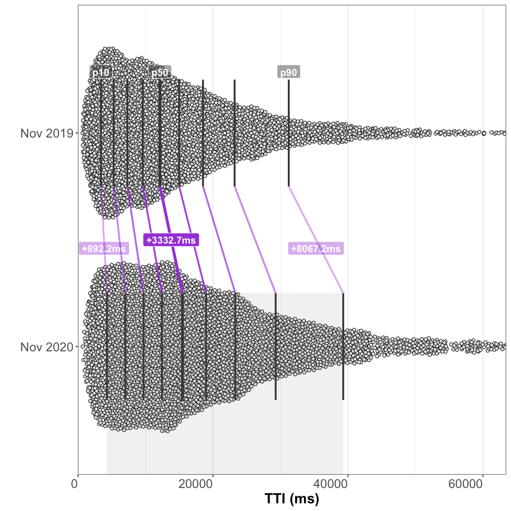

# Analysis of HTTP Archive Lighthouse results, November 2020 
## Summary of queried tables
**November 2020** (latest):
  - Lighthouse versions: [`5.6.0`](https://github.com/GoogleChrome/lighthouse/releases/tag/v5.6.0), and [`6.4.1`](https://github.com/GoogleChrome/lighthouse/releases/tag/v6.4.1)
  - **6.9M** total Lighthouse runs
  - **1.57% error rate** (109K runs with a `runtimeError`)
  - 11.54% metric error rate (797K runs with a `null` Performance score)
  - Chrome versions: `86.0.4240`, and `87.0.4280`

**October 2020** (one month prior):
  - Lighthouse versions: [`5.6.0`](https://github.com/GoogleChrome/lighthouse/releases/tag/v5.6.0), [`6.3.0`](https://github.com/GoogleChrome/lighthouse/releases/tag/v6.3.0), [`6.4.0`](https://github.com/GoogleChrome/lighthouse/releases/tag/v6.4.0), and [`6.4.1`](https://github.com/GoogleChrome/lighthouse/releases/tag/v6.4.1)
  - **7M** total Lighthouse runs
  - **1.38% error rate** (96K runs with a `runtimeError`)
  - 11.61% metric error rate (810K runs with a `null` Performance score)
  - Chrome versions: `85.0.4183`, and `86.0.4240`

**November 2019** (one year prior):
  - Lighthouse version: [`5.6.0`](https://github.com/GoogleChrome/lighthouse/releases/tag/v5.6.0)
  - **5.2M** total Lighthouse runs
  - **1.04% error rate** (54K runs with a `runtimeError`)
  - 3.81% metric error rate (197K runs with a `null` Performance score)
  - Chrome version: `78.0.3904`

## Overall Performance score

### October 2020 vs November 2020 (month-over-month)
_results based on 5,577,176 pairs of before/after runs of the same sites without error_

##### Shifts in the overall performance distribution

| deciles | October 2020 | November 2020 | change |
| --- | --- | --- | --- |
| p10 | 8 | **8** | 0 _(95% CI [0, 0])_ |
| p20 | 14 | **14** | 0 _(95% CI [0, 0])_ |
| p30 | 20 | **20** | 0 _(95% CI [0, 0])_ |
| p40 | 26 | **26** | 0 _(95% CI [0, 0])_ |
| p50 | 33 | **33** | 0 _(95% CI [0, 0])_ |
| p60 | 41 | **41** | 0 _(95% CI [0, 0])_ |
| p70 | 51 | **51** | 0 _(95% CI [0, 0])_ |
| p80 | 63 | **64** | +1 _(95% CI [1, 1])_ |
| p90 | 82 | **83** | +1 _(95% CI [0.6, 1.4])_ |

##### Distribution of performance changes seen by individual sites

| deciles | change |
| --- | --- |
| p10 | -8 _(95% CI [-8, -8])_ |
| p20 | -4 _(95% CI [-4, -4])_ |
| p30 | -2 _(95% CI [-2, -2])_ |
| p40 | -1 _(95% CI [-1, -1])_ |
| p50 | 0 _(95% CI [0, 0])_ |
| p60 | +1 _(95% CI [1, 1])_ |
| p70 | +2 _(95% CI [2, 2])_ |
| p80 | +5 _(95% CI [5, 5])_ |
| p90 | +9 _(95% CI [9, 9])_ |

### November 2019 vs November 2020 (year-over-year)
_results based on 2,479,788 pairs of before/after runs of the same sites without error_

##### Shifts in the overall performance distribution

| deciles | November 2019 | November 2020 | change |
| --- | --- | --- | --- |
| p10 | 8 | **8** | 0 _(95% CI [0, 0])_ |
| p20 | 16 | **13.4** | -2.6 _(95% CI [-3.3, -1.9])_ |
| p30 | 23 | **19** | -4 _(95% CI [-4, -4])_ |
| p40 | 30 | **25** | -5 _(95% CI [-5, -5])_ |
| p50 | 37 | **32** | -5 _(95% CI [-5, -5])_ |
| p60 | 46 | **40** | -6 _(95% CI [-6, -6])_ |
| p70 | 56 | **50** | -6 _(95% CI [-6, -6])_ |
| p80 | 70 | **62** | -8 _(95% CI [-8, -8])_ |
| p90 | 89 | **81.4** | -7.6 _(95% CI [-8.3, -6.9])_ |

##### Distribution of performance changes seen by individual sites

| deciles | change |
| --- | --- |
| p10 | -24 _(95% CI [-24, -24])_ |
| p20 | -16 _(95% CI [-16, -16])_ |
| p30 | -11 _(95% CI [-11, -11])_ |
| p40 | -7 _(95% CI [-7, -7])_ |
| p50 | -3 _(95% CI [-3, -3])_ |
| p60 | -1 _(95% CI [-1, -1])_ |
| p70 | +2 _(95% CI [2, 2])_ |
| p80 | +7 _(95% CI [7, 7])_ |
| p90 | +15 _(95% CI [15, 15])_ |

## First Contentful Paint
### October 2020 vs November 2020 (month-over-month)
_results based on 6,548,386 pairs of before/after runs of the same sites without error_

##### Shifts in the overall FCP distribution

| deciles | October 2020 | November 2020 | change |
| --- | --- | --- | --- |
| p10 | 2,154.8ms | **2,132.4ms** | -22.5ms _(95% CI [-23.7, -21.2])_ |
| p20 | 2,692.6ms | **2,664.9ms** | -27.7ms _(95% CI [-28.9, -26.5])_ |
| p30 | 3,093.8ms | **3,065.5ms** | -28.3ms _(95% CI [-29.4, -27.2])_ |
| p40 | 3,471.4ms | **3,441.3ms** | -30.1ms _(95% CI [-31.3, -28.8])_ |
| p50 | 3,879.7ms | **3,852.3ms** | -27.4ms _(95% CI [-28.8, -26])_ |
| p60 | 4,329.8ms | **4,304.3ms** | -25.5ms _(95% CI [-27.2, -23.8])_ |
| p70 | 4,865.6ms | **4,837.8ms** | -27.8ms _(95% CI [-29.9, -25.8])_ |
| p80 | 5,699.2ms | **5,670.2ms** | -29.1ms _(95% CI [-32.2, -25.9])_ |
| p90 | 7,278ms | **7,241.7ms** | -36.3ms _(95% CI [-42, -30.6])_ |

##### Distribution of FCP changes seen by individual sites

| deciles | change |
| --- | --- |
| p10 | -677.3ms _(95% CI [-678.7, -676])_ |
| p20 | -351.3ms _(95% CI [-351.9, -350.7])_ |
| p30 | -203.1ms _(95% CI [-203.5, -202.7])_ |
| p40 | -102.4ms _(95% CI [-102.8, -102.1])_ |
| p50 | -18.9ms _(95% CI [-19.2, -18.6])_ |
| p60 | +62.9ms _(95% CI [62.6, 63.3])_ |
| p70 | +160.8ms _(95% CI [160.4, 161.2])_ |
| p80 | +304ms _(95% CI [303.4, 304.5])_ |
| p90 | +618.6ms _(95% CI [617.3, 619.9])_ |

### November 2019 vs November 2020 (year-over-year)
_results based on 2,791,365 pairs of before/after runs of the same sites without error_

##### Shifts in the overall FCP distribution

| deciles | November 2019 | November 2020 | change |
| --- | --- | --- | --- |
| p10 | 1,903.9ms | **2,159.4ms** | +255.5ms _(95% CI [252.9, 258.1])_ |
| p20 | 2,467.2ms | **2,691.4ms** | +224.2ms _(95% CI [221.8, 226.6])_ |
| p30 | 2,885ms | **3,085.9ms** | +200.8ms _(95% CI [198.3, 203.4])_ |
| p40 | 3,258.1ms | **3,452.3ms** | +194.2ms _(95% CI [191.4, 197])_ |
| p50 | 3,639.4ms | **3,849.2ms** | +209.8ms _(95% CI [206.6, 213])_ |
| p60 | 4,068.9ms | **4,288.8ms** | +219.9ms _(95% CI [216.2, 223.6])_ |
| p70 | 4,613.3ms | **4,807.1ms** | +193.8ms _(95% CI [189.5, 198.2])_ |
| p80 | 5,403ms | **5,606.6ms** | +203.6ms _(95% CI [197.9, 209.4])_ |
| p90 | 6,915ms | **7,105.6ms** | +190.6ms _(95% CI [180.1, 201.2])_ |

##### Distribution of FCP changes seen by individual sites

| deciles | change |
| --- | --- |
| p10 | -1,144.4ms _(95% CI [-1,149.1, -1,140.1])_ |
| p20 | -408.5ms _(95% CI [-410.7, -406.4])_ |
| p30 | -85.2ms _(95% CI [-86.6, -83.9])_ |
| p40 | +105.4ms _(95% CI [104.5, 106.3])_ |
| p50 | +247.7ms _(95% CI [246.9, 248.5])_ |
| p60 | +387.2ms _(95% CI [386.3, 388.1])_ |
| p70 | +563.9ms _(95% CI [562.6, 564.9])_ |
| p80 | +848.4ms _(95% CI [846.5, 850.2])_ |
| p90 | +1,514.5ms _(95% CI [1,510.7, 1,518.7])_ |

## Speed Index
### October 2020 vs November 2020 (month-over-month)
_results based on 6,542,608 pairs of before/after runs of the same sites without error_

##### Shifts in the overall Speed Index distribution

| deciles | October 2020 | November 2020 | change |
| --- | --- | --- | --- |
| p10 | 2,906.9ms | **2,888.1ms** | -18.9ms _(95% CI [-20.9, -16.9])_ |
| p20 | 3,877.1ms | **3,858.6ms** | -18.5ms _(95% CI [-20.5, -16.5])_ |
| p30 | 4,744.3ms | **4,727.3ms** | -17.1ms _(95% CI [-19.4, -14.7])_ |
| p40 | 5,650.5ms | **5,633.9ms** | -16.6ms _(95% CI [-19.7, -13.6])_ |
| p50 | 6,680.2ms | **6,659.6ms** | -20.6ms _(95% CI [-24.2, -17])_ |
| p60 | 7,954ms | **7,931.7ms** | -22.3ms _(95% CI [-27.3, -17.2])_ |
| p70 | 9,668.5ms | **9,645.4ms** | -23ms _(95% CI [-29.8, -16.2])_ |
| p80 | 12,179.9ms | **12,149.6ms** | -30.3ms _(95% CI [-39.8, -20.8])_ |
| p90 | 16,805.3ms | **16,741.8ms** | -63.4ms _(95% CI [-78.5, -48.4])_ |

##### Distribution of Speed Index changes seen by individual sites

| deciles | change |
| --- | --- |
| p10 | -1,828.1ms _(95% CI [-1,832.8, -1,823.2])_ |
| p20 | -729.5ms _(95% CI [-731.2, -727.7])_ |
| p30 | -345.3ms _(95% CI [-346.2, -344.4])_ |
| p40 | -148.5ms _(95% CI [-149.1, -147.9])_ |
| p50 | -12.1ms _(95% CI [-12.8, -11.8])_ |
| p60 | +121.8ms _(95% CI [121.1, 122.2])_ |
| p70 | +311.7ms _(95% CI [310.7, 312.5])_ |
| p80 | +683.6ms _(95% CI [681.7, 685.2])_ |
| p90 | +1,764.5ms _(95% CI [1,759.7, 1,769.3])_ |

### November 2019 vs November 2020 (year-over-year)
_results based on 2,789,363 pairs of before/after runs of the same sites without error_

##### Shifts in the overall Speed Index distribution

| deciles | November 2019 | November 2020 | change |
| --- | --- | --- | --- |
| p10 | 2,801.3ms | **2,871.2ms** | +69.8ms _(95% CI [65.9, 73.8])_ |
| p20 | 3,775ms | **3,862ms** | +87ms _(95% CI [82.7, 91.3])_ |
| p30 | 4,615.3ms | **4,733.3ms** | +118ms _(95% CI [112.9, 123.2])_ |
| p40 | 5,469.8ms | **5,639.6ms** | +169.8ms _(95% CI [163.4, 176.1])_ |
| p50 | 6,436.3ms | **6,658.5ms** | +222.2ms _(95% CI [214.2, 230.2])_ |
| p60 | 7,609.5ms | **7,915ms** | +305.5ms _(95% CI [294.8, 316.2])_ |
| p70 | 9,136ms | **9,606.8ms** | +470.8ms _(95% CI [457.4, 484.2])_ |
| p80 | 11,359.7ms | **12,081ms** | +721.3ms _(95% CI [702.7, 740])_ |
| p90 | 15,476.3ms | **16,617.7ms** | +1,141.4ms _(95% CI [1,107.7, 1,175.1])_ |

##### Distribution of Speed Index changes seen by individual sites

| deciles | change |
| --- | --- |
| p10 | -3,463.6ms _(95% CI [-3,476.1, -3,451.8])_ |
| p20 | -1,381.1ms _(95% CI [-1,386.8, -1,375.6])_ |
| p30 | -533.1ms _(95% CI [-536.1, -530.1])_ |
| p40 | -91.4ms _(95% CI [-93.2, -89.6])_ |
| p50 | +172.4ms _(95% CI [170.8, 173.9])_ |
| p60 | +488.2ms _(95% CI [485.9, 490.3])_ |
| p70 | +1,024.9ms _(95% CI [1,020.9, 1,029])_ |
| p80 | +2,072.6ms _(95% CI [2,065.5, 2,079.9])_ |
| p90 | +4,700.5ms _(95% CI [4,683.7, 4,716.2])_ |

## Largest Contentful Paint
### October 2020 vs November 2020 (month-over-month)
_results based on 6,528,982 pairs of before/after runs of the same sites without error_

##### Shifts in the overall LCP distribution

| deciles | October 2020 | November 2020 | change |
| --- | --- | --- | --- |
| p10 | 2,873.9ms | **2,844.6ms** | -29.3ms _(95% CI [-31.4, -27.2])_ |
| p20 | 3,850.7ms | **3,818.6ms** | -32.1ms _(95% CI [-34.5, -29.7])_ |
| p30 | 4,739.1ms | **4,704.7ms** | -34.5ms _(95% CI [-37.5, -31.4])_ |
| p40 | 5,710.1ms | **5,674ms** | -36.1ms _(95% CI [-39.6, -32.7])_ |
| p50 | 6,845.7ms | **6,807.9ms** | -37.8ms _(95% CI [-42.1, -33.4])_ |
| p60 | 8,334.9ms | **8,283.8ms** | -51.1ms _(95% CI [-57, -45.1])_ |
| p70 | 10,434ms | **10,387.7ms** | -46.2ms _(95% CI [-53.8, -38.6])_ |
| p80 | 13,951.7ms | **13,862.7ms** | -89ms _(95% CI [-103.7, -74.3])_ |
| p90 | 21,343.7ms | **21,254ms** | -89.6ms _(95% CI [-118.5, -60.8])_ |

##### Distribution of LCP changes seen by individual sites

| deciles | change |
| --- | --- |
| p10 | -2,363.7ms _(95% CI [-2,371.1, -2,356.8])_ |
| p20 | -865.9ms _(95% CI [-868.3, -863.7])_ |
| p30 | -393.3ms _(95% CI [-394.4, -392.3])_ |
| p40 | -167.8ms _(95% CI [-168.5, -167.2])_ |
| p50 | -17.1ms _(95% CI [-17.6, -16.6])_ |
| p60 | +131.2ms _(95% CI [130.5, 131.8])_ |
| p70 | +348.2ms _(95% CI [347.2, 349.2])_ |
| p80 | +802.8ms _(95% CI [800.7, 804.9])_ |
| p90 | +2,238.2ms _(95% CI [2,231.7, 2,244.2])_ |

### November 2019 vs November 2020 (year-over-year)
_results based on 2,710,059 pairs of before/after runs of the same sites without error_

##### Shifts in the overall LCP distribution

| deciles | November 2019 | November 2020 | change |
| --- | --- | --- | --- |
| p10 | 2,643.6ms | **2,793.2ms** | +149.6ms _(95% CI [145.2, 154.1])_ |
| p20 | 3,640.6ms | **3,737.6ms** | +97ms _(95% CI [91.6, 102.3])_ |
| p30 | 4,528.9ms | **4,592.9ms** | +64ms _(95% CI [57.8, 70.1])_ |
| p40 | 5,461.4ms | **5,523.7ms** | +62.3ms _(95% CI [54.7, 69.9])_ |
| p50 | 6,553.2ms | **6,603.8ms** | +50.6ms _(95% CI [40.1, 61.1])_ |
| p60 | 7,942.3ms | **7,996.3ms** | +53.9ms _(95% CI [40.1, 67.8])_ |
| p70 | 9,863.6ms | **9,990.8ms** | +127.2ms _(95% CI [107.3, 147.2])_ |
| p80 | 13,027.6ms | **13,315.7ms** | +288.1ms _(95% CI [256.4, 319.9])_ |
| p90 | 19,313.1ms | **20,471ms** | +1,157.9ms _(95% CI [1,098.7, 1,217.1])_ |

##### Distribution of LCP changes seen by individual sites

| deciles | change |
| --- | --- |
| p10 | -5,041.3ms _(95% CI [-5,063.8, -5,021.2])_ |
| p20 | -1,932.1ms _(95% CI [-1,940.3, -1,924.1])_ |
| p30 | -739.8ms _(95% CI [-744.5, -735.5])_ |
| p40 | -121.1ms _(95% CI [-123.8, -118.5])_ |
| p50 | +221.4ms _(95% CI [219.7, 223])_ |
| p60 | +554.8ms _(95% CI [552.3, 557.3])_ |
| p70 | +1,153.8ms _(95% CI [1,149.3, 1,158.5])_ |
| p80 | +2,413.3ms _(95% CI [2,404.1, 2,422.7])_ |
| p90 | +6,127.9ms _(95% CI [6,102.6, 6,153.3])_ |

## Time to Interactive
### October 2020 vs November 2020 (month-over-month)
_results based on 5,595,707 pairs of before/after runs of the same sites without error_

##### Shifts in the overall TTI distribution

| deciles | October 2020 | November 2020 | change |
| --- | --- | --- | --- |
| p10 | 4,099.2ms | **4,082.1ms** | -17.1ms _(95% CI [-23, -11.2])_ |
| p20 | 6,667.5ms | **6,641.2ms** | -26.3ms _(95% CI [-33.5, -19.2])_ |
| p30 | 9,214.8ms | **9,177.6ms** | -37.3ms _(95% CI [-46, -28.5])_ |
| p40 | 11,851.6ms | **11,807.3ms** | -44.3ms _(95% CI [-53.3, -35.2])_ |
| p50 | 14,820.6ms | **14,726.7ms** | -93.9ms _(95% CI [-106.3, -81.5])_ |
| p60 | 18,309.7ms | **18,160.3ms** | -149.4ms _(95% CI [-164.6, -134.1])_ |
| p70 | 22,467.1ms | **22,307.7ms** | -159.4ms _(95% CI [-177.3, -141.5])_ |
| p80 | 28,313.9ms | **28,110.6ms** | -203.3ms _(95% CI [-226.3, -180.3])_ |
| p90 | 38,163.2ms | **37,923.2ms** | -240.1ms _(95% CI [-283.2, -197])_ |

##### Distribution of TTI changes seen by individual sites

| deciles | change |
| --- | --- |
| p10 | -6,613.1ms _(95% CI [-6,628.6, -6,596.1])_ |
| p20 | -2,617.6ms _(95% CI [-2,626.2, -2,609.4])_ |
| p30 | -956.6ms _(95% CI [-960.4, -952.8])_ |
| p40 | -303.8ms _(95% CI [-305.4, -302.2])_ |
| p50 | -12ms _(95% CI [-12.9, -11])_ |
| p60 | +270.6ms _(95% CI [269.1, 272.2])_ |
| p70 | +893.4ms _(95% CI [889.8, 897.2])_ |
| p80 | +2,455.2ms _(95% CI [2,447.5, 2,463])_ |
| p90 | +6,229.6ms _(95% CI [6,214.1, 6,245])_ |

### November 2019 vs November 2020 (year-over-year)
_results based on 2,487,546 pairs of before/after runs of the same sites without error_

##### Shifts in the overall TTI distribution

| deciles | November 2019 | November 2020 | change |
| --- | --- | --- | --- |
| p10 | 3,403.2ms | **4,295.4ms** | +892.2ms _(95% CI [883.3, 901.1])_ |
| p20 | 5,276.9ms | **7,018.3ms** | +1,741.4ms _(95% CI [1,728.5, 1,754.3])_ |
| p30 | 7,317.1ms | **9,708.8ms** | +2,391.7ms _(95% CI [2,376.4, 2,407.1])_ |
| p40 | 9,597.1ms | **12,446.2ms** | +2,849.1ms _(95% CI [2,829, 2,869.1])_ |
| p50 | 12,143.3ms | **15,476ms** | +3,332.7ms _(95% CI [3,312.5, 3,352.9])_ |
| p60 | 14,990.3ms | **18,974.6ms** | +3,984.3ms _(95% CI [3,959, 4,009.6])_ |
| p70 | 18,520.1ms | **23,310.9ms** | +4,790.8ms _(95% CI [4,758.1, 4,823.4])_ |
| p80 | 23,201.5ms | **29,286.9ms** | +6,085.4ms _(95% CI [6,037.7, 6,133.1])_ |
| p90 | 31,227.9ms | **39,295.1ms** | +8,067.2ms _(95% CI [7,986.9, 8,147.5])_ |

##### Distribution of TTI changes seen by individual sites

| deciles | change |
| --- | --- |
| p10 | -4,890.5ms _(95% CI [-4,915.3, -4,866.5])_ |
| p20 | -1,086.6ms _(95% CI [-1,097.1, -1,075.7])_ |
| p30 | +102.9ms _(95% CI [99.8, 106.1])_ |
| p40 | +705ms _(95% CI [700, 709.7])_ |
| p50 | +1,728.7ms _(95% CI [1,721.4, 1,736.4])_ |
| p60 | +3,284.9ms _(95% CI [3,274.3, 3,296.3])_ |
| p70 | +5,558.4ms _(95% CI [5,543.3, 5,574.2])_ |
| p80 | +9,115.5ms _(95% CI [9,092.7, 9,139.7])_ |
| p90 | +16,100.6ms _(95% CI [16,061.2, 16,142.9])_ |

## Total Blocking Time
### October 2020 vs November 2020 (month-over-month)
_results based on 5,595,707 pairs of before/after runs of the same sites without error_

##### Shifts in the overall TBT distribution

| deciles | October 2020 | November 2020 | change |
| --- | --- | --- | --- |
| p10 | 38.6ms | **37.2ms** | -1.3ms _(95% CI [-1.5, -1.1])_ |
| p20 | 167.6ms | **163.7ms** | -3.9ms _(95% CI [-4.3, -3.4])_ |
| p30 | 368.9ms | **361ms** | -7.9ms _(95% CI [-8.5, -7.2])_ |
| p40 | 615.2ms | **604.8ms** | -10.4ms _(95% CI [-11.3, -9.5])_ |
| p50 | 920.5ms | **915.6ms** | -4.8ms _(95% CI [-6.2, -3.5])_ |
| p60 | 1,326.9ms | **1,327.4ms** | +0.5ms _(95% CI [-1.2, 2.2])_ |
| p70 | 1,887.5ms | **1,884.4ms** | -3.1ms _(95% CI [-5.5, -0.7])_ |
| p80 | 2,730.9ms | **2,726.1ms** | -4.8ms _(95% CI [-8.2, -1.3])_ |
| p90 | 4,327.9ms | **4,301.9ms** | -26ms _(95% CI [-32.2, -19.8])_ |

##### Distribution of TBT changes seen by individual sites

| deciles | change |
| --- | --- |
| p10 | -723ms _(95% CI [-724.8, -721.2])_ |
| p20 | -302.1ms _(95% CI [-302.9, -301.3])_ |
| p30 | -131.9ms _(95% CI [-132.4, -131.5])_ |
| p40 | -43.3ms _(95% CI [-43.5, -43])_ |
| p50 | 0ms _(95% CI [0, 0])_ |
| p60 | +35.3ms _(95% CI [35, 35.5])_ |
| p70 | +122.3ms _(95% CI [121.9, 122.8])_ |
| p80 | +297.7ms _(95% CI [296.8, 298.5])_ |
| p90 | +736.3ms _(95% CI [734.5, 738.2])_ |

### November 2019 vs November 2020 (year-over-year)
_results based on 2,487,546 pairs of before/after runs of the same sites without error_

##### Shifts in the overall TBT distribution

| deciles | November 2019 | November 2020 | change |
| --- | --- | --- | --- |
| p10 | 1.8ms | **45.3ms** | +43.5ms _(95% CI [43.1, 43.9])_ |
| p20 | 63.7ms | **187.3ms** | +123.6ms _(95% CI [122.6, 124.7])_ |
| p30 | 154.6ms | **399.4ms** | +244.8ms _(95% CI [243.3, 246.4])_ |
| p40 | 278.9ms | **662.1ms** | +383.2ms _(95% CI [381.1, 385.3])_ |
| p50 | 448.5ms | **1,000.7ms** | +552.2ms _(95% CI [549.5, 554.8])_ |
| p60 | 682ms | **1,440.2ms** | +758.2ms _(95% CI [754.7, 761.6])_ |
| p70 | 994ms | **2,033.5ms** | +1,039.5ms _(95% CI [1,035.2, 1,043.9])_ |
| p80 | 1,469.3ms | **2,926.5ms** | +1,457.2ms _(95% CI [1,450.6, 1,463.8])_ |
| p90 | 2,406.2ms | **4,592.9ms** | +2,186.7ms _(95% CI [2,174.2, 2,199.2])_ |

##### Distribution of TBT changes seen by individual sites

| deciles | change |
| --- | --- |
| p10 | -112.9ms _(95% CI [-114.4, -111.5])_ |
| p20 | +0.6ms _(95% CI [0.3, 1])_ |
| p30 | +81.5ms _(95% CI [81, 82.1])_ |
| p40 | +205.2ms _(95% CI [204.3, 206.1])_ |
| p50 | +377.6ms _(95% CI [376.3, 378.8])_ |
| p60 | +619.6ms _(95% CI [617.7, 621.3])_ |
| p70 | +979.5ms _(95% CI [977.1, 981.9])_ |
| p80 | +1,557.8ms _(95% CI [1,553.9, 1,561.3])_ |
| p90 | +2,721.2ms _(95% CI [2,714.2, 2,727.8])_ |

## Cumulative Layout Shift
### October 2020 vs November 2020 (month-over-month)
_results based on 6,534,394 pairs of before/after runs of the same sites without error_

##### Shifts in the overall CLS distribution

| deciles | October 2020 | November 2020 | change |
| --- | --- | --- | --- |
| p10 | 0 | **0** | 0 _(95% CI [0, 0])_ |
| p20 | 0.003 | **0.003** | 0 _(95% CI [0, 0])_ |
| p30 | 0.019 | **0.019** | 0 _(95% CI [0, 0])_ |
| p40 | 0.055 | **0.054** | -0.001 _(95% CI [-0.001, -0.001])_ |
| p50 | 0.107 | **0.106** | -0.001 _(95% CI [-0.001, -0.001])_ |
| p60 | 0.181 | **0.18** | -0.002 _(95% CI [-0.002, -0.001])_ |
| p70 | 0.288 | **0.285** | -0.003 _(95% CI [-0.003, -0.002])_ |
| p80 | 0.456 | **0.45** | -0.006 _(95% CI [-0.007, -0.005])_ |
| p90 | 0.819 | **0.803** | -0.016 _(95% CI [-0.018, -0.015])_ |

##### Distribution of CLS changes seen by individual sites

| deciles | change |
| --- | --- |
| p10 | -0.1 _(95% CI [-0.101, -0.1])_ |
| p20 | -0.015 _(95% CI [-0.015, -0.015])_ |
| p30 | -0.001 _(95% CI [-0.001, -0.001])_ |
| p40 | 0 _(95% CI [0, 0])_ |
| p50 | 0 _(95% CI [0, 0])_ |
| p60 | 0 _(95% CI [0, 0])_ |
| p70 | 0 _(95% CI [0, 0])_ |
| p80 | +0.009 _(95% CI [0.009, 0.009])_ |
| p90 | +0.086 _(95% CI [0.086, 0.086])_ |

### November 2019 vs November 2020 (year-over-year)

CLS data was not collected in November 2019.

