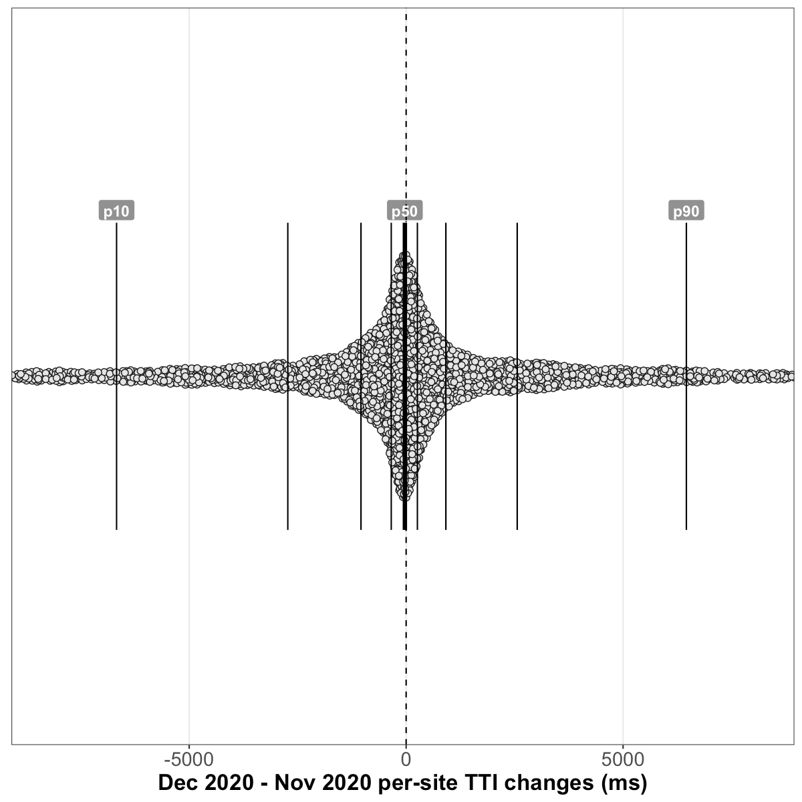

# Analysis of HTTP Archive Lighthouse results, December 2020 
## Summary of queried tables
**December 2020** (latest):
  - Lighthouse versions: [`5.6.0`](https://github.com/GoogleChrome/lighthouse/releases/tag/v5.6.0), [`6.4.1`](https://github.com/GoogleChrome/lighthouse/releases/tag/v6.4.1), [`6.5.0`](https://github.com/GoogleChrome/lighthouse/releases/tag/v6.5.0), and [`7.0.0`](https://github.com/GoogleChrome/lighthouse/releases/tag/v7.0.0)
  - **7M** total Lighthouse runs
  - **1.64% error rate** (114K runs with a `runtimeError`)
  - 11.41% metric error rate (794K runs with a `null` Performance score)
  - Chrome versions: `86.0.4240`, and `87.0.4280`

**November 2020** (one month prior):
  - Lighthouse versions: [`5.6.0`](https://github.com/GoogleChrome/lighthouse/releases/tag/v5.6.0), and [`6.4.1`](https://github.com/GoogleChrome/lighthouse/releases/tag/v6.4.1)
  - **6.9M** total Lighthouse runs
  - **1.57% error rate** (109K runs with a `runtimeError`)
  - 11.54% metric error rate (797K runs with a `null` Performance score)
  - Chrome versions: `86.0.4240`, and `87.0.4280`

**December 2019** (one year prior):
  - Lighthouse version: [`5.6.0`](https://github.com/GoogleChrome/lighthouse/releases/tag/v5.6.0)
  - **5.2M** total Lighthouse runs
  - **1.76% error rate** (91K runs with a `runtimeError`)
  - 8.61% metric error rate (445K runs with a `null` Performance score)
  - Chrome versions: `78.0.3904`, and `79.0.3945`

## Overall Performance score

### November 2020 vs December 2020 (month-over-month)
_results based on 4,218,908 pairs of before/after runs of the same sites without error_

##### Shifts in the overall performance distribution

| deciles | November 2020 | December 2020 | change |
| --- | --- | --- | --- |
| p10 | 8 | **9** | +1 _(95% CI [1, 1])_ |
| p20 | 14 | **14** | 0 _(95% CI [0, 0])_ |
| p30 | 19 | **20** | +1 _(95% CI [1, 1])_ |
| p40 | 26 | **27** | +1 _(95% CI [1, 1])_ |
| p50 | 33 | **34** | +1 _(95% CI [1, 1])_ |
| p60 | 41 | **42** | +1 _(95% CI [1, 1])_ |
| p70 | 50 | **52** | +2 _(95% CI [1.9, 2.1])_ |
| p80 | 63 | **64** | +1 _(95% CI [1, 1])_ |
| p90 | 82 | **82** | 0 _(95% CI [-0.3, 0.4])_ |

##### Distribution of performance changes seen by individual sites

| deciles | change |
| --- | --- |
| p10 | -7 _(95% CI [-7, -7])_ |
| p20 | -4 _(95% CI [-4, -4])_ |
| p30 | -2 _(95% CI [-2, -2])_ |
| p40 | 0 _(95% CI [0, 0])_ |
| p50 | 0 _(95% CI [0, 0])_ |
| p60 | +1 _(95% CI [1, 1])_ |
| p70 | +3 _(95% CI [3, 3])_ |
| p80 | +5 _(95% CI [5, 5])_ |
| p90 | +10 _(95% CI [10, 10])_ |

### December 2019 vs December 2020 (year-over-year)
_results based on 2,271,269 pairs of before/after runs of the same sites without error_

##### Shifts in the overall performance distribution

| deciles | December 2019 | December 2020 | change |
| --- | --- | --- | --- |
| p10 | 6 | **8** | +2 _(95% CI [2, 2])_ |
| p20 | 13 | **14** | +1 _(95% CI [1, 1])_ |
| p30 | 20 | **19** | -1 _(95% CI [-1, -1])_ |
| p40 | 28 | **25.3** | -2.7 _(95% CI [-3.5, -1.8])_ |
| p50 | 35.4 | **32** | -3.4 _(95% CI [-4.2, -2.6])_ |
| p60 | 44 | **40** | -4 _(95% CI [-4, -4])_ |
| p70 | 55 | **50** | -5 _(95% CI [-5, -5])_ |
| p80 | 69 | **61.9** | -7.1 _(95% CI [-7.6, -6.5])_ |
| p90 | 88 | **80.2** | -7.8 _(95% CI [-8.5, -7.2])_ |

##### Distribution of performance changes seen by individual sites

| deciles | change |
| --- | --- |
| p10 | -25 _(95% CI [-25, -25])_ |
| p20 | -16 _(95% CI [-16, -16])_ |
| p30 | -11 _(95% CI [-11, -11])_ |
| p40 | -6 _(95% CI [-6, -6])_ |
| p50 | -3 _(95% CI [-3, -3])_ |
| p60 | 0 _(95% CI [0, 0])_ |
| p70 | +4 _(95% CI [4, 4])_ |
| p80 | +10 _(95% CI [10, 10])_ |
| p90 | +20 _(95% CI [20, 20])_ |

## First Contentful Paint
### November 2020 vs December 2020 (month-over-month)
_results based on 4,953,000 pairs of before/after runs of the same sites without error_

##### Shifts in the overall FCP distribution

| deciles | November 2020 | December 2020 | change |
| --- | --- | --- | --- |
| p10 | 2,166.7ms | **2,153.5ms** | -13.1ms _(95% CI [-14.6, -11.7])_ |
| p20 | 2,700.9ms | **2,684.7ms** | -16.2ms _(95% CI [-17.5, -14.9])_ |
| p30 | 3,093.6ms | **3,081ms** | -12.6ms _(95% CI [-13.9, -11.3])_ |
| p40 | 3,465.9ms | **3,455.5ms** | -10.4ms _(95% CI [-11.7, -9.1])_ |
| p50 | 3,873.7ms | **3,864ms** | -9.6ms _(95% CI [-11.3, -7.9])_ |
| p60 | 4,322.6ms | **4,314.1ms** | -8.5ms _(95% CI [-10.3, -6.7])_ |
| p70 | 4,855.1ms | **4,846.4ms** | -8.7ms _(95% CI [-11.2, -6.3])_ |
| p80 | 5,684.5ms | **5,676.7ms** | -7.8ms _(95% CI [-11.3, -4.4])_ |
| p90 | 7,246.9ms | **7,234ms** | -12.9ms _(95% CI [-19.5, -6.4])_ |

##### Distribution of FCP changes seen by individual sites

| deciles | change |
| --- | --- |
| p10 | -646ms _(95% CI [-647.6, -644.5])_ |
| p20 | -330.4ms _(95% CI [-331, -329.8])_ |
| p30 | -190.5ms _(95% CI [-191, -190.1])_ |
| p40 | -94.2ms _(95% CI [-94.6, -93.8])_ |
| p50 | -12.8ms _(95% CI [-13.1, -12.4])_ |
| p60 | +68.7ms _(95% CI [68.3, 69])_ |
| p70 | +167.9ms _(95% CI [167.4, 168.4])_ |
| p80 | +315.4ms _(95% CI [314.7, 316.1])_ |
| p90 | +641.6ms _(95% CI [640.1, 643.2])_ |

### December 2019 vs December 2020 (year-over-year)
_results based on 2,669,459 pairs of before/after runs of the same sites without error_

##### Shifts in the overall FCP distribution

| deciles | December 2019 | December 2020 | change |
| --- | --- | --- | --- |
| p10 | 1,941.3ms | **2,137.7ms** | +196.4ms _(95% CI [193.3, 199.5])_ |
| p20 | 2,535.5ms | **2,669ms** | +133.5ms _(95% CI [130.6, 136.4])_ |
| p30 | 2,995.2ms | **3,065.5ms** | +70.3ms _(95% CI [67.4, 73.1])_ |
| p40 | 3,435.9ms | **3,431ms** | -5ms _(95% CI [-8.4, -1.6])_ |
| p50 | 3,946ms | **3,831ms** | -115ms _(95% CI [-119.6, -110.4])_ |
| p60 | 4,598.1ms | **4,271.3ms** | -326.8ms _(95% CI [-331.5, -322.1])_ |
| p70 | 5,537.6ms | **4,783.8ms** | -753.8ms _(95% CI [-761.3, -746.2])_ |
| p80 | 7,082.9ms | **5,572.7ms** | -1,510.2ms _(95% CI [-1,528.9, -1,491.5])_ |
| p90 | 10,175.3ms | **7,025.4ms** | -3,149.9ms _(95% CI [-3,196.6, -3,103.3])_ |

##### Distribution of FCP changes seen by individual sites

| deciles | change |
| --- | --- |
| p10 | -4,909.2ms _(95% CI [-4,927.1, -4,892])_ |
| p20 | -1,611.3ms _(95% CI [-1,621.5, -1,601.5])_ |
| p30 | -446.8ms _(95% CI [-450.5, -443.3])_ |
| p40 | -10ms _(95% CI [-11.7, -8.3])_ |
| p50 | +205.1ms _(95% CI [204.1, 206.2])_ |
| p60 | +361.1ms _(95% CI [360.2, 362])_ |
| p70 | +536.8ms _(95% CI [535.6, 537.9])_ |
| p80 | +805.6ms _(95% CI [803.7, 807.4])_ |
| p90 | +1,427.2ms _(95% CI [1,423.4, 1,431.1])_ |

## Speed Index
### November 2020 vs December 2020 (month-over-month)
_results based on 4,948,921 pairs of before/after runs of the same sites without error_

##### Shifts in the overall Speed Index distribution

| deciles | November 2020 | December 2020 | change |
| --- | --- | --- | --- |
| p10 | 2,920.7ms | **2,871.9ms** | -48.8ms _(95% CI [-51.1, -46.5])_ |
| p20 | 3,896ms | **3,852.5ms** | -43.6ms _(95% CI [-46.2, -40.9])_ |
| p30 | 4,767.5ms | **4,734.3ms** | -33.2ms _(95% CI [-36.3, -30])_ |
| p40 | 5,676.8ms | **5,646.9ms** | -29.9ms _(95% CI [-33.4, -26.3])_ |
| p50 | 6,705.4ms | **6,677.8ms** | -27.7ms _(95% CI [-32.2, -23.2])_ |
| p60 | 7,979.3ms | **7,948.3ms** | -31ms _(95% CI [-36.9, -25.1])_ |
| p70 | 9,691ms | **9,652.1ms** | -38.9ms _(95% CI [-46.3, -31.5])_ |
| p80 | 12,183.7ms | **12,149.3ms** | -34.4ms _(95% CI [-44.6, -24.2])_ |
| p90 | 16,793ms | **16,786.6ms** | -6.5ms _(95% CI [-26.2, 13.2])_ |

##### Distribution of Speed Index changes seen by individual sites

| deciles | change |
| --- | --- |
| p10 | -1,880.7ms _(95% CI [-1,886.2, -1,875.3])_ |
| p20 | -763.4ms _(95% CI [-765.5, -761.4])_ |
| p30 | -370ms _(95% CI [-371, -368.8])_ |
| p40 | -167.2ms _(95% CI [-167.9, -166.5])_ |
| p50 | -26ms _(95% CI [-26.6, -25.3])_ |
| p60 | +112.2ms _(95% CI [111.6, 113])_ |
| p70 | +312.4ms _(95% CI [311.3, 313.4])_ |
| p80 | +715ms _(95% CI [712.9, 717.2])_ |
| p90 | +1,862.9ms _(95% CI [1,857.2, 1,868.7])_ |

### December 2019 vs December 2020 (year-over-year)
_results based on 2,665,770 pairs of before/after runs of the same sites without error_

##### Shifts in the overall Speed Index distribution

| deciles | December 2019 | December 2020 | change |
| --- | --- | --- | --- |
| p10 | 2,904ms | **2,798.7ms** | -105.2ms _(95% CI [-110.3, -100.1])_ |
| p20 | 3,990.3ms | **3,787.2ms** | -203.2ms _(95% CI [-208.7, -197.6])_ |
| p30 | 4,924ms | **4,662.6ms** | -261.4ms _(95% CI [-267.8, -254.9])_ |
| p40 | 5,866.9ms | **5,560.6ms** | -306.3ms _(95% CI [-314.2, -298.3])_ |
| p50 | 6,916.7ms | **6,571.9ms** | -344.8ms _(95% CI [-355.1, -334.5])_ |
| p60 | 8,186.7ms | **7,805.1ms** | -381.5ms _(95% CI [-394.4, -368.7])_ |
| p70 | 9,714.9ms | **9,469.5ms** | -245.4ms _(95% CI [-259.7, -231.2])_ |
| p80 | 11,684.2ms | **11,904.5ms** | +220.2ms _(95% CI [200.7, 239.8])_ |
| p90 | 14,417.8ms | **16,420.9ms** | +2,003.1ms _(95% CI [1,968.5, 2,037.7])_ |

##### Distribution of Speed Index changes seen by individual sites

| deciles | change |
| --- | --- |
| p10 | -5,376.4ms _(95% CI [-5,391.8, -5,362])_ |
| p20 | -2,584.2ms _(95% CI [-2,594.1, -2,574.4])_ |
| p30 | -1,094.1ms _(95% CI [-1,099.8, -1,088.4])_ |
| p40 | -299.5ms _(95% CI [-302.8, -296.3])_ |
| p50 | +106ms _(95% CI [104.1, 107.7])_ |
| p60 | +451.8ms _(95% CI [449.3, 454.5])_ |
| p70 | +1,058.6ms _(95% CI [1,054.1, 1,063.4])_ |
| p80 | +2,281.6ms _(95% CI [2,273.1, 2,290.8])_ |
| p90 | +5,300.9ms _(95% CI [5,282.8, 5,318.3])_ |

## Largest Contentful Paint
### November 2020 vs December 2020 (month-over-month)
_results based on 4,939,974 pairs of before/after runs of the same sites without error_

##### Shifts in the overall LCP distribution

| deciles | November 2020 | December 2020 | change |
| --- | --- | --- | --- |
| p10 | 2,875.3ms | **2,807.7ms** | -67.6ms _(95% CI [-70.1, -65.2])_ |
| p20 | 3,845.4ms | **3,776.2ms** | -69.1ms _(95% CI [-72.4, -65.8])_ |
| p30 | 4,731.3ms | **4,681.4ms** | -49.9ms _(95% CI [-53.4, -46.4])_ |
| p40 | 5,698.1ms | **5,659.8ms** | -38.3ms _(95% CI [-42.5, -34.2])_ |
| p50 | 6,823.3ms | **6,797.9ms** | -25.4ms _(95% CI [-30.1, -20.8])_ |
| p60 | 8,280.2ms | **8,253.1ms** | -27.1ms _(95% CI [-33.5, -20.6])_ |
| p70 | 10,367.3ms | **10,350.4ms** | -16.9ms _(95% CI [-26.8, -7])_ |
| p80 | 13,802.4ms | **13,780.7ms** | -21.7ms _(95% CI [-38.6, -4.9])_ |
| p90 | 21,159.7ms | **21,152.6ms** | -7ms _(95% CI [-39.7, 25.6])_ |

##### Distribution of LCP changes seen by individual sites

| deciles | change |
| --- | --- |
| p10 | -2,394.9ms _(95% CI [-2,402.8, -2,386.6])_ |
| p20 | -896.4ms _(95% CI [-899, -893.6])_ |
| p30 | -407.2ms _(95% CI [-408.4, -405.9])_ |
| p40 | -171.8ms _(95% CI [-172.6, -171])_ |
| p50 | -17.8ms _(95% CI [-18.4, -17.1])_ |
| p60 | +133.7ms _(95% CI [132.9, 134.5])_ |
| p70 | +359.3ms _(95% CI [358.1, 360.5])_ |
| p80 | +839.3ms _(95% CI [836.8, 841.9])_ |
| p90 | +2,350ms _(95% CI [2,342, 2,358.1])_ |

### December 2019 vs December 2020 (year-over-year)
_results based on 2,464,418 pairs of before/after runs of the same sites without error_

##### Shifts in the overall LCP distribution

| deciles | December 2019 | December 2020 | change |
| --- | --- | --- | --- |
| p10 | 2,655.9ms | **2,774.5ms** | +118.6ms _(95% CI [113.8, 123.4])_ |
| p20 | 3,719.6ms | **3,734.1ms** | +14.5ms _(95% CI [8.8, 20.2])_ |
| p30 | 4,712.2ms | **4,616.8ms** | -95.3ms _(95% CI [-101.9, -88.7])_ |
| p40 | 5,741.6ms | **5,567.5ms** | -174.1ms _(95% CI [-182.8, -165.4])_ |
| p50 | 6,944.6ms | **6,666.3ms** | -278.2ms _(95% CI [-290.7, -265.8])_ |
| p60 | 8,502.7ms | **8,063.6ms** | -439.1ms _(95% CI [-454.5, -423.6])_ |
| p70 | 10,390.2ms | **10,063.1ms** | -327.1ms _(95% CI [-351.1, -303.1])_ |
| p80 | 12,282.7ms | **13,382ms** | +1,099.4ms _(95% CI [1,073.5, 1,125.2])_ |
| p90 | 17,264.6ms | **20,565.6ms** | +3,301ms _(95% CI [3,238.2, 3,363.8])_ |

##### Distribution of LCP changes seen by individual sites

| deciles | change |
| --- | --- |
| p10 | -5,946.8ms _(95% CI [-5,964.3, -5,929.8])_ |
| p20 | -2,742.4ms _(95% CI [-2,753.6, -2,731.7])_ |
| p30 | -1,125.6ms _(95% CI [-1,132.7, -1,118.8])_ |
| p40 | -234.9ms _(95% CI [-239.1, -230.8])_ |
| p50 | +223.9ms _(95% CI [221.9, 226])_ |
| p60 | +586.3ms _(95% CI [583.6, 589.1])_ |
| p70 | +1,270.8ms _(95% CI [1,265.6, 1,276.6])_ |
| p80 | +2,818.7ms _(95% CI [2,807.2, 2,831.3])_ |
| p90 | +7,540ms _(95% CI [7,507.1, 7,571.7])_ |

## Time to Interactive
### November 2020 vs December 2020 (month-over-month)
_results based on 4,231,679 pairs of before/after runs of the same sites without error_

##### Shifts in the overall TTI distribution

| deciles | November 2020 | December 2020 | change |
| --- | --- | --- | --- |
| p10 | 4,231.4ms | **4,119.4ms** | -112.1ms _(95% CI [-118.5, -105.6])_ |
| p20 | 6,835.3ms | **6,708.9ms** | -126.5ms _(95% CI [-134.5, -118.4])_ |
| p30 | 9,409.4ms | **9,279.1ms** | -130.3ms _(95% CI [-139.7, -120.9])_ |
| p40 | 12,027.6ms | **11,895.6ms** | -132ms _(95% CI [-144.1, -119.9])_ |
| p50 | 14,938.2ms | **14,809.9ms** | -128.3ms _(95% CI [-141.4, -115.3])_ |
| p60 | 18,399ms | **18,239.8ms** | -159.2ms _(95% CI [-175.6, -142.9])_ |
| p70 | 22,517ms | **22,403.1ms** | -113.9ms _(95% CI [-139.2, -88.6])_ |
| p80 | 28,307.6ms | **28,271.6ms** | -36ms _(95% CI [-58.4, -13.6])_ |
| p90 | 38,141.4ms | **38,313.3ms** | +171.9ms _(95% CI [128.2, 215.5])_ |

##### Distribution of TTI changes seen by individual sites

| deciles | change |
| --- | --- |
| p10 | -6,673.8ms _(95% CI [-6,691.5, -6,656.2])_ |
| p20 | -2,727.3ms _(95% CI [-2,736.6, -2,717.4])_ |
| p30 | -1,040.4ms _(95% CI [-1,045.1, -1,035.9])_ |
| p40 | -343.2ms _(95% CI [-345.2, -341.1])_ |
| p50 | -29.4ms _(95% CI [-30.5, -28.2])_ |
| p60 | +259.2ms _(95% CI [257.4, 261.1])_ |
| p70 | +915.8ms _(95% CI [911.4, 920.4])_ |
| p80 | +2,559.4ms _(95% CI [2,550.3, 2,569])_ |
| p90 | +6,458.6ms _(95% CI [6,439.7, 6,477.9])_ |

### December 2019 vs December 2020 (year-over-year)
_results based on 2,293,983 pairs of before/after runs of the same sites without error_

##### Shifts in the overall TTI distribution

| deciles | December 2019 | December 2020 | change |
| --- | --- | --- | --- |
| p10 | 3,332.3ms | **4,420.6ms** | +1,088.4ms _(95% CI [1,077, 1,099.7])_ |
| p20 | 5,260ms | **7,263.5ms** | +2,003.5ms _(95% CI [1,988.6, 2,018.3])_ |
| p30 | 7,405.9ms | **10,000.8ms** | +2,595ms _(95% CI [2,576.5, 2,613.5])_ |
| p40 | 9,708.5ms | **12,719ms** | +3,010.6ms _(95% CI [2,991.8, 3,029.4])_ |
| p50 | 12,119.7ms | **15,717.3ms** | +3,597.6ms _(95% CI [3,575.3, 3,619.8])_ |
| p60 | 14,736.9ms | **19,178ms** | +4,441.1ms _(95% CI [4,412.3, 4,469.9])_ |
| p70 | 18,196.9ms | **23,492.9ms** | +5,295.9ms _(95% CI [5,257.8, 5,334.1])_ |
| p80 | 22,873.9ms | **29,484.2ms** | +6,610.3ms _(95% CI [6,561.8, 6,658.7])_ |
| p90 | 31,184.9ms | **39,696.1ms** | +8,511.3ms _(95% CI [8,427.1, 8,595.4])_ |

##### Distribution of TTI changes seen by individual sites

| deciles | change |
| --- | --- |
| p10 | -4,896.5ms _(95% CI [-4,919.6, -4,870.2])_ |
| p20 | -1,077ms _(95% CI [-1,088.4, -1,065.2])_ |
| p30 | +198.2ms _(95% CI [194.4, 201.8])_ |
| p40 | +901.6ms _(95% CI [895.8, 907.3])_ |
| p50 | +2,020.8ms _(95% CI [2,011.7, 2,029.6])_ |
| p60 | +3,647.2ms _(95% CI [3,635.1, 3,659.7])_ |
| p70 | +5,977.3ms _(95% CI [5,961, 5,993.8])_ |
| p80 | +9,632ms _(95% CI [9,607.1, 9,658.1])_ |
| p90 | +16,938.6ms _(95% CI [16,892.9, 16,985.6])_ |

## Total Blocking Time
### November 2020 vs December 2020 (month-over-month)
_results based on 4,231,679 pairs of before/after runs of the same sites without error_

##### Shifts in the overall TBT distribution

| deciles | November 2020 | December 2020 | change |
| --- | --- | --- | --- |
| p10 | 41.6ms | **32.5ms** | -9.2ms _(95% CI [-9.4, -8.9])_ |
| p20 | 176.7ms | **151.9ms** | -24.8ms _(95% CI [-25.4, -24.2])_ |
| p30 | 380.8ms | **340.7ms** | -40.2ms _(95% CI [-41, -39.4])_ |
| p40 | 633ms | **574.2ms** | -58.9ms _(95% CI [-59.9, -57.8])_ |
| p50 | 956.7ms | **875.9ms** | -80.8ms _(95% CI [-82.3, -79.3])_ |
| p60 | 1,379ms | **1,273.4ms** | -105.6ms _(95% CI [-107.5, -103.7])_ |
| p70 | 1,946.2ms | **1,804.8ms** | -141.4ms _(95% CI [-144.2, -138.5])_ |
| p80 | 2,798ms | **2,599.1ms** | -198.9ms _(95% CI [-202.7, -195.2])_ |
| p90 | 4,374.6ms | **4,078.4ms** | -296.2ms _(95% CI [-303.2, -289.1])_ |

##### Distribution of TBT changes seen by individual sites

| deciles | change |
| --- | --- |
| p10 | -896.2ms _(95% CI [-898.5, -893.9])_ |
| p20 | -420ms _(95% CI [-421.1, -418.9])_ |
| p30 | -212.7ms _(95% CI [-213.4, -212.1])_ |
| p40 | -97.9ms _(95% CI [-98.3, -97.5])_ |
| p50 | -28.3ms _(95% CI [-28.5, -28])_ |
| p60 | 0ms _(95% CI [0, 0])_ |
| p70 | +56.7ms _(95% CI [56.3, 57.1])_ |
| p80 | +186.2ms _(95% CI [185.5, 186.9])_ |
| p90 | +537.8ms _(95% CI [536, 539.6])_ |

### December 2019 vs December 2020 (year-over-year)
_results based on 2,293,983 pairs of before/after runs of the same sites without error_

##### Shifts in the overall TBT distribution

| deciles | December 2019 | December 2020 | change |
| --- | --- | --- | --- |
| p10 | 0ms | **43.1ms** | +43.1ms _(95% CI [42.6, 43.6])_ |
| p20 | 25ms | **182.1ms** | +157.1ms _(95% CI [156, 158.3])_ |
| p30 | 86.3ms | **386.5ms** | +300.2ms _(95% CI [298.6, 301.8])_ |
| p40 | 173ms | **635.9ms** | +462.9ms _(95% CI [460.7, 465.1])_ |
| p50 | 293.8ms | **957.6ms** | +663.8ms _(95% CI [661.1, 666.5])_ |
| p60 | 472.5ms | **1,373.3ms** | +900.8ms _(95% CI [897.3, 904.3])_ |
| p70 | 721.9ms | **1,926.3ms** | +1,204.4ms _(95% CI [1,200, 1,208.8])_ |
| p80 | 1,096.1ms | **2,757.7ms** | +1,661.6ms _(95% CI [1,655, 1,668.2])_ |
| p90 | 1,848.9ms | **4,316.5ms** | +2,467.6ms _(95% CI [2,455.8, 2,479.3])_ |

##### Distribution of TBT changes seen by individual sites

| deciles | change |
| --- | --- |
| p10 | -6.7ms _(95% CI [-7.3, -6.1])_ |
| p20 | +39.3ms _(95% CI [38.9, 39.7])_ |
| p30 | +143.5ms _(95% CI [142.8, 144.3])_ |
| p40 | +291.7ms _(95% CI [290.7, 292.8])_ |
| p50 | +486.2ms _(95% CI [484.8, 487.7])_ |
| p60 | +750.6ms _(95% CI [748.7, 752.5])_ |
| p70 | +1,129.4ms _(95% CI [1,126.8, 1,132.1])_ |
| p80 | +1,720.3ms _(95% CI [1,716.4, 1,724.3])_ |
| p90 | +2,905.4ms _(95% CI [2,898.4, 2,912])_ |

## Cumulative Layout Shift
### November 2020 vs December 2020 (month-over-month)
_results based on 4,947,114 pairs of before/after runs of the same sites without error_

##### Shifts in the overall CLS distribution

| deciles | November 2020 | December 2020 | change |
| --- | --- | --- | --- |
| p10 | 0 | **0** | 0 _(95% CI [0, 0])_ |
| p20 | 0.004 | **0.004** | 0 _(95% CI [0, 0])_ |
| p30 | 0.021 | **0.021** | 0 _(95% CI [0, 0])_ |
| p40 | 0.057 | **0.057** | 0 _(95% CI [0, 0])_ |
| p50 | 0.11 | **0.11** | 0 _(95% CI [0, 0])_ |
| p60 | 0.185 | **0.185** | -0.001 _(95% CI [-0.001, 0])_ |
| p70 | 0.293 | **0.292** | -0.001 _(95% CI [-0.002, -0.001])_ |
| p80 | 0.462 | **0.458** | -0.004 _(95% CI [-0.004, -0.003])_ |
| p90 | 0.817 | **0.807** | -0.01 _(95% CI [-0.011, -0.008])_ |

##### Distribution of CLS changes seen by individual sites

| deciles | change |
| --- | --- |
| p10 | -0.072 _(95% CI [-0.072, -0.071])_ |
| p20 | -0.007 _(95% CI [-0.007, -0.007])_ |
| p30 | 0 _(95% CI [0, 0])_ |
| p40 | 0 _(95% CI [0, 0])_ |
| p50 | 0 _(95% CI [0, 0])_ |
| p60 | 0 _(95% CI [0, 0])_ |
| p70 | 0 _(95% CI [0, 0])_ |
| p80 | +0.008 _(95% CI [0.008, 0.009])_ |
| p90 | +0.072 _(95% CI [0.072, 0.072])_ |

### December 2019 vs December 2020 (year-over-year)

CLS data was not collected in December 2019.

