# Analysis of HTTP Archive Lighthouse results, January 2021 
## Summary of queried tables
**January 2021** (latest):
  - Lighthouse version: [`7.0.0`](https://github.com/GoogleChrome/lighthouse/releases/tag/v7.0.0)
  - **6.7M** total Lighthouse runs
  - **1.56% error rate** (105K runs with a `runtimeError`)
  - 10.61% metric error rate (712K runs with a `null` Performance score)
  - Chrome version: `87.0.4280`

**December 2020** (one month prior):
  - Lighthouse versions: [`5.6.0`](https://github.com/GoogleChrome/lighthouse/releases/tag/v5.6.0), [`6.4.1`](https://github.com/GoogleChrome/lighthouse/releases/tag/v6.4.1), [`6.5.0`](https://github.com/GoogleChrome/lighthouse/releases/tag/v6.5.0), and [`7.0.0`](https://github.com/GoogleChrome/lighthouse/releases/tag/v7.0.0)
  - **7M** total Lighthouse runs
  - **1.64% error rate** (114K runs with a `runtimeError`)
  - 11.41% metric error rate (794K runs with a `null` Performance score)
  - Chrome versions: `86.0.4240`, and `87.0.4280`

**January 2020** (one year prior):
  - Lighthouse versions: [`2.9.1`](https://github.com/GoogleChrome/lighthouse/releases/tag/v2.9.1), and [`5.6.0`](https://github.com/GoogleChrome/lighthouse/releases/tag/v5.6.0)
  - **5.1M** total Lighthouse runs
  - **2.23% error rate** (115K runs with a `runtimeError`)
  - 13.53% metric error rate (696K runs with a `null` Performance score)
  - Chrome versions: `65.0.3325`, and `79.0.3945`

## Overall Performance score

### December 2020 vs January 2021 (month-over-month)
_results based on 4,466,574 pairs of before/after runs of the same sites without error_

##### Shifts in the overall performance distribution

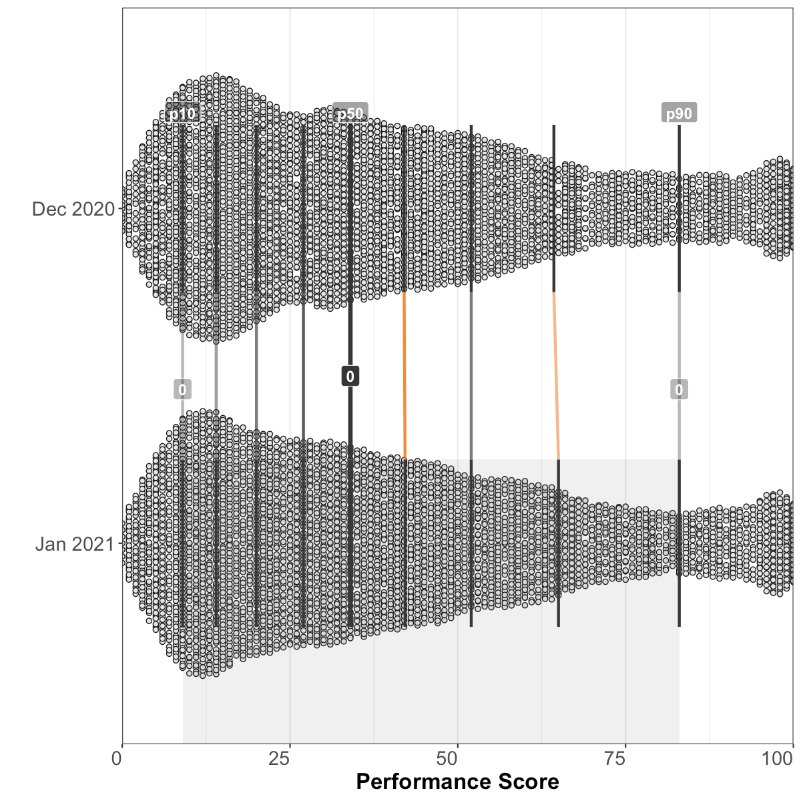

| deciles | December 2020 | January 2021 | change |
| --- | --- | --- | --- |
| p10 | 9 | **9** | 0 _(95% CI [0, 0])_ |
| p20 | 14 | **14** | 0 _(95% CI [0, 0])_ |
| p30 | 20 | **20** | 0 _(95% CI [0, 0])_ |
| p40 | 27 | **27** | 0 _(95% CI [0, 0])_ |
| p50 | 34 | **34** | 0 _(95% CI [0, 0])_ |
| p60 | 42 | **42.1** | +0.1 _(95% CI [-0.5, 0.7])_ |
| p70 | 52 | **52** | 0 _(95% CI [0, 0])_ |
| p80 | 64.3 | **65** | +0.7 _(95% CI [-0.1, 1.4])_ |
| p90 | 83 | **83** | 0 _(95% CI [0, 0])_ |

##### Distribution of performance changes seen by individual sites

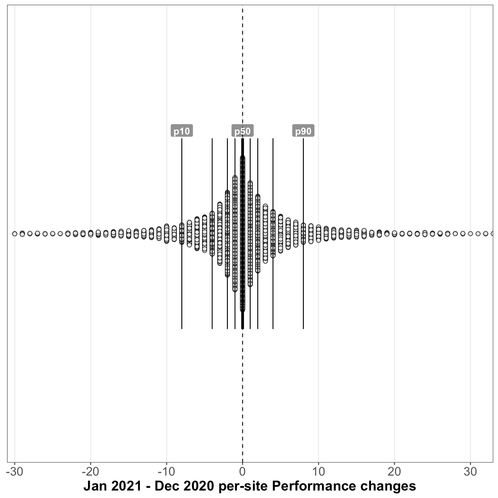

| deciles | change |
| --- | --- |
| p10 | -8 _(95% CI [-8, -8])_ |
| p20 | -4 _(95% CI [-4, -4])_ |
| p30 | -2 _(95% CI [-2, -2])_ |
| p40 | -1 _(95% CI [-1, -1])_ |
| p50 | 0 _(95% CI [0, 0])_ |
| p60 | +1 _(95% CI [1, 1])_ |
| p70 | +2 _(95% CI [2, 2])_ |
| p80 | +4 _(95% CI [4, 4])_ |
| p90 | +8 _(95% CI [8, 8])_ |

### January 2020 vs January 2021 (year-over-year)
_results based on 2,051,587 pairs of before/after runs of the same sites without error_

##### Shifts in the overall performance distribution

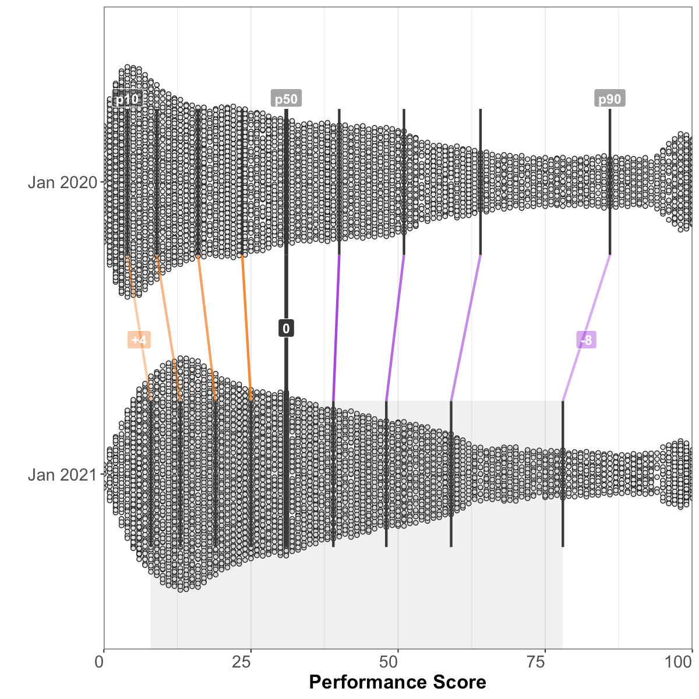

| deciles | January 2020 | January 2021 | change |
| --- | --- | --- | --- |
| p10 | 4 | **8** | +4 _(95% CI [4, 4])_ |
| p20 | 9 | **13** | +4 _(95% CI [4, 4])_ |
| p30 | 16 | **19** | +3 _(95% CI [2.6, 3.4])_ |
| p40 | 23.5 | **25** | +1.5 _(95% CI [0.7, 2.3])_ |
| p50 | 31 | **31** | 0 _(95% CI [-0.1, 0.1])_ |
| p60 | 40 | **39** | -1 _(95% CI [-1, -1])_ |
| p70 | 51 | **48** | -3 _(95% CI [-3.1, -2.9])_ |
| p80 | 64 | **59** | -5 _(95% CI [-5.3, -4.7])_ |
| p90 | 86 | **78** | -8 _(95% CI [-8.1, -7.9])_ |

##### Distribution of performance changes seen by individual sites

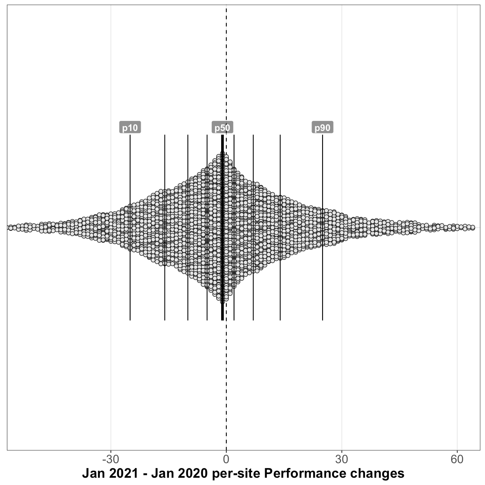

| deciles | change |
| --- | --- |
| p10 | -25 _(95% CI [-25, -25])_ |
| p20 | -16 _(95% CI [-16, -16])_ |
| p30 | -10 _(95% CI [-10, -10])_ |
| p40 | -5 _(95% CI [-5, -5])_ |
| p50 | -1 _(95% CI [-1, -1])_ |
| p60 | +2 _(95% CI [2, 2])_ |
| p70 | +7 _(95% CI [7, 7])_ |
| p80 | +14 _(95% CI [14, 14])_ |
| p90 | +25 _(95% CI [25, 25])_ |

## First Contentful Paint
### December 2020 vs January 2021 (month-over-month)
_results based on 5,188,914 pairs of before/after runs of the same sites without error_

##### Shifts in the overall FCP distribution

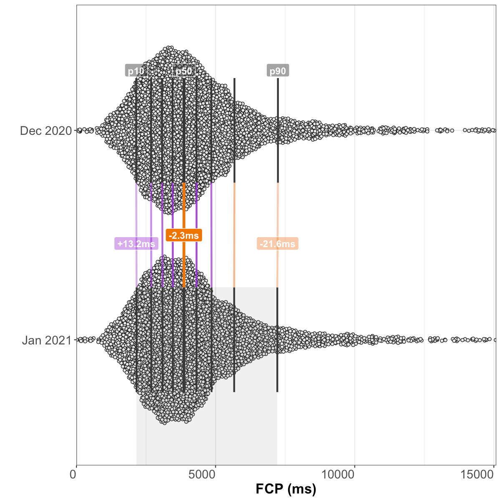

| deciles | December 2020 | January 2021 | change |
| --- | --- | --- | --- |
| p10 | 2,148.1ms | **2,161.2ms** | +13.2ms _(95% CI [11.7, 14.6])_ |
| p20 | 2,681ms | **2,689.8ms** | +8.8ms _(95% CI [7.4, 10.1])_ |
| p30 | 3,078.4ms | **3,094.7ms** | +16.3ms _(95% CI [15.1, 17.5])_ |
| p40 | 3,454.1ms | **3,465ms** | +10.9ms _(95% CI [9.5, 12.4])_ |
| p50 | 3,863.7ms | **3,861.5ms** | -2.3ms _(95% CI [-3.9, -0.7])_ |
| p60 | 4,314.5ms | **4,315.3ms** | +0.8ms _(95% CI [-1, 2.6])_ |
| p70 | 4,846.6ms | **4,854.6ms** | +8ms _(95% CI [5.9, 10.1])_ |
| p80 | 5,678.1ms | **5,667.9ms** | -10.2ms _(95% CI [-13.2, -7.1])_ |
| p90 | 7,240.3ms | **7,218.8ms** | -21.6ms _(95% CI [-28, -15.1])_ |

##### Distribution of FCP changes seen by individual sites

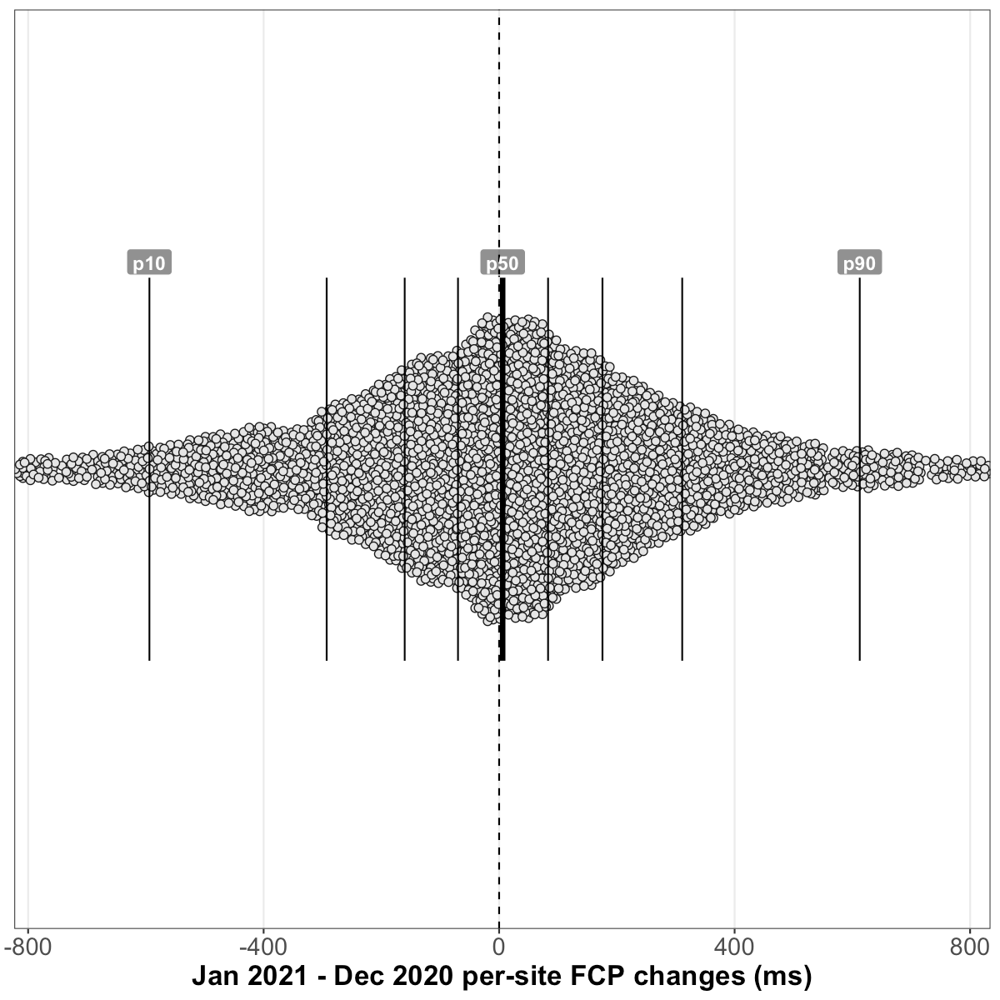

| deciles | change |
| --- | --- |
| p10 | -594ms _(95% CI [-595.4, -592.5])_ |
| p20 | -292.9ms _(95% CI [-293.5, -292.3])_ |
| p30 | -160.4ms _(95% CI [-160.8, -160])_ |
| p40 | -69.8ms _(95% CI [-70.2, -69.5])_ |
| p50 | +6.1ms _(95% CI [5.8, 6.4])_ |
| p60 | +83.1ms _(95% CI [82.8, 83.5])_ |
| p70 | +175.5ms _(95% CI [175.1, 176])_ |
| p80 | +311ms _(95% CI [310.4, 311.6])_ |
| p90 | +612.6ms _(95% CI [611.1, 613.9])_ |

### January 2020 vs January 2021 (year-over-year)
_results based on 2,518,027 pairs of before/after runs of the same sites without error_

##### Shifts in the overall FCP distribution

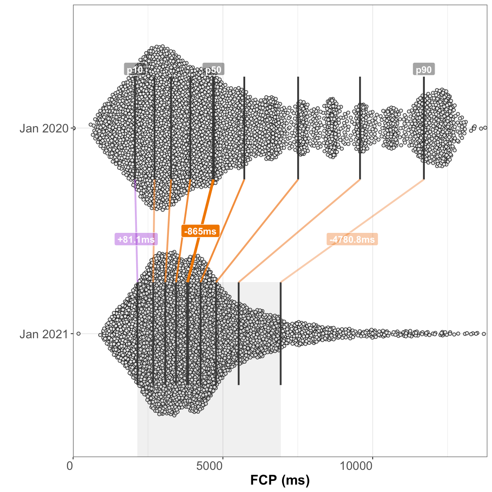

| deciles | January 2020 | January 2021 | change |
| --- | --- | --- | --- |
| p10 | 2,066.2ms | **2,147.3ms** | +81.1ms _(95% CI [77.4, 84.8])_ |
| p20 | 2,717.3ms | **2,673.5ms** | -43.8ms _(95% CI [-47.3, -40.4])_ |
| p30 | 3,270.8ms | **3,077.1ms** | -193.7ms _(95% CI [-197.8, -189.7])_ |
| p40 | 3,914.2ms | **3,436ms** | -478.2ms _(95% CI [-484, -472.5])_ |
| p50 | 4,685.1ms | **3,820ms** | -865ms _(95% CI [-870.4, -859.7])_ |
| p60 | 5,713.9ms | **4,253.5ms** | -1,460.4ms _(95% CI [-1,468.1, -1,452.7])_ |
| p70 | 7,511.5ms | **4,770.7ms** | -2,740.8ms _(95% CI [-2,752.5, -2,729])_ |
| p80 | 9,577.9ms | **5,527.1ms** | -4,050.8ms _(95% CI [-4,060, -4,041.6])_ |
| p90 | 11,709.4ms | **6,928.6ms** | -4,780.8ms _(95% CI [-4,792.2, -4,769.4])_ |

##### Distribution of FCP changes seen by individual sites

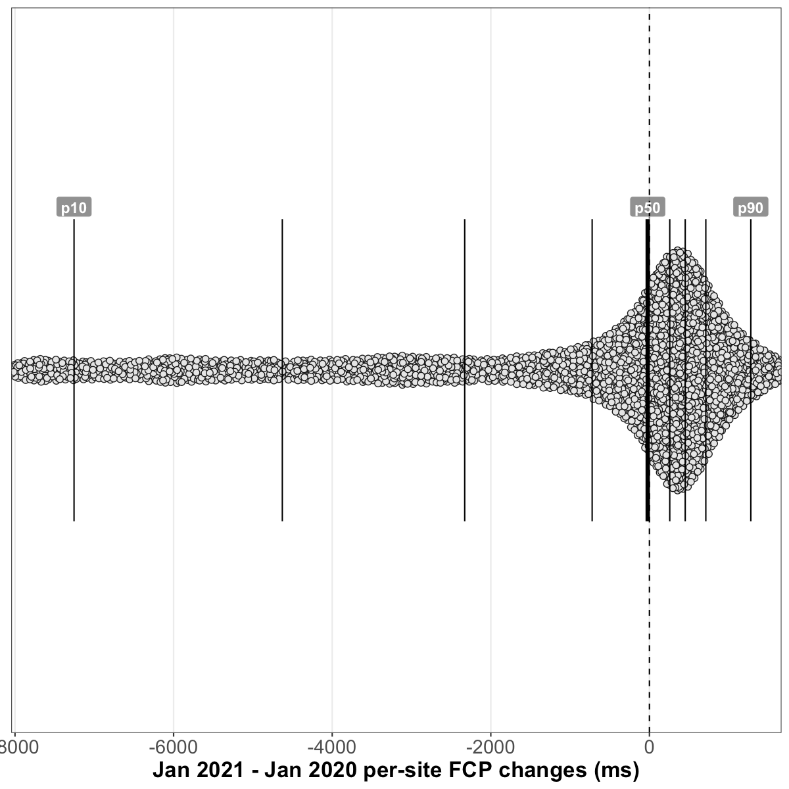

| deciles | change |
| --- | --- |
| p10 | -7,255.4ms _(95% CI [-7,264.8, -7,245.9])_ |
| p20 | -4,629.1ms _(95% CI [-4,641, -4,616.8])_ |
| p30 | -2,329.4ms _(95% CI [-2,340.4, -2,318.3])_ |
| p40 | -722.3ms _(95% CI [-729.2, -715.3])_ |
| p50 | -21.8ms _(95% CI [-24.3, -19.1])_ |
| p60 | +256.4ms _(95% CI [255.2, 257.6])_ |
| p70 | +451.4ms _(95% CI [450.2, 452.7])_ |
| p80 | +711.2ms _(95% CI [709.5, 712.8])_ |
| p90 | +1,278.3ms _(95% CI [1,274.5, 1,282])_ |

## Speed Index
### December 2020 vs January 2021 (month-over-month)
_results based on 5,184,634 pairs of before/after runs of the same sites without error_

##### Shifts in the overall Speed Index distribution

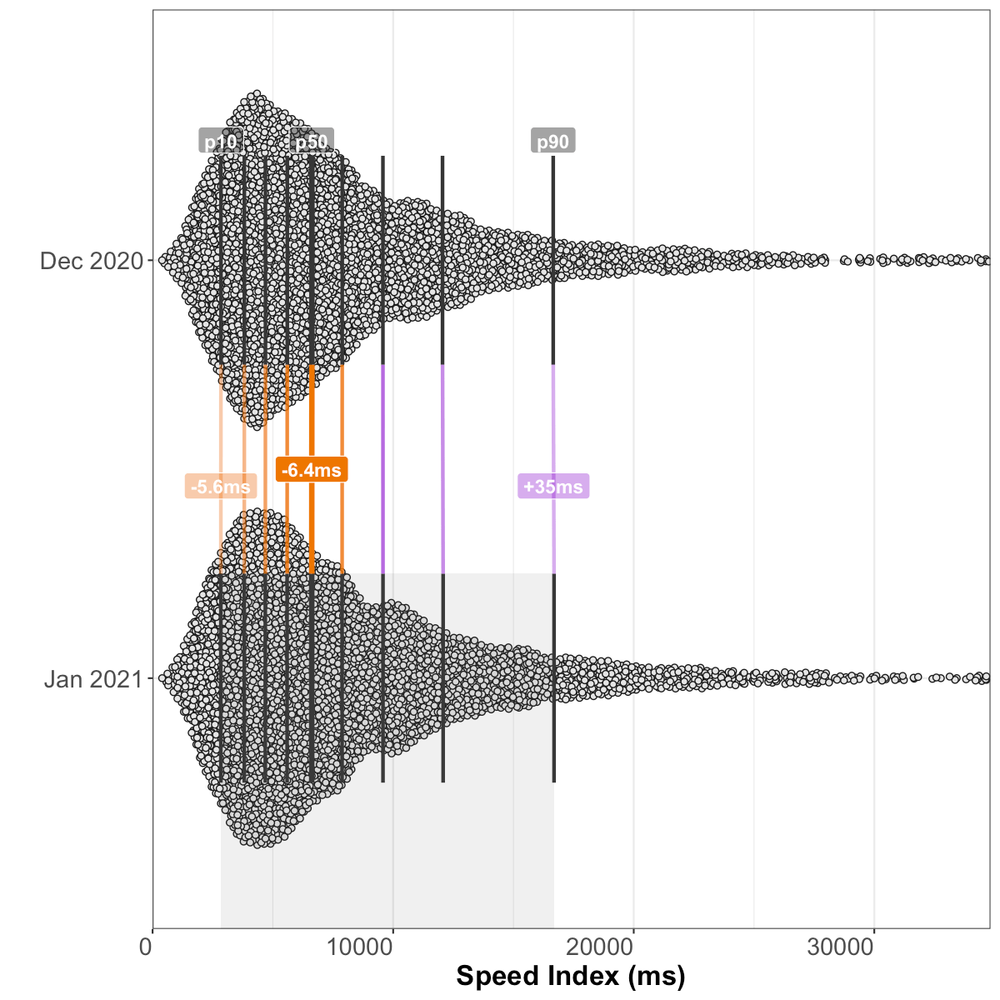

| deciles | December 2020 | January 2021 | change |
| --- | --- | --- | --- |
| p10 | 2,841.8ms | **2,836.2ms** | -5.6ms _(95% CI [-8, -3.2])_ |
| p20 | 3,814.4ms | **3,811.2ms** | -3.3ms _(95% CI [-5.8, -0.8])_ |
| p30 | 4,691.4ms | **4,684.9ms** | -6.5ms _(95% CI [-9.1, -3.9])_ |
| p40 | 5,598.3ms | **5,591.1ms** | -7.2ms _(95% CI [-10.4, -4])_ |
| p50 | 6,621.2ms | **6,614.8ms** | -6.4ms _(95% CI [-10.5, -2.4])_ |
| p60 | 7,881.8ms | **7,877.3ms** | -4.5ms _(95% CI [-9.9, 0.9])_ |
| p70 | 9,574.5ms | **9,577.1ms** | +2.7ms _(95% CI [-4.6, 10])_ |
| p80 | 12,051.8ms | **12,076.9ms** | +25.1ms _(95% CI [15.3, 34.9])_ |
| p90 | 16,652.8ms | **16,687.8ms** | +35ms _(95% CI [16.6, 53.5])_ |

##### Distribution of Speed Index changes seen by individual sites

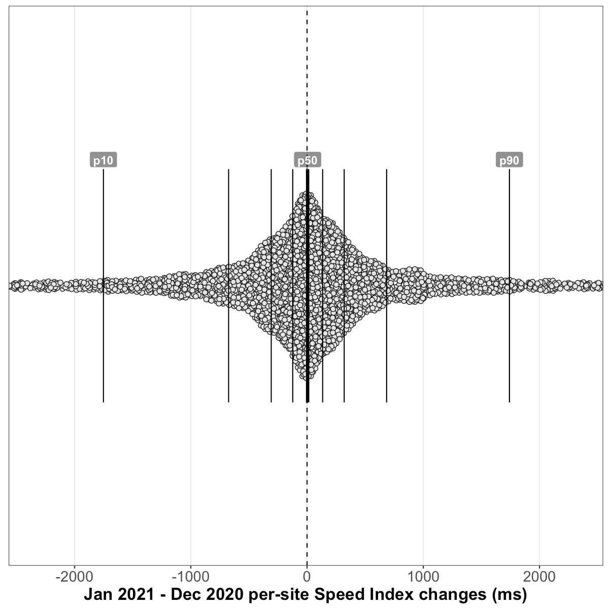

| deciles | change |
| --- | --- |
| p10 | -1,751.9ms _(95% CI [-1,757.1, -1,746.8])_ |
| p20 | -674.9ms _(95% CI [-676.7, -673])_ |
| p30 | -308.1ms _(95% CI [-309.1, -307.1])_ |
| p40 | -123.3ms _(95% CI [-124, -122.7])_ |
| p50 | +5ms _(95% CI [4.5, 5.5])_ |
| p60 | +134.1ms _(95% CI [133.5, 134.8])_ |
| p70 | +319.5ms _(95% CI [318.6, 320.5])_ |
| p80 | +684.6ms _(95% CI [682.7, 686.5])_ |
| p90 | +1,741.3ms _(95% CI [1,736.1, 1,746.3])_ |

### January 2020 vs January 2021 (year-over-year)
_results based on 2,512,678 pairs of before/after runs of the same sites without error_

##### Shifts in the overall Speed Index distribution

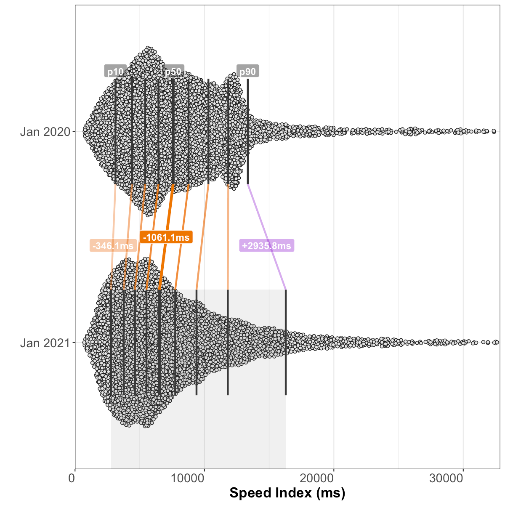

| deciles | January 2020 | January 2021 | change |
| --- | --- | --- | --- |
| p10 | 3,124.9ms | **2,778.8ms** | -346.1ms _(95% CI [-352.8, -339.3])_ |
| p20 | 4,404.8ms | **3,762.7ms** | -642.2ms _(95% CI [-649.3, -635])_ |
| p30 | 5,420.2ms | **4,630ms** | -790.2ms _(95% CI [-799.4, -780.9])_ |
| p40 | 6,447.3ms | **5,520.4ms** | -926.9ms _(95% CI [-937.1, -916.7])_ |
| p50 | 7,583.5ms | **6,522.4ms** | -1,061.1ms _(95% CI [-1,071.5, -1,050.6])_ |
| p60 | 8,773.8ms | **7,743ms** | -1,030.9ms _(95% CI [-1,042, -1,019.7])_ |
| p70 | 10,307ms | **9,387.6ms** | -919.4ms _(95% CI [-937.8, -901])_ |
| p80 | 11,842ms | **11,806.9ms** | -35.1ms _(95% CI [-54.2, -16.1])_ |
| p90 | 13,349.5ms | **16,285.3ms** | +2,935.8ms _(95% CI [2,898.5, 2,973.1])_ |

##### Distribution of Speed Index changes seen by individual sites

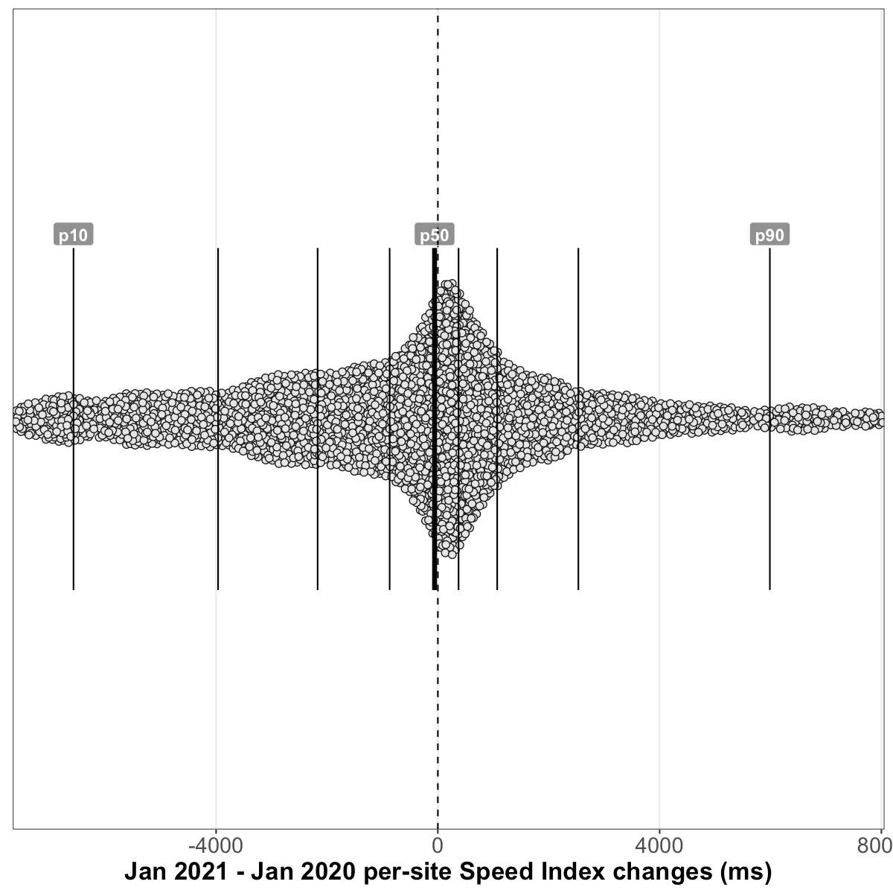

| deciles | change |
| --- | --- |
| p10 | -6,572ms _(95% CI [-6,584, -6,559.5])_ |
| p20 | -3,964.2ms _(95% CI [-3,974.6, -3,954.1])_ |
| p30 | -2,169.1ms _(95% CI [-2,177.7, -2,160.2])_ |
| p40 | -869.7ms _(95% CI [-876.2, -863.3])_ |
| p50 | -59.4ms _(95% CI [-62.6, -56.1])_ |
| p60 | +373.3ms _(95% CI [370.5, 376.3])_ |
| p70 | +1,070.5ms _(95% CI [1,064.8, 1,076.3])_ |
| p80 | +2,534.3ms _(95% CI [2,524.3, 2,544.2])_ |
| p90 | +5,988.3ms _(95% CI [5,968.5, 6,009.2])_ |

## Largest Contentful Paint
### December 2020 vs January 2021 (month-over-month)
_results based on 5,176,393 pairs of before/after runs of the same sites without error_

##### Shifts in the overall LCP distribution

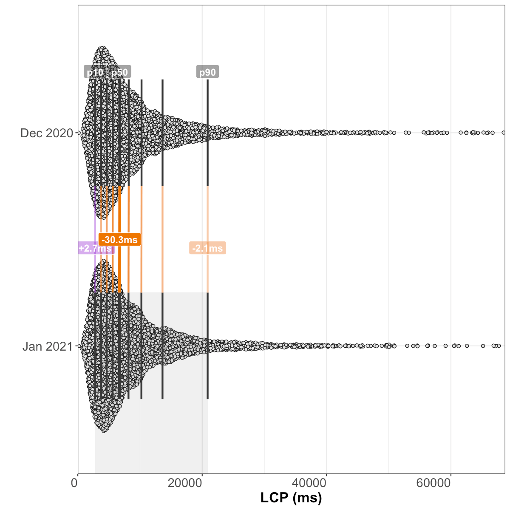

| deciles | December 2020 | January 2021 | change |
| --- | --- | --- | --- |
| p10 | 2,784ms | **2,786.7ms** | +2.7ms _(95% CI [0.4, 5])_ |
| p20 | 3,746.9ms | **3,745.4ms** | -1.5ms _(95% CI [-3.9, 0.8])_ |
| p30 | 4,644.8ms | **4,644.2ms** | -0.6ms _(95% CI [-3.6, 2.3])_ |
| p40 | 5,613.7ms | **5,599.6ms** | -14.1ms _(95% CI [-17.9, -10.4])_ |
| p50 | 6,741.6ms | **6,711.3ms** | -30.3ms _(95% CI [-34.7, -25.9])_ |
| p60 | 8,182.4ms | **8,147.2ms** | -35.3ms _(95% CI [-41.5, -29])_ |
| p70 | 10,248.8ms | **10,221.8ms** | -27ms _(95% CI [-36.2, -17.8])_ |
| p80 | 13,624.4ms | **13,617.1ms** | -7.3ms _(95% CI [-22, 7.5])_ |
| p90 | 20,877.5ms | **20,875.4ms** | -2.1ms _(95% CI [-30.8, 26.7])_ |

##### Distribution of LCP changes seen by individual sites

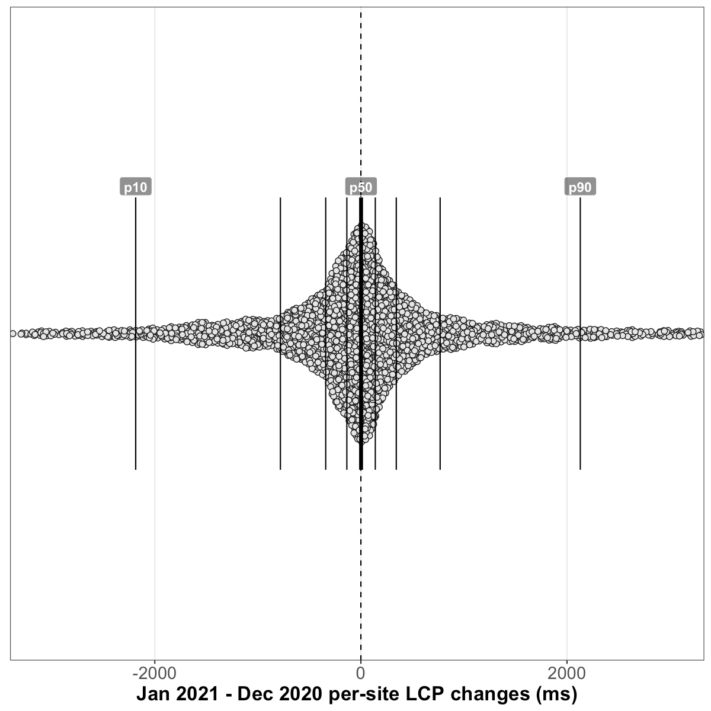

| deciles | change |
| --- | --- |
| p10 | -2,185.1ms _(95% CI [-2,192.3, -2,178])_ |
| p20 | -781ms _(95% CI [-783.4, -778.7])_ |
| p30 | -341.3ms _(95% CI [-342.4, -340.3])_ |
| p40 | -136.1ms _(95% CI [-136.8, -135.4])_ |
| p50 | +1.9ms _(95% CI [1.3, 2.4])_ |
| p60 | +140ms _(95% CI [139.3, 140.6])_ |
| p70 | +343.3ms _(95% CI [342.4, 344.4])_ |
| p80 | +768.9ms _(95% CI [766.7, 771.2])_ |
| p90 | +2,129.2ms _(95% CI [2,122.1, 2,136.4])_ |

### January 2020 vs January 2021 (year-over-year)
_results based on 2,059,516 pairs of before/after runs of the same sites without error_

##### Shifts in the overall LCP distribution

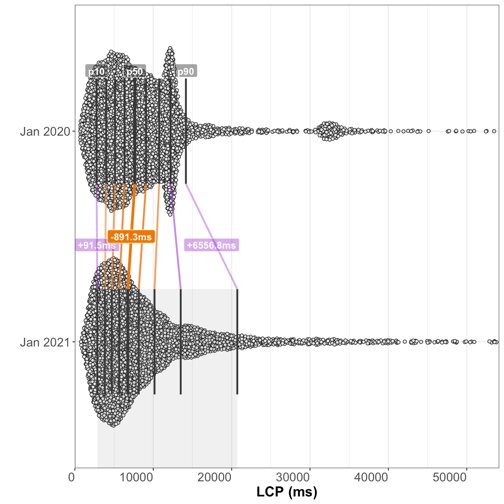

| deciles | January 2020 | January 2021 | change |
| --- | --- | --- | --- |
| p10 | 2,768.5ms | **2,860.1ms** | +91.5ms _(95% CI [85.5, 97.6])_ |
| p20 | 3,984.9ms | **3,824ms** | -161ms _(95% CI [-169.6, -152.3])_ |
| p30 | 5,118.3ms | **4,716.2ms** | -402.1ms _(95% CI [-412.7, -391.5])_ |
| p40 | 6,333.3ms | **5,659.5ms** | -673.8ms _(95% CI [-687, -660.5])_ |
| p50 | 7,645.1ms | **6,753.8ms** | -891.3ms _(95% CI [-903.4, -879.3])_ |
| p60 | 9,075.4ms | **8,156ms** | -919.4ms _(95% CI [-940.9, -897.9])_ |
| p70 | 10,752.4ms | **10,163.8ms** | -588.6ms _(95% CI [-612.2, -565.1])_ |
| p80 | 12,209.8ms | **13,504.2ms** | +1,294.4ms _(95% CI [1,263.6, 1,325.2])_ |
| p90 | 14,165.8ms | **20,722.6ms** | +6,556.8ms _(95% CI [6,484.5, 6,629])_ |

##### Distribution of LCP changes seen by individual sites

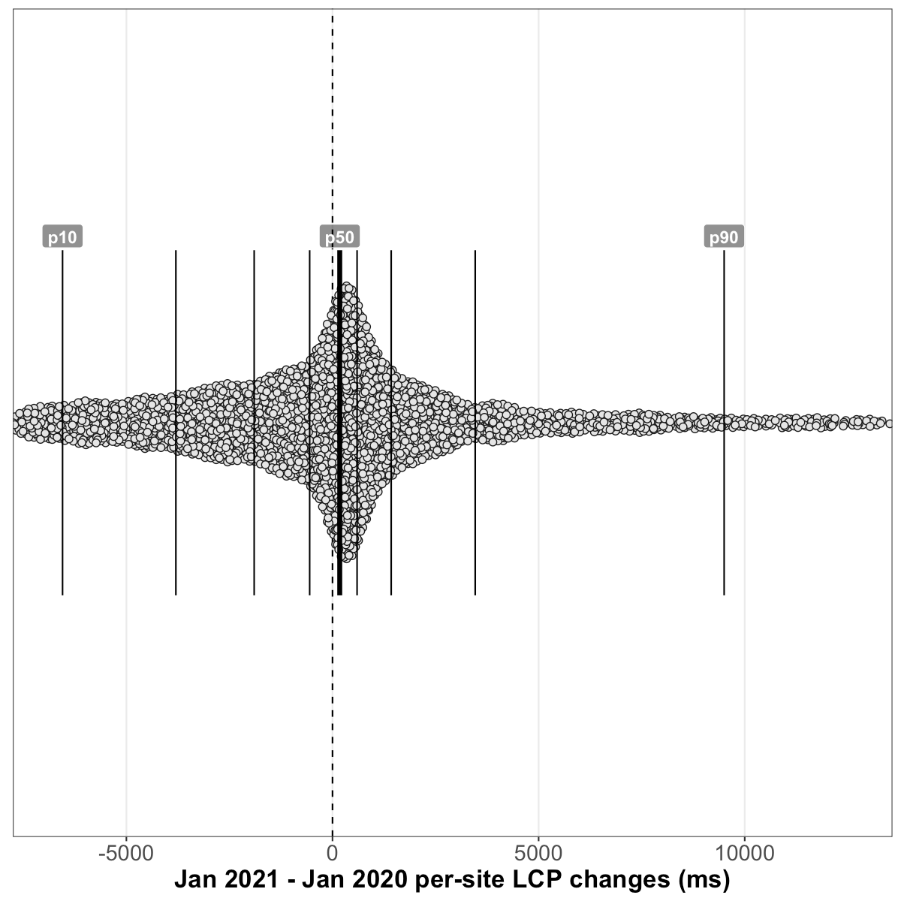

| deciles | change |
| --- | --- |
| p10 | -6,548.4ms _(95% CI [-6,562.6, -6,533.1])_ |
| p20 | -3,799.4ms _(95% CI [-3,811.6, -3,786.7])_ |
| p30 | -1,900.2ms _(95% CI [-1,910.5, -1,890.2])_ |
| p40 | -553.9ms _(95% CI [-561, -546.9])_ |
| p50 | +175.6ms _(95% CI [172.7, 178.5])_ |
| p60 | +596.1ms _(95% CI [592.5, 599.7])_ |
| p70 | +1,424ms _(95% CI [1,416.3, 1,432])_ |
| p80 | +3,461.8ms _(95% CI [3,444.2, 3,480.2])_ |
| p90 | +9,500.6ms _(95% CI [9,459.9, 9,542.9])_ |

## Time to Interactive
### December 2020 vs January 2021 (month-over-month)
_results based on 4,479,775 pairs of before/after runs of the same sites without error_

##### Shifts in the overall TTI distribution

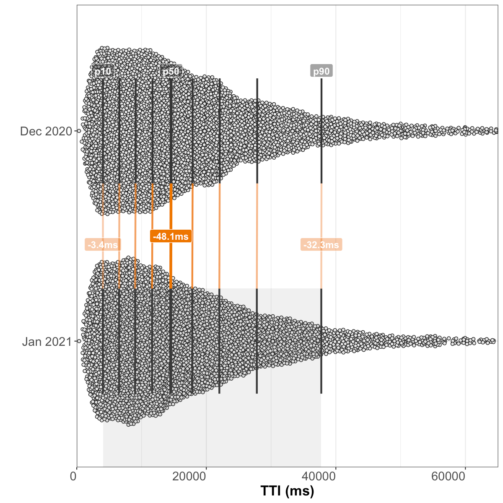

| deciles | December 2020 | January 2021 | change |
| --- | --- | --- | --- |
| p10 | 4,040.5ms | **4,037.1ms** | -3.4ms _(95% CI [-10.1, 3.2])_ |
| p20 | 6,581.4ms | **6,537ms** | -44.3ms _(95% CI [-52.1, -36.6])_ |
| p30 | 9,088.8ms | **9,009.9ms** | -78.9ms _(95% CI [-89.1, -68.6])_ |
| p40 | 11,695.8ms | **11,627.8ms** | -67.9ms _(95% CI [-78.6, -57.2])_ |
| p50 | 14,557.2ms | **14,509.1ms** | -48.1ms _(95% CI [-61, -35.2])_ |
| p60 | 17,885.6ms | **17,829.5ms** | -56.1ms _(95% CI [-71.1, -41])_ |
| p70 | 22,067.4ms | **22,013.8ms** | -53.6ms _(95% CI [-72.3, -34.9])_ |
| p80 | 27,857.6ms | **27,798.4ms** | -59.2ms _(95% CI [-91.1, -27.2])_ |
| p90 | 37,781.5ms | **37,749.2ms** | -32.3ms _(95% CI [-89.1, 24.5])_ |

##### Distribution of TTI changes seen by individual sites

| deciles | change |
| --- | --- |
| p10 | -6,248.2ms _(95% CI [-6,265.1, -6,230.1])_ |
| p20 | -2,449.5ms _(95% CI [-2,458.2, -2,440.5])_ |
| p30 | -885.1ms _(95% CI [-889.2, -881.2])_ |
| p40 | -273.6ms _(95% CI [-275.3, -271.9])_ |
| p50 | -0.6ms _(95% CI [-1.6, 0.4])_ |
| p60 | +267ms _(95% CI [265.4, 268.7])_ |
| p70 | +842.4ms _(95% CI [838.5, 846.2])_ |
| p80 | +2,331.6ms _(95% CI [2,322.6, 2,340.1])_ |
| p90 | +6,078ms _(95% CI [6,059.9, 6,094.1])_ |

### January 2020 vs January 2021 (year-over-year)
_results based on 2,088,803 pairs of before/after runs of the same sites without error_

##### Shifts in the overall TTI distribution

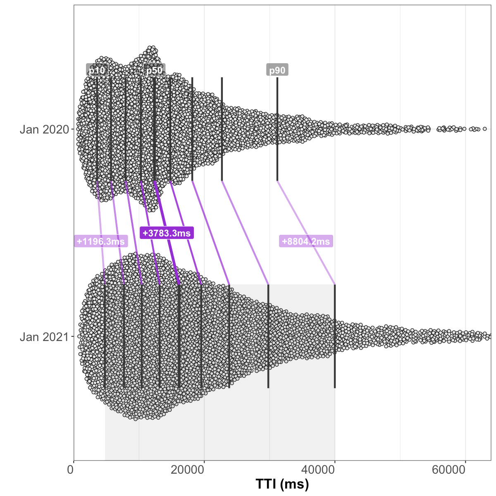

| deciles | January 2020 | January 2021 | change |
| --- | --- | --- | --- |
| p10 | 3,574.9ms | **4,771.3ms** | +1,196.3ms _(95% CI [1,183.2, 1,209.5])_ |
| p20 | 5,712.8ms | **7,700.1ms** | +1,987.2ms _(95% CI [1,969.9, 2,004.5])_ |
| p30 | 7,943.6ms | **10,422.5ms** | +2,478.8ms _(95% CI [2,457.9, 2,499.7])_ |
| p40 | 10,283.3ms | **13,164.4ms** | +2,881.1ms _(95% CI [2,858.3, 2,904])_ |
| p50 | 12,368.2ms | **16,151.5ms** | +3,783.3ms _(95% CI [3,760.5, 3,806.2])_ |
| p60 | 14,778.6ms | **19,523.6ms** | +4,745ms _(95% CI [4,708.6, 4,781.3])_ |
| p70 | 18,157.7ms | **23,812ms** | +5,654.2ms _(95% CI [5,623.7, 5,684.8])_ |
| p80 | 22,698ms | **29,799.7ms** | +7,101.7ms _(95% CI [7,058.2, 7,145.1])_ |
| p90 | 31,183.8ms | **39,988ms** | +8,804.2ms _(95% CI [8,717.3, 8,891.1])_ |

##### Distribution of TTI changes seen by individual sites

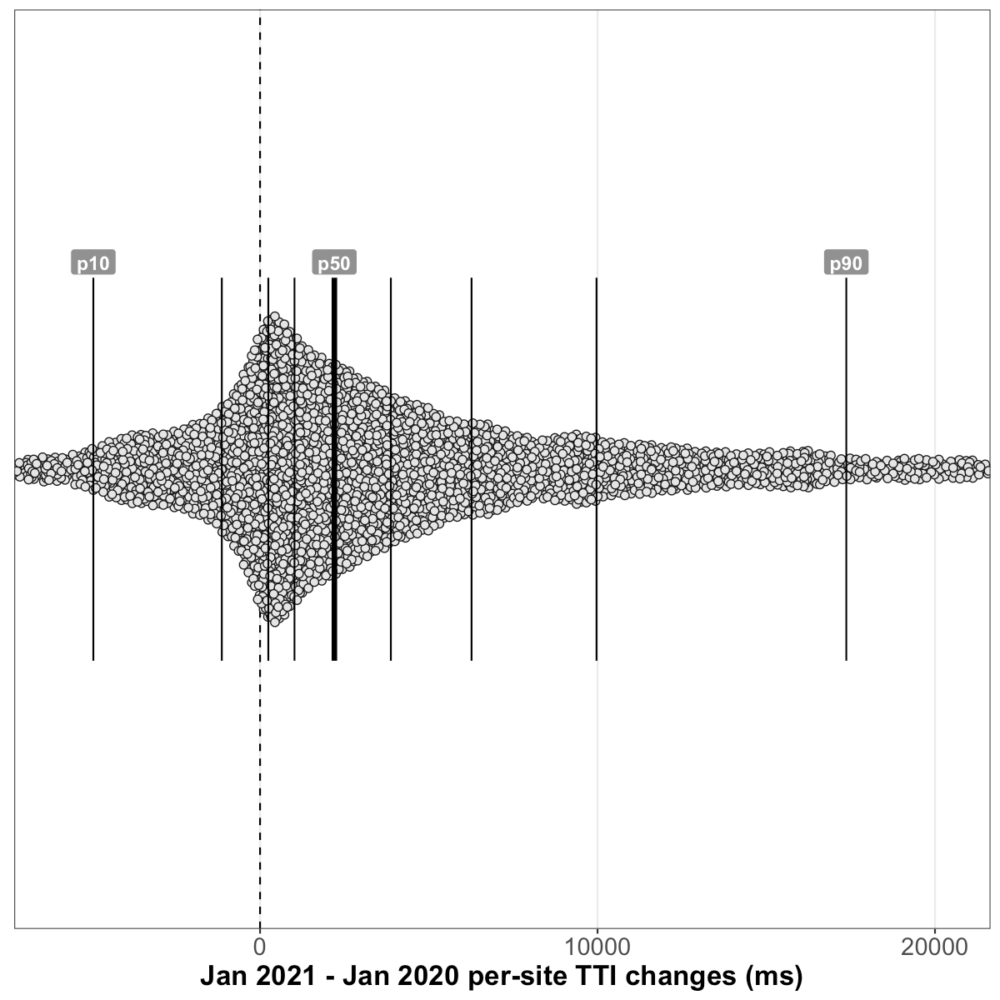

| deciles | change |
| --- | --- |
| p10 | -4,940.2ms _(95% CI [-4,966.5, -4,913.5])_ |
| p20 | -1,133.2ms _(95% CI [-1,146, -1,120.3])_ |
| p30 | +244.8ms _(95% CI [240.7, 249])_ |
| p40 | +1,020.2ms _(95% CI [1,014.1, 1,026.3])_ |
| p50 | +2,202.8ms _(95% CI [2,193, 2,212])_ |
| p60 | +3,876ms _(95% CI [3,862.6, 3,888.6])_ |
| p70 | +6,266.3ms _(95% CI [6,249.3, 6,283.5])_ |
| p80 | +9,969.5ms _(95% CI [9,943.9, 9,993.4])_ |
| p90 | +17,371.6ms _(95% CI [17,324.4, 17,420.2])_ |

## Total Blocking Time
### December 2020 vs January 2021 (month-over-month)
_results based on 4,479,775 pairs of before/after runs of the same sites without error_

##### Shifts in the overall TBT distribution

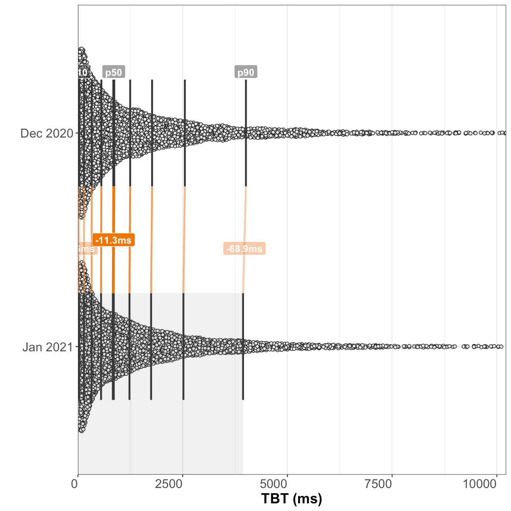

| deciles | December 2020 | January 2021 | change |
| --- | --- | --- | --- |
| p10 | 30.4ms | **29.8ms** | -0.6ms _(95% CI [-0.8, -0.4])_ |
| p20 | 144.6ms | **142.6ms** | -2ms _(95% CI [-2.5, -1.5])_ |
| p30 | 329.3ms | **324.4ms** | -4.8ms _(95% CI [-5.5, -4.1])_ |
| p40 | 558.2ms | **551.2ms** | -7ms _(95% CI [-7.9, -6])_ |
| p50 | 854.7ms | **843.4ms** | -11.3ms _(95% CI [-12.7, -9.9])_ |
| p60 | 1,245.9ms | **1,229.3ms** | -16.6ms _(95% CI [-18.5, -14.7])_ |
| p70 | 1,769.7ms | **1,745.6ms** | -24.2ms _(95% CI [-26.7, -21.6])_ |
| p80 | 2,552.1ms | **2,517.3ms** | -34.8ms _(95% CI [-38.5, -31.2])_ |
| p90 | 4,009.9ms | **3,941ms** | -68.9ms _(95% CI [-75.2, -62.6])_ |

##### Distribution of TBT changes seen by individual sites

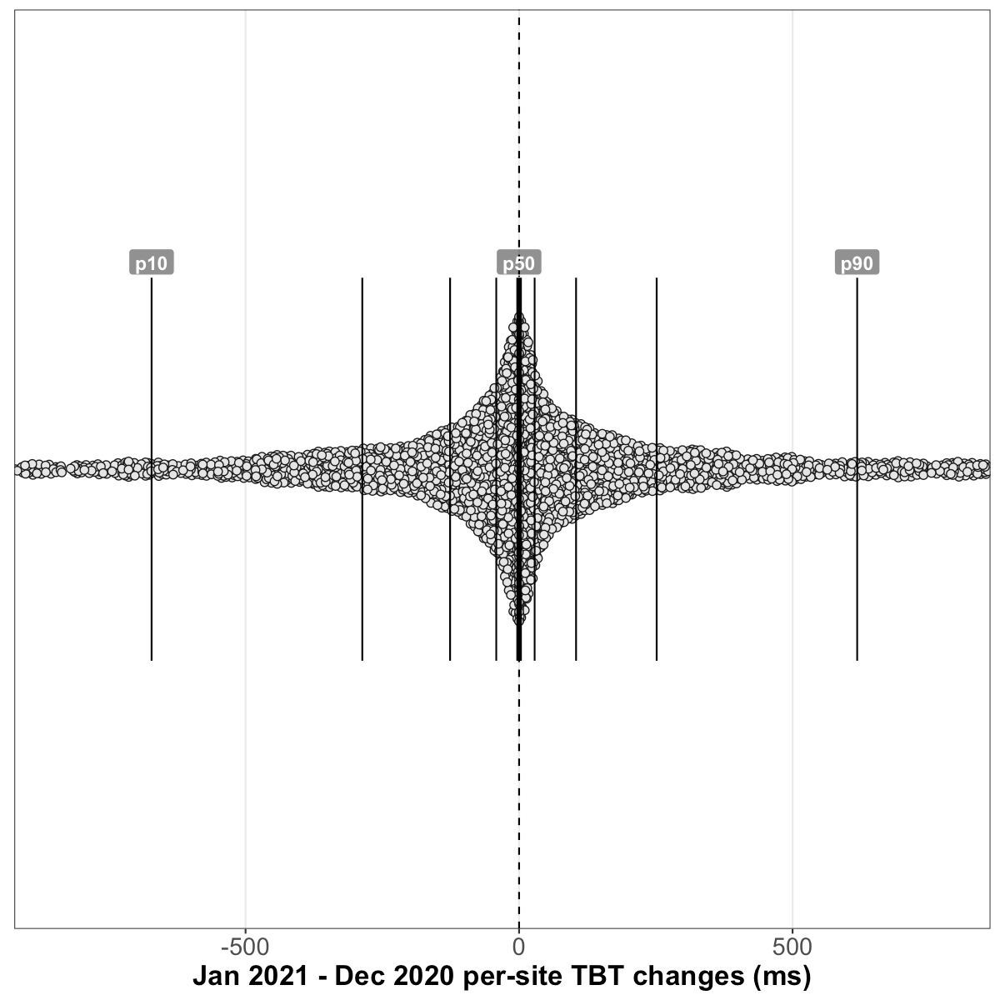

| deciles | change |
| --- | --- |
| p10 | -671.8ms _(95% CI [-673.6, -669.9])_ |
| p20 | -286.6ms _(95% CI [-287.4, -285.7])_ |
| p30 | -126.1ms _(95% CI [-126.5, -125.6])_ |
| p40 | -41.7ms _(95% CI [-42, -41.4])_ |
| p50 | 0ms _(95% CI [0, 0])_ |
| p60 | +28.4ms _(95% CI [28.2, 28.7])_ |
| p70 | +104.2ms _(95% CI [103.7, 104.6])_ |
| p80 | +251.5ms _(95% CI [250.8, 252.3])_ |
| p90 | +618.1ms _(95% CI [616.2, 619.8])_ |

### January 2020 vs January 2021 (year-over-year)
_results based on 2,088,803 pairs of before/after runs of the same sites without error_

##### Shifts in the overall TBT distribution

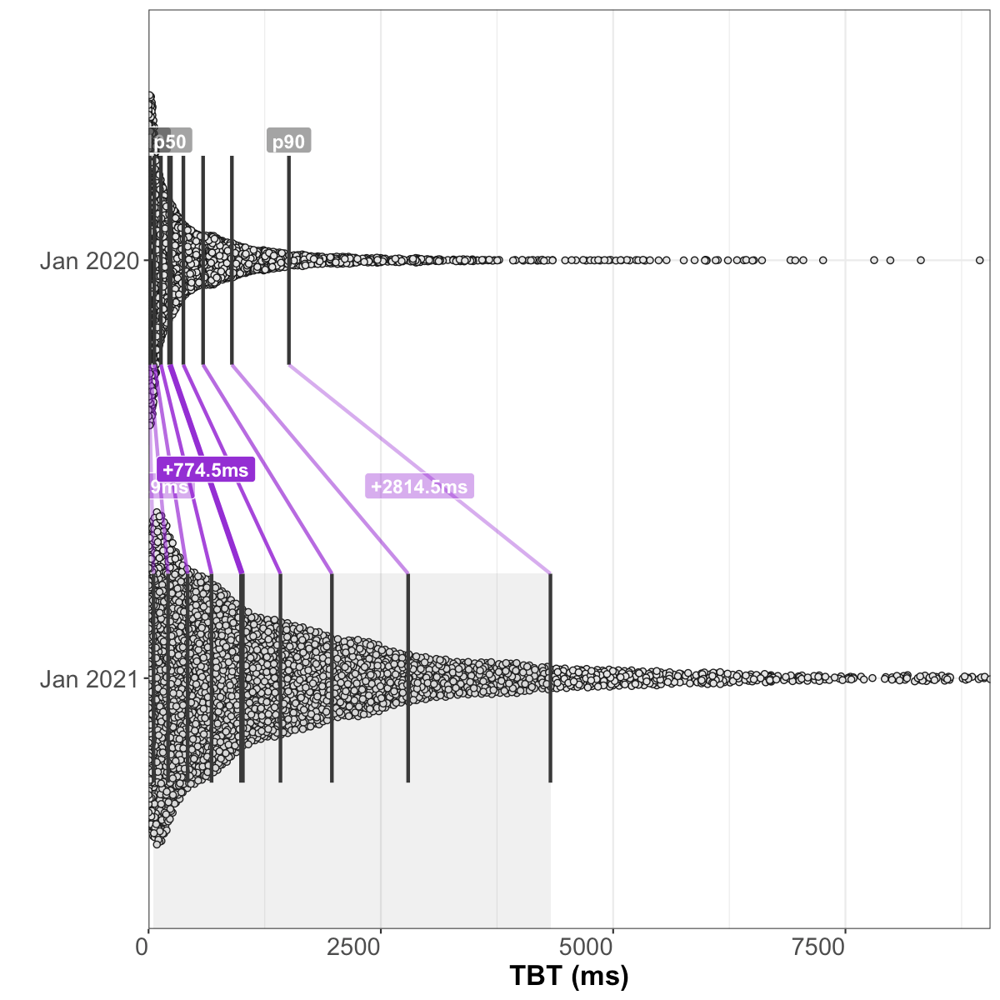

| deciles | January 2020 | January 2021 | change |
| --- | --- | --- | --- |
| p10 | 0ms | **53.9ms** | +53.9ms _(95% CI [53.3, 54.5])_ |
| p20 | 13.7ms | **209.5ms** | +195.8ms _(95% CI [194.4, 197.1])_ |
| p30 | 62.4ms | **420.9ms** | +358.6ms _(95% CI [356.8, 360.3])_ |
| p40 | 133.1ms | **677.7ms** | +544.6ms _(95% CI [542.3, 547])_ |
| p50 | 230.5ms | **1,005.1ms** | +774.5ms _(95% CI [771.4, 777.7])_ |
| p60 | 374.7ms | **1,419.5ms** | +1,044.8ms _(95% CI [1,041.3, 1,048.4])_ |
| p70 | 586.8ms | **1,973.1ms** | +1,386.2ms _(95% CI [1,381.6, 1,390.9])_ |
| p80 | 896.9ms | **2,793.8ms** | +1,896.8ms _(95% CI [1,889.7, 1,903.9])_ |
| p90 | 1,510.6ms | **4,325ms** | +2,814.5ms _(95% CI [2,802.1, 2,826.8])_ |

##### Distribution of TBT changes seen by individual sites

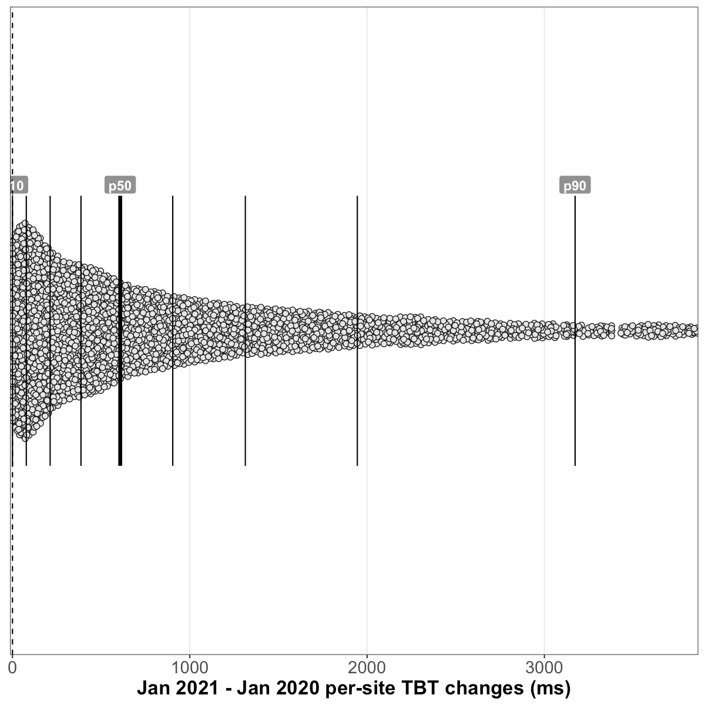

| deciles | change |
| --- | --- |
| p10 | 0ms _(95% CI [0, 0])_ |
| p20 | +77.9ms _(95% CI [77.3, 78.5])_ |
| p30 | +212.3ms _(95% CI [211.3, 213.3])_ |
| p40 | +386.3ms _(95% CI [385, 387.5])_ |
| p50 | +607.5ms _(95% CI [605.9, 609.3])_ |
| p60 | +903.9ms _(95% CI [901.8, 906.2])_ |
| p70 | +1,313.3ms _(95% CI [1,310.2, 1,316.6])_ |
| p80 | +1,944.9ms _(95% CI [1,940.7, 1,949.5])_ |
| p90 | +3,173ms _(95% CI [3,164.9, 3,180.2])_ |

## Cumulative Layout Shift
### December 2020 vs January 2021 (month-over-month)
_results based on 5,187,949 pairs of before/after runs of the same sites without error_

##### Shifts in the overall CLS distribution

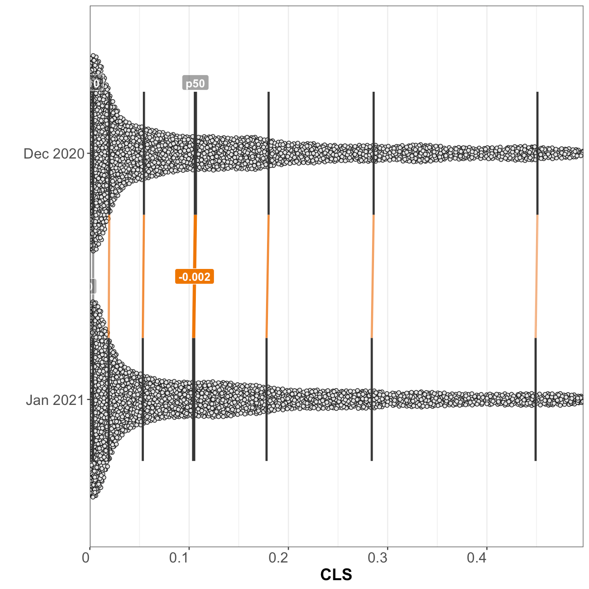

| deciles | December 2020 | January 2021 | change |
| --- | --- | --- | --- |
| p10 | 0 | **0** | 0 _(95% CI [0, 0])_ |
| p20 | 0.003 | **0.003** | 0 _(95% CI [0, 0])_ |
| p30 | 0.02 | **0.019** | -0.001 _(95% CI [-0.001, 0])_ |
| p40 | 0.054 | **0.053** | -0.001 _(95% CI [-0.001, -0.001])_ |
| p50 | 0.106 | **0.105** | -0.002 _(95% CI [-0.002, -0.002])_ |
| p60 | 0.18 | **0.178** | -0.002 _(95% CI [-0.002, -0.002])_ |
| p70 | 0.286 | **0.284** | -0.002 _(95% CI [-0.002, -0.002])_ |
| p80 | 0.451 | **0.449** | -0.002 _(95% CI [-0.002, -0.001])_ |
| p90 | 0.798 | **0.797** | -0.001 _(95% CI [-0.002, 0])_ |

##### Distribution of CLS changes seen by individual sites

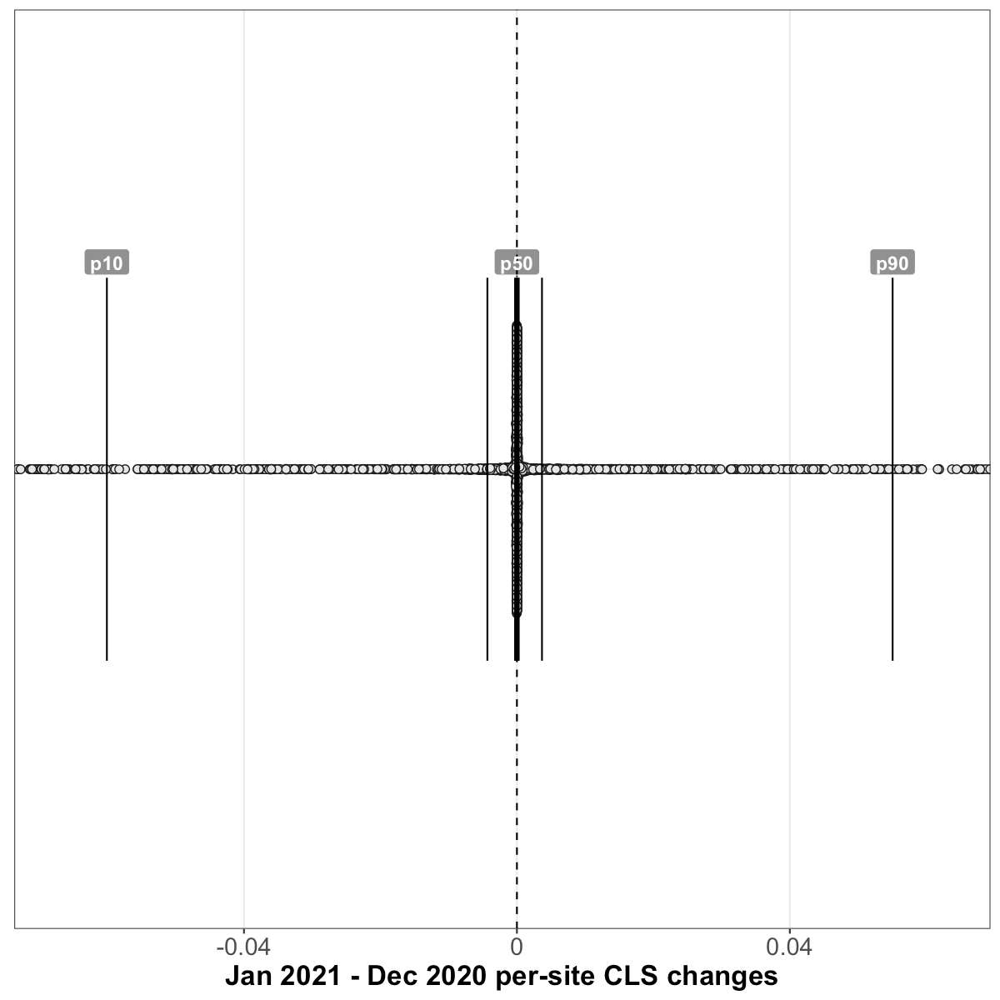

| deciles | change |
| --- | --- |
| p10 | -0.06 _(95% CI [-0.06, -0.06])_ |
| p20 | -0.004 _(95% CI [-0.004, -0.004])_ |
| p30 | 0 _(95% CI [0, 0])_ |
| p40 | 0 _(95% CI [0, 0])_ |
| p50 | 0 _(95% CI [0, 0])_ |
| p60 | 0 _(95% CI [0, 0])_ |
| p70 | 0 _(95% CI [0, 0])_ |
| p80 | +0.004 _(95% CI [0.004, 0.004])_ |
| p90 | +0.055 _(95% CI [0.055, 0.055])_ |

### January 2020 vs January 2021 (year-over-year)

CLS data was not collected in January 2020.

