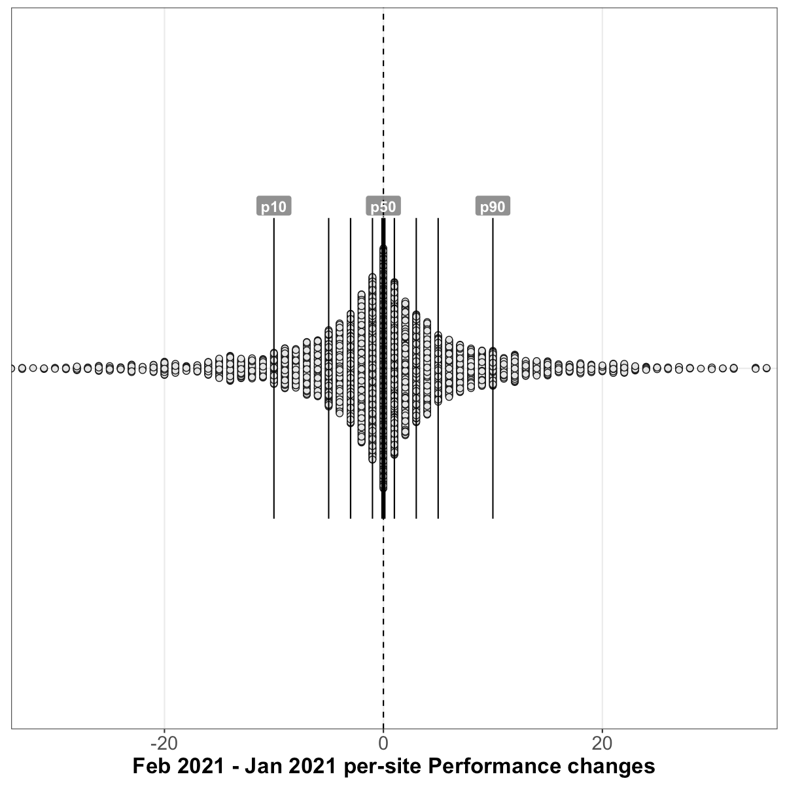
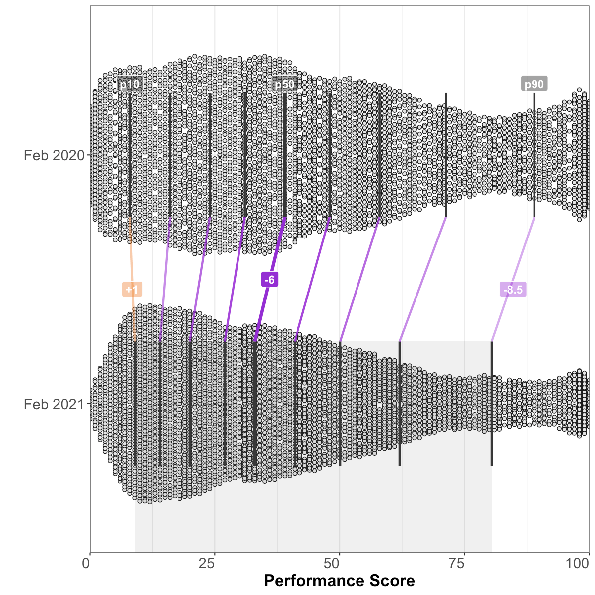

# Analysis of HTTP Archive Lighthouse results, February 2021 
## Summary of queried tables
**February 2021** (latest):
  - Lighthouse versions: [`6.4.1`](https://github.com/GoogleChrome/lighthouse/releases/tag/v6.4.1), [`7.0.1`](https://github.com/GoogleChrome/lighthouse/releases/tag/v7.0.1), and [`7.1.0`](https://github.com/GoogleChrome/lighthouse/releases/tag/v7.1.0)
  - **6.9M** total Lighthouse runs
  - **1.44% error rate** (99K runs with a `runtimeError`)
  - 15.91% metric error rate (1.1M runs with a `null` Performance score)
  - Chrome versions: `79.0.3945`, `87.0.4280`, and `88.0.4324`

**January 2021** (one month prior):
  - Lighthouse version: [`7.0.0`](https://github.com/GoogleChrome/lighthouse/releases/tag/v7.0.0)
  - **6.7M** total Lighthouse runs
  - **1.56% error rate** (105K runs with a `runtimeError`)
  - 10.61% metric error rate (712K runs with a `null` Performance score)
  - Chrome version: `87.0.4280`

**February 2020** (one year prior):
  - Lighthouse version: [`5.6.0`](https://github.com/GoogleChrome/lighthouse/releases/tag/v5.6.0)
  - **5.1M** total Lighthouse runs
  - **1.37% error rate** (70K runs with a `runtimeError`)
  - 6.06% metric error rate (307K runs with a `null` Performance score)
  - Chrome versions: `79.0.3945`, and `80.0.3987`

## Overall Performance score

### January 2021 vs February 2021 (month-over-month)
_results based on 5,202,731 pairs of before/after runs of the same sites without error_

##### Shifts in the overall performance distribution

| deciles | January 2021 | February 2021 | change |
| --- | --- | --- | --- |
| p10 | 9 | **9** | 0 _(95% CI [0, 0])_ |
| p20 | 15 | **15** | 0 _(95% CI [0, 0])_ |
| p30 | 22 | **22** | 0 _(95% CI [0, 0])_ |
| p40 | 29 | **29** | 0 _(95% CI [0, 0])_ |
| p50 | 36 | **36** | 0 _(95% CI [0, 0])_ |
| p60 | 44 | **44** | 0 _(95% CI [0, 0])_ |
| p70 | 54 | **54** | 0 _(95% CI [0, 0])_ |
| p80 | 66 | **66** | 0 _(95% CI [-0.2, 0.2])_ |
| p90 | 85 | **85** | 0 _(95% CI [-0.2, 0.2])_ |

##### Distribution of performance changes seen by individual sites

| deciles | change |
| --- | --- |
| p10 | -10 _(95% CI [-10, -10])_ |
| p20 | -5 _(95% CI [-5, -5])_ |
| p30 | -3 _(95% CI [-3, -3])_ |
| p40 | -1 _(95% CI [-1, -1])_ |
| p50 | 0 _(95% CI [0, 0])_ |
| p60 | +1 _(95% CI [1, 1])_ |
| p70 | +3 _(95% CI [3, 3])_ |
| p80 | +5 _(95% CI [5, 5])_ |
| p90 | +10 _(95% CI [10, 10])_ |

### February 2020 vs February 2021 (year-over-year)
_results based on 2,382,283 pairs of before/after runs of the same sites without error_

##### Shifts in the overall performance distribution

| deciles | February 2020 | February 2021 | change |
| --- | --- | --- | --- |
| p10 | 8 | **9** | +1 _(95% CI [0.8, 1.2])_ |
| p20 | 16 | **14** | -2 _(95% CI [-2, -2])_ |
| p30 | 24 | **20** | -4 _(95% CI [-4, -4])_ |
| p40 | 31 | **27** | -4 _(95% CI [-4.3, -3.7])_ |
| p50 | 39 | **33** | -6 _(95% CI [-6, -6])_ |
| p60 | 48 | **41** | -7 _(95% CI [-7, -7])_ |
| p70 | 58 | **50.1** | -7.9 _(95% CI [-8.5, -7.3])_ |
| p80 | 71.3 | **62** | -9.3 _(95% CI [-10, -8.5])_ |
| p90 | 89 | **80.5** | -8.5 _(95% CI [-9.3, -7.7])_ |

##### Distribution of performance changes seen by individual sites

| deciles | change |
| --- | --- |
| p10 | -27 _(95% CI [-27, -27])_ |
| p20 | -18 _(95% CI [-18, -18])_ |
| p30 | -13 _(95% CI [-13, -13])_ |
| p40 | -8 _(95% CI [-8, -8])_ |
| p50 | -4 _(95% CI [-4, -4])_ |
| p60 | -1 _(95% CI [-1, -1])_ |
| p70 | +2 _(95% CI [2, 2])_ |
| p80 | +8 _(95% CI [8, 8])_ |
| p90 | +17 _(95% CI [17, 17])_ |

## First Contentful Paint
### January 2021 vs February 2021 (month-over-month)
_results based on 6,321,061 pairs of before/after runs of the same sites without error_

##### Shifts in the overall FCP distribution

| deciles | January 2021 | February 2021 | change |
| --- | --- | --- | --- |
| p10 | 2,152.7ms | **2,118ms** | -34.7ms _(95% CI [-36.2, -33.2])_ |
| p20 | 2,679ms | **2,641.2ms** | -37.7ms _(95% CI [-39, -36.4])_ |
| p30 | 3,085.1ms | **3,037.6ms** | -47.4ms _(95% CI [-48.7, -46.2])_ |
| p40 | 3,457.7ms | **3,408.3ms** | -49.4ms _(95% CI [-50.7, -48.1])_ |
| p50 | 3,856.1ms | **3,822.3ms** | -33.8ms _(95% CI [-35.2, -32.3])_ |
| p60 | 4,310.8ms | **4,254.7ms** | -56.1ms _(95% CI [-57.8, -54.4])_ |
| p70 | 4,850.8ms | **4,816.2ms** | -34.6ms _(95% CI [-36.7, -32.6])_ |
| p80 | 5,668.2ms | **5,623.5ms** | -44.7ms _(95% CI [-47.8, -41.6])_ |
| p90 | 7,228.6ms | **7,186.7ms** | -41.9ms _(95% CI [-47.6, -36.3])_ |

##### Distribution of FCP changes seen by individual sites

| deciles | change |
| --- | --- |
| p10 | -737.4ms _(95% CI [-738.9, -736])_ |
| p20 | -403.7ms _(95% CI [-404.3, -403.1])_ |
| p30 | -242.6ms _(95% CI [-243.1, -242.2])_ |
| p40 | -126.4ms _(95% CI [-126.9, -126])_ |
| p50 | -27.8ms _(95% CI [-28.2, -27.5])_ |
| p60 | +67.5ms _(95% CI [67.2, 67.9])_ |
| p70 | +177.2ms _(95% CI [176.7, 177.6])_ |
| p80 | +331.2ms _(95% CI [330.6, 331.8])_ |
| p90 | +657.8ms _(95% CI [656.4, 659.1])_ |

### February 2020 vs February 2021 (year-over-year)
_results based on 2,901,948 pairs of before/after runs of the same sites without error_

##### Shifts in the overall FCP distribution

| deciles | February 2020 | February 2021 | change |
| --- | --- | --- | --- |
| p10 | 1,914ms | **2,162.9ms** | +248.9ms _(95% CI [246, 251.8])_ |
| p20 | 2,472.9ms | **2,677.5ms** | +204.6ms _(95% CI [202.3, 207])_ |
| p30 | 2,892.1ms | **3,066.3ms** | +174.2ms _(95% CI [172, 176.5])_ |
| p40 | 3,288.3ms | **3,431.7ms** | +143.4ms _(95% CI [140.9, 146])_ |
| p50 | 3,709.5ms | **3,834.2ms** | +124.6ms _(95% CI [121.7, 127.6])_ |
| p60 | 4,225ms | **4,254.8ms** | +29.8ms _(95% CI [26.1, 33.4])_ |
| p70 | 4,918.1ms | **4,801.1ms** | -117ms _(95% CI [-122.6, -111.4])_ |
| p80 | 6,012.4ms | **5,575ms** | -437.3ms _(95% CI [-445.5, -429.2])_ |
| p90 | 8,516.8ms | **7,071.2ms** | -1,445.6ms _(95% CI [-1,466.8, -1,424.4])_ |

##### Distribution of FCP changes seen by individual sites

| deciles | change |
| --- | --- |
| p10 | -2,577.6ms _(95% CI [-2,590.4, -2,565.4])_ |
| p20 | -749.8ms _(95% CI [-753.7, -746.1])_ |
| p30 | -199.1ms _(95% CI [-200.8, -197.3])_ |
| p40 | +66ms _(95% CI [64.8, 67.1])_ |
| p50 | +246.1ms _(95% CI [245.2, 247])_ |
| p60 | +409ms _(95% CI [408.1, 409.9])_ |
| p70 | +602.9ms _(95% CI [601.6, 604.1])_ |
| p80 | +899.5ms _(95% CI [897.6, 901.3])_ |
| p90 | +1,554ms _(95% CI [1,550, 1,557.9])_ |

## Speed Index
### January 2021 vs February 2021 (month-over-month)
_results based on 6,315,652 pairs of before/after runs of the same sites without error_

##### Shifts in the overall Speed Index distribution

| deciles | January 2021 | February 2021 | change |
| --- | --- | --- | --- |
| p10 | 2,824.8ms | **2,824ms** | -0.8ms _(95% CI [-3, 1.4])_ |
| p20 | 3,800.6ms | **3,791.9ms** | -8.7ms _(95% CI [-10.9, -6.5])_ |
| p30 | 4,673.5ms | **4,653.1ms** | -20.4ms _(95% CI [-23.1, -17.7])_ |
| p40 | 5,576.7ms | **5,548.7ms** | -28.1ms _(95% CI [-31, -25.1])_ |
| p50 | 6,597.8ms | **6,578.7ms** | -19.1ms _(95% CI [-22.8, -15.4])_ |
| p60 | 7,860.6ms | **7,858.1ms** | -2.5ms _(95% CI [-7.4, 2.3])_ |
| p70 | 9,562.6ms | **9,588.2ms** | +25.5ms _(95% CI [19, 32.1])_ |
| p80 | 12,063.9ms | **12,135.4ms** | +71.5ms _(95% CI [62.2, 80.9])_ |
| p90 | 16,674.6ms | **16,873.4ms** | +198.8ms _(95% CI [179.9, 217.6])_ |

##### Distribution of Speed Index changes seen by individual sites

| deciles | change |
| --- | --- |
| p10 | -1,907.3ms _(95% CI [-1,912.2, -1,902.1])_ |
| p20 | -758.5ms _(95% CI [-760.4, -756.6])_ |
| p30 | -356.9ms _(95% CI [-357.8, -355.9])_ |
| p40 | -147ms _(95% CI [-147.7, -146.4])_ |
| p50 | +4.8ms _(95% CI [4.1, 5.3])_ |
| p60 | +158.4ms _(95% CI [157.8, 159])_ |
| p70 | +375.6ms _(95% CI [374.7, 376.6])_ |
| p80 | +800.1ms _(95% CI [798.2, 802.1])_ |
| p90 | +2,029ms _(95% CI [2,023.7, 2,034.3])_ |

### February 2020 vs February 2021 (year-over-year)
_results based on 2,899,262 pairs of before/after runs of the same sites without error_

##### Shifts in the overall Speed Index distribution

| deciles | February 2020 | February 2021 | change |
| --- | --- | --- | --- |
| p10 | 2,866ms | **2,907.5ms** | +41.5ms _(95% CI [37.3, 45.7])_ |
| p20 | 3,854.7ms | **3,887.6ms** | +32.9ms _(95% CI [28, 37.8])_ |
| p30 | 4,750.6ms | **4,754.6ms** | +4ms _(95% CI [-1.4, 9.3])_ |
| p40 | 5,665ms | **5,662.7ms** | -2.3ms _(95% CI [-9, 4.4])_ |
| p50 | 6,707.2ms | **6,706.9ms** | -0.3ms _(95% CI [-9.4, 8.7])_ |
| p60 | 7,991.1ms | **7,997.7ms** | +6.5ms _(95% CI [-4.2, 17.3])_ |
| p70 | 9,635.7ms | **9,742.1ms** | +106.3ms _(95% CI [92.6, 120.1])_ |
| p80 | 11,911.7ms | **12,305.2ms** | +393.5ms _(95% CI [374.4, 412.6])_ |
| p90 | 15,805.9ms | **17,082.3ms** | +1,276.4ms _(95% CI [1,239.4, 1,313.4])_ |

##### Distribution of Speed Index changes seen by individual sites

| deciles | change |
| --- | --- |
| p10 | -4,773.4ms _(95% CI [-4,788.5, -4,758.5])_ |
| p20 | -1,936.9ms _(95% CI [-1,944.7, -1,928.9])_ |
| p30 | -711.6ms _(95% CI [-716.2, -707.1])_ |
| p40 | -113.9ms _(95% CI [-116.2, -111.4])_ |
| p50 | +212.6ms _(95% CI [210.8, 214.4])_ |
| p60 | +575ms _(95% CI [572.3, 577.4])_ |
| p70 | +1,168.9ms _(95% CI [1,164.7, 1,173.1])_ |
| p80 | +2,317.1ms _(95% CI [2,309.4, 2,324.5])_ |
| p90 | +5,170.1ms _(95% CI [5,154.3, 5,184.7])_ |

## Largest Contentful Paint
### January 2021 vs February 2021 (month-over-month)
_results based on 6,305,515 pairs of before/after runs of the same sites without error_

##### Shifts in the overall LCP distribution

| deciles | January 2021 | February 2021 | change |
| --- | --- | --- | --- |
| p10 | 2,777.3ms | **2,681.9ms** | -95.4ms _(95% CI [-97.9, -92.9])_ |
| p20 | 3,742.2ms | **3,571.2ms** | -171ms _(95% CI [-173.6, -168.4])_ |
| p30 | 4,644.9ms | **4,398.2ms** | -246.7ms _(95% CI [-249.7, -243.7])_ |
| p40 | 5,601ms | **5,264.3ms** | -336.7ms _(95% CI [-340.7, -332.8])_ |
| p50 | 6,713ms | **6,258.3ms** | -454.7ms _(95% CI [-459.3, -450.2])_ |
| p60 | 8,149.8ms | **7,518.1ms** | -631.7ms _(95% CI [-638.1, -625.4])_ |
| p70 | 10,231.7ms | **9,246.4ms** | -985.3ms _(95% CI [-994.8, -975.8])_ |
| p80 | 13,637.8ms | **12,019.7ms** | -1,618ms _(95% CI [-1,634.6, -1,601.5])_ |
| p90 | 20,883.8ms | **17,617.8ms** | -3,266ms _(95% CI [-3,298.1, -3,234])_ |

##### Distribution of LCP changes seen by individual sites

| deciles | change |
| --- | --- |
| p10 | -5,295.5ms _(95% CI [-5,311.4, -5,279.3])_ |
| p20 | -1,704.9ms _(95% CI [-1,709.9, -1,699.8])_ |
| p30 | -708.7ms _(95% CI [-710.8, -706.7])_ |
| p40 | -320.4ms _(95% CI [-321.4, -319.4])_ |
| p50 | -106.1ms _(95% CI [-106.8, -105.4])_ |
| p60 | +66.4ms _(95% CI [65.7, 67.1])_ |
| p70 | +275.3ms _(95% CI [274.3, 276.2])_ |
| p80 | +671ms _(95% CI [669.1, 672.8])_ |
| p90 | +1,904.8ms _(95% CI [1,898.8, 1,910.3])_ |

### February 2020 vs February 2021 (year-over-year)
_results based on 2,757,750 pairs of before/after runs of the same sites without error_

##### Shifts in the overall LCP distribution

| deciles | February 2020 | February 2021 | change |
| --- | --- | --- | --- |
| p10 | 2,662.9ms | **2,724.8ms** | +61.8ms _(95% CI [57.3, 66.3])_ |
| p20 | 3,635.3ms | **3,615.1ms** | -20.1ms _(95% CI [-25.5, -14.8])_ |
| p30 | 4,557.6ms | **4,430.5ms** | -127.2ms _(95% CI [-133.5, -120.9])_ |
| p40 | 5,528.4ms | **5,284ms** | -244.4ms _(95% CI [-251.4, -237.4])_ |
| p50 | 6,692.1ms | **6,261.4ms** | -430.7ms _(95% CI [-440.1, -421.3])_ |
| p60 | 8,175.3ms | **7,495.7ms** | -679.5ms _(95% CI [-691.8, -667.3])_ |
| p70 | 10,191.2ms | **9,184.7ms** | -1,006.5ms _(95% CI [-1,023.6, -989.4])_ |
| p80 | 12,905.7ms | **11,903.1ms** | -1,002.7ms _(95% CI [-1,023.7, -981.6])_ |
| p90 | 19,807.6ms | **17,412.1ms** | -2,395.5ms _(95% CI [-2,445.6, -2,345.4])_ |

##### Distribution of LCP changes seen by individual sites

| deciles | change |
| --- | --- |
| p10 | -7,845.8ms _(95% CI [-7,870.6, -7,821.4])_ |
| p20 | -3,442.2ms _(95% CI [-3,455.4, -3,429.2])_ |
| p30 | -1,475.3ms _(95% CI [-1,483, -1,467.8])_ |
| p40 | -432ms _(95% CI [-436.4, -427.7])_ |
| p50 | +110.1ms _(95% CI [107.9, 112.2])_ |
| p60 | +465.8ms _(95% CI [463.6, 468])_ |
| p70 | +988.3ms _(95% CI [984.3, 992.2])_ |
| p80 | +2,042.8ms _(95% CI [2,035.4, 2,050.1])_ |
| p90 | +5,011.8ms _(95% CI [4,991.8, 5,031.6])_ |

## Time to Interactive
### January 2021 vs February 2021 (month-over-month)
_results based on 5,218,497 pairs of before/after runs of the same sites without error_

##### Shifts in the overall TTI distribution

| deciles | January 2021 | February 2021 | change |
| --- | --- | --- | --- |
| p10 | 3,855.2ms | **4,023.7ms** | +168.5ms _(95% CI [162.4, 174.5])_ |
| p20 | 6,237.1ms | **6,573.9ms** | +336.8ms _(95% CI [329.2, 344.3])_ |
| p30 | 8,627.5ms | **9,105.3ms** | +477.8ms _(95% CI [468, 487.5])_ |
| p40 | 11,093.7ms | **11,709.6ms** | +615.9ms _(95% CI [605.6, 626.3])_ |
| p50 | 13,810.4ms | **14,633.1ms** | +822.7ms _(95% CI [809.3, 836.1])_ |
| p60 | 17,001.8ms | **18,055ms** | +1,053.1ms _(95% CI [1,032.2, 1,074])_ |
| p70 | 20,876.9ms | **22,472.2ms** | +1,595.3ms _(95% CI [1,577.8, 1,612.9])_ |
| p80 | 26,302.5ms | **28,766ms** | +2,463.5ms _(95% CI [2,431.9, 2,495.2])_ |
| p90 | 35,676.6ms | **39,853.2ms** | +4,176.5ms _(95% CI [4,132.6, 4,220.4])_ |

##### Distribution of TTI changes seen by individual sites

| deciles | change |
| --- | --- |
| p10 | -4,941.4ms _(95% CI [-4,954.8, -4,928.7])_ |
| p20 | -1,746.8ms _(95% CI [-1,753.1, -1,740.9])_ |
| p30 | -579.6ms _(95% CI [-582.3, -577])_ |
| p40 | -122.2ms _(95% CI [-123.5, -120.9])_ |
| p50 | +172.9ms _(95% CI [171.5, 174.3])_ |
| p60 | +660.5ms _(95% CI [657.6, 663.4])_ |
| p70 | +1,711.9ms _(95% CI [1,705.8, 1,717.9])_ |
| p80 | +4,075.3ms _(95% CI [4,064.1, 4,086.7])_ |
| p90 | +9,542.1ms _(95% CI [9,518.1, 9,565.1])_ |

### February 2020 vs February 2021 (year-over-year)
_results based on 2,395,078 pairs of before/after runs of the same sites without error_

##### Shifts in the overall TTI distribution

| deciles | February 2020 | February 2021 | change |
| --- | --- | --- | --- |
| p10 | 3,289ms | **4,679.9ms** | +1,390.8ms _(95% CI [1,378.7, 1,402.9])_ |
| p20 | 5,069.1ms | **7,555.1ms** | +2,486ms _(95% CI [2,471.7, 2,500.2])_ |
| p30 | 7,137.3ms | **10,287.8ms** | +3,150.5ms _(95% CI [3,131.6, 3,169.5])_ |
| p40 | 9,392ms | **13,015.3ms** | +3,623.3ms _(95% CI [3,600.3, 3,646.3])_ |
| p50 | 11,865.2ms | **16,125.6ms** | +4,260.4ms _(95% CI [4,232.9, 4,287.9])_ |
| p60 | 14,552.3ms | **19,720ms** | +5,167.7ms _(95% CI [5,138, 5,197.4])_ |
| p70 | 18,040.6ms | **24,376.7ms** | +6,336.1ms _(95% CI [6,295.3, 6,376.9])_ |
| p80 | 22,691.5ms | **30,904.5ms** | +8,213ms _(95% CI [8,159.8, 8,266.2])_ |
| p90 | 30,831.4ms | **42,272.6ms** | +11,441.3ms _(95% CI [11,349.7, 11,532.8])_ |

##### Distribution of TTI changes seen by individual sites

| deciles | change |
| --- | --- |
| p10 | -4,575.4ms _(95% CI [-4,599.7, -4,551.4])_ |
| p20 | -750.5ms _(95% CI [-760.8, -740.2])_ |
| p30 | +355.6ms _(95% CI [351.5, 359.6])_ |
| p40 | +1,236.5ms _(95% CI [1,229.6, 1,243])_ |
| p50 | +2,523.4ms _(95% CI [2,513.5, 2,533.3])_ |
| p60 | +4,342.2ms _(95% CI [4,329, 4,356.5])_ |
| p70 | +6,970.3ms _(95% CI [6,952, 6,989.4])_ |
| p80 | +11,185ms _(95% CI [11,158, 11,213.3])_ |
| p90 | +19,919.5ms _(95% CI [19,868.3, 19,970.9])_ |

## Total Blocking Time
### January 2021 vs February 2021 (month-over-month)
_results based on 5,218,497 pairs of before/after runs of the same sites without error_

##### Shifts in the overall TBT distribution

| deciles | January 2021 | February 2021 | change |
| --- | --- | --- | --- |
| p10 | 25.9ms | **38.5ms** | +12.5ms _(95% CI [12.3, 12.7])_ |
| p20 | 126.6ms | **150.1ms** | +23.5ms _(95% CI [23, 23.9])_ |
| p30 | 295ms | **320.1ms** | +25.1ms _(95% CI [24.5, 25.8])_ |
| p40 | 505.7ms | **534.9ms** | +29.3ms _(95% CI [28.4, 30.1])_ |
| p50 | 774.6ms | **812.1ms** | +37.4ms _(95% CI [36.3, 38.6])_ |
| p60 | 1,132.6ms | **1,176.5ms** | +43.9ms _(95% CI [42.3, 45.6])_ |
| p70 | 1,614.2ms | **1,663.5ms** | +49.3ms _(95% CI [47.1, 51.5])_ |
| p80 | 2,333.8ms | **2,382.6ms** | +48.8ms _(95% CI [45.4, 52.1])_ |
| p90 | 3,668.2ms | **3,698.9ms** | +30.6ms _(95% CI [24.6, 36.6])_ |

##### Distribution of TBT changes seen by individual sites

| deciles | change |
| --- | --- |
| p10 | -667.1ms _(95% CI [-668.8, -665.4])_ |
| p20 | -269.1ms _(95% CI [-269.9, -268.3])_ |
| p30 | -105.7ms _(95% CI [-106.2, -105.3])_ |
| p40 | -23.8ms _(95% CI [-24.1, -23.6])_ |
| p50 | +4.2ms _(95% CI [4, 4.4])_ |
| p60 | +60.4ms _(95% CI [60.1, 60.7])_ |
| p70 | +152.3ms _(95% CI [151.8, 152.8])_ |
| p80 | +323.1ms _(95% CI [322.3, 324])_ |
| p90 | +738.8ms _(95% CI [736.9, 740.7])_ |

### February 2020 vs February 2021 (year-over-year)
_results based on 2,395,078 pairs of before/after runs of the same sites without error_

##### Shifts in the overall TBT distribution

| deciles | February 2020 | February 2021 | change |
| --- | --- | --- | --- |
| p10 | 0ms | **61.2ms** | +61.2ms _(95% CI [60.6, 61.8])_ |
| p20 | 30.3ms | **209.3ms** | +178.9ms _(95% CI [177.9, 180])_ |
| p30 | 93.2ms | **408.9ms** | +315.7ms _(95% CI [314.3, 317.1])_ |
| p40 | 177.6ms | **654.2ms** | +476.5ms _(95% CI [474.6, 478.5])_ |
| p50 | 294.3ms | **968.5ms** | +674.1ms _(95% CI [671.5, 676.8])_ |
| p60 | 464.3ms | **1,370ms** | +905.7ms _(95% CI [902.6, 908.8])_ |
| p70 | 706ms | **1,901.8ms** | +1,195.8ms _(95% CI [1,191.5, 1,200])_ |
| p80 | 1,072.4ms | **2,680.8ms** | +1,608.4ms _(95% CI [1,602.7, 1,614.1])_ |
| p90 | 1,804.1ms | **4,119.4ms** | +2,315.3ms _(95% CI [2,305.3, 2,325.4])_ |

##### Distribution of TBT changes seen by individual sites

| deciles | change |
| --- | --- |
| p10 | -15ms _(95% CI [-15.8, -14.2])_ |
| p20 | +48.7ms _(95% CI [48.2, 49.1])_ |
| p30 | +156.4ms _(95% CI [155.7, 157.2])_ |
| p40 | +302.3ms _(95% CI [301.3, 303.4])_ |
| p50 | +493.6ms _(95% CI [492.2, 495])_ |
| p60 | +753.3ms _(95% CI [751.4, 755.2])_ |
| p70 | +1,122ms _(95% CI [1,119.6, 1,124.6])_ |
| p80 | +1,693.7ms _(95% CI [1,690.2, 1,697.3])_ |
| p90 | +2,800.7ms _(95% CI [2,794, 2,807.3])_ |

## Cumulative Layout Shift
### January 2021 vs February 2021 (month-over-month)
_results based on 6,321,061 pairs of before/after runs of the same sites without error_

##### Shifts in the overall CLS distribution

| deciles | January 2021 | February 2021 | change |
| --- | --- | --- | --- |
| p10 | 0 | **0** | 0 _(95% CI [0, 0])_ |
| p20 | 0.003 | **0.003** | 0 _(95% CI [0, 0])_ |
| p30 | 0.018 | **0.019** | 0 _(95% CI [0, 0])_ |
| p40 | 0.052 | **0.054** | +0.002 _(95% CI [0.002, 0.002])_ |
| p50 | 0.103 | **0.107** | +0.004 _(95% CI [0.004, 0.005])_ |
| p60 | 0.175 | **0.183** | +0.008 _(95% CI [0.007, 0.008])_ |
| p70 | 0.28 | **0.293** | +0.013 _(95% CI [0.012, 0.013])_ |
| p80 | 0.443 | **0.469** | +0.026 _(95% CI [0.025, 0.027])_ |
| p90 | 0.788 | **0.862** | +0.074 _(95% CI [0.073, 0.075])_ |

##### Distribution of CLS changes seen by individual sites

| deciles | change |
| --- | --- |
| p10 | -0.069 _(95% CI [-0.07, -0.069])_ |
| p20 | -0.007 _(95% CI [-0.007, -0.006])_ |
| p30 | 0 _(95% CI [0, 0])_ |
| p40 | 0 _(95% CI [0, 0])_ |
| p50 | 0 _(95% CI [0, 0])_ |
| p60 | 0 _(95% CI [0, 0])_ |
| p70 | +0.002 _(95% CI [0.002, 0.002])_ |
| p80 | +0.021 _(95% CI [0.021, 0.021])_ |
| p90 | +0.129 _(95% CI [0.128, 0.129])_ |

### February 2020 vs February 2021 (year-over-year)

CLS data was not collected in February 2020.

